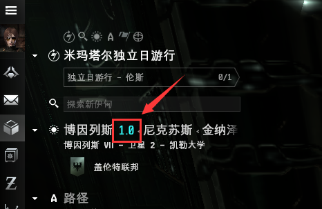

# 1.地域划分

## 前言

EVE宇宙有百个星系，中心是四大帝国领土，外圈是各大海盗势力以及可被玩家军团联盟占领的星系，下面主要介绍三大安等地区。

## 安全等级

每一个星系都有一个公共的安全等级，表示了所指恒星系的安全程度,范围从0.0-1.0，这个安全程度是由游戏中的虚拟势力帝国统一合作关系部所制定，数值越高越安全，数值越低越危险。

**左上角显示地区星系名称后面有颜色的数字就是安全等级，如下图所指**

## 三大安等地区

### 1.高安区（0.5-1.0）

安全等级0.5-1.0的星系，岗哨炮的数量会增加，同时也会刷新统合部的**安全巡逻队**在PK发生地。当你在高安被玩家直接攻击，**NPC巡逻队**就会来你身边击毁攻击你的玩家，**安全等级越高巡逻队来的越快，越低来的越慢，所以不是百分百安全**，一般敢在高安作案的都是十几个以上玩家同时攻击你，速战速决，我们把这种作战方式叫做QB。

### 2.低安区（0.1-0.4）

全等级0.1-0.4的星系，星门、星门旁的公告版以及空间站部署有少量**岗哨炮**来进行安全保护，**没有巡逻队**，所以危险程度相当高。低安是个很复杂的地区，这里有各方势力的玩家在这里**PK**，萌新进入这个地区基本就是他们的猎物。虽然星门有**岗哨炮**保护，但遇到专业**堵门队**，基本很难逃脱，可尝试**反冲**。

### 3.0.0区（<0.1）

安全等级<0.1的星系，完全开放非法攻击行为，简称 **00**。00地区不属于**四大帝国**，玩家可以在这里组建**军团**占领主权，在这里开发生产，军团与军团间组成**联盟**，联盟与联盟间合作组成**联盟群**，互相协助。当外来人员进入他们地盘，就会组织反收割队进行驱赶猎杀，所以也是**非常危险**的地区。
