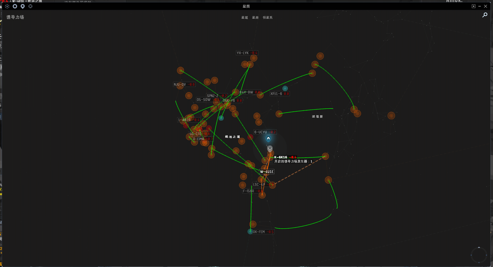
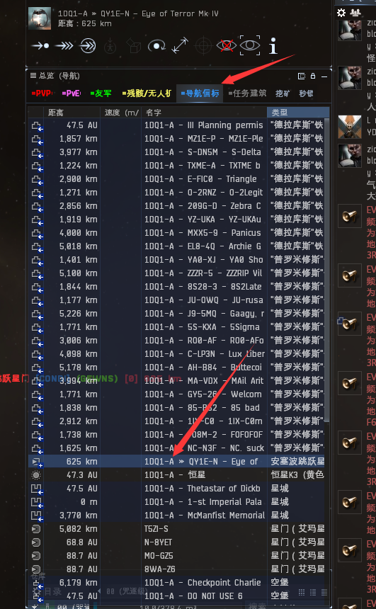
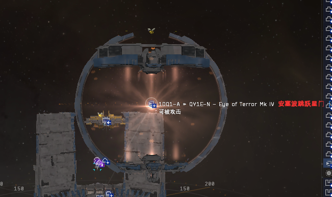
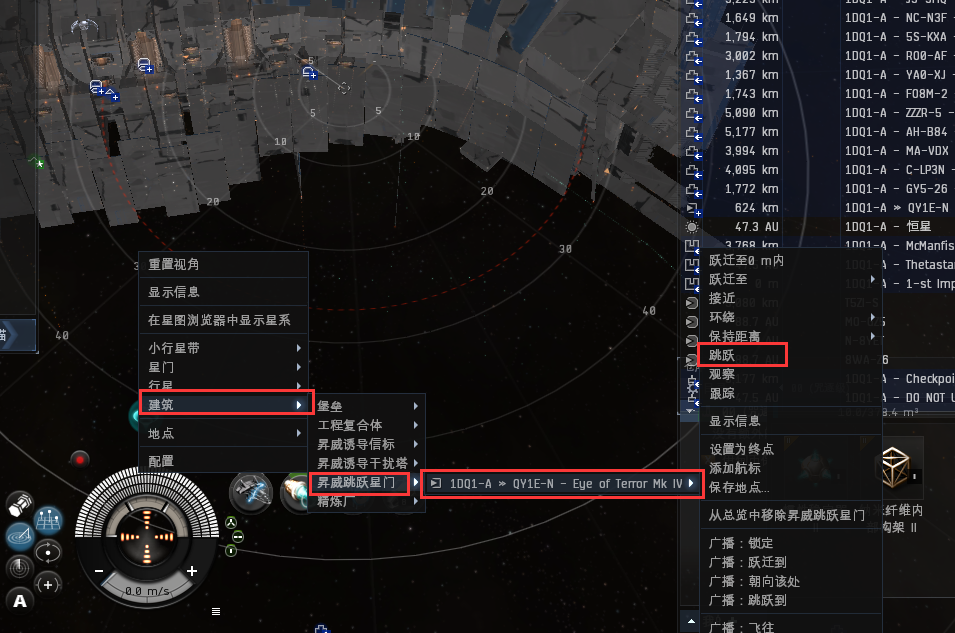
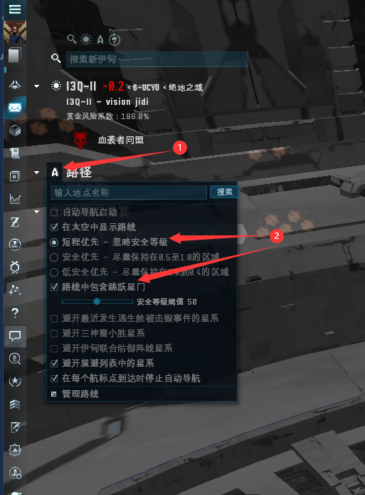
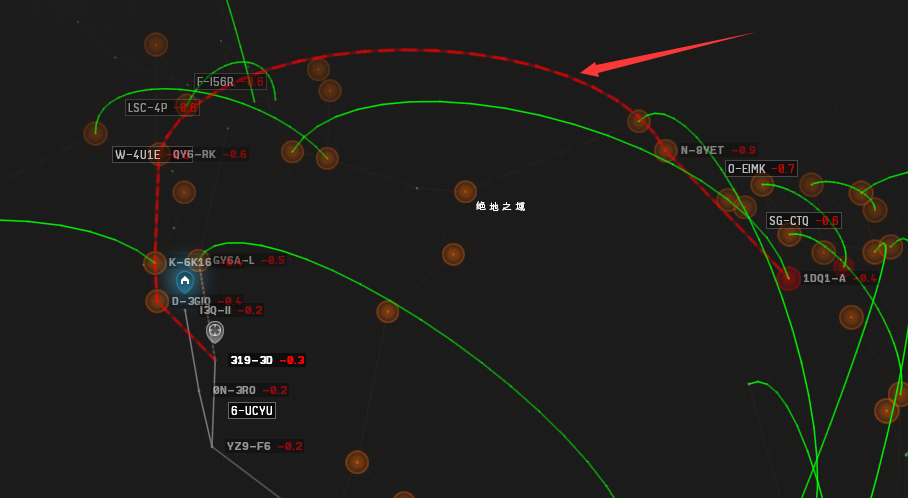

# 2.跳桥的使用

## 前言

**跳桥**就是一个快速通道，这个通道只有自己人才可以通过，需收取一点点小费用。打开星图就可以看到有很多绿色的曲线，两端连接的星系各有一个**安塞波跳跃星门**，和普通星门一样，跳跃过去就到另一端。

## 如何找到跳桥

到有跳桥的星系就可以看到，这是总览上的跳桥


一般跳桥的名称有写另一端的星系名称


右键太空也可以找到，如下图

## 导航设置

左边点击A，选择**短程优先**，打钩**路线中包含跳跃星门**，这样你设置某个终点就会把跳桥算进去。

