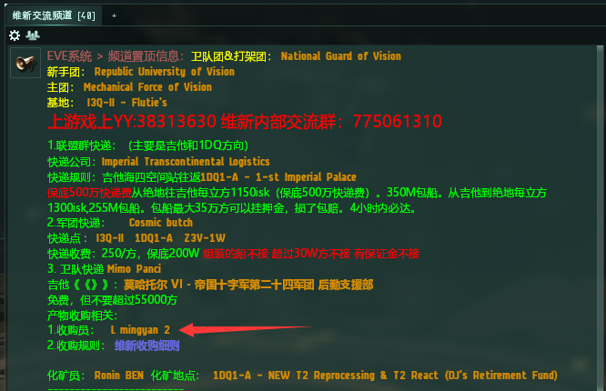

# 3.合同及相关常识

## 前言

经过长时间的教学了解，我们知道了，很多新人不会挂合同和搜合同，所以在此写出合同的使用方法和如何搜索合同。

## 一.合同在哪里

如下图

今后会经常用到，可以拖到左边快捷栏

在合同的**起始页**（Start Page）里，你可以看到能够挂出的**公开**及**私人**合同数量，当前在你的**军团**中挂出的合同**总数**，以及合同交易的过程。

## 二.创建合同

点击页面最下方的**创建合同**（Create Contract）即可创建你想要的合同。

### 合同的种类：

1.  物品交换（Item Exchange）合同：ISK（星币）换物、物换ISK（星币）、物换物；
2. 拍卖合同（Auction）：拍卖物品，以价竞争，一般没人用，所以我不讲；
3. 快递合同（Courier）：就是把物品给快递员运输到你指定位置；

### 可用性（Availability）：

第一页的**可用性（Availability）**选项是选择你的合同要显示的范围，具体区别如下：

1. 公开（Public）：所有人可以搜索到；
2. 私人（Private）：只有指定玩家才能搜索到，名字（Name）后面框框输入**玩家ID（名字）**；
   * **搜索依据（Search By）**：指**搜索的模糊度**，选哪个都一样，只要输入的**名字正确**，那么就一定是挂给正确的人，推荐选择**Only Exact Phrase（**完全相同的词**）**
3. 我的军团（My corporation）：顾名思义，就是只有我的军团的人可以搜索到；
4. 我的联盟（My Alliance）：顾名思义，就是只有我的联盟的人可以搜索到；

## 三.物品交换的使用

这里挂个私人合同演示，如下图

选择物品所在建筑，下面选上你要交易的物品，然后下一步

* 我将支付（I will pay）：**你**支付给**对方**星币
* 我将收取（I will receive）：**对方**支付给**你**星币
* 期满（Expiration）：合同持续时间，一般选择**4周（4 Weeks）**，时间到了就会过期，过期对方就搜索不到，手动**删除合同**才能把**物品收回**

核对一下**对方信息**和**金额**，正确就可以点**完成**

## 四.军团收购合同

为了方便军团成员安全便捷出货，军团专门安排收购员收你们的不要的垃圾装备、矿物、脑插等等物品。

* **收购地点：I3Q-II、1DQ1-A、Z3V-1W**
* **价格：辟邪按皮米收购价9折，其他按吉他收购价9折，特殊物品在“维新收购细则“频道有标价格**


**蓝图不收，其他星系也不收**


**1.在"维新交流频道"就有收购详细说明**

**2.创建合同**

* 合同类型：**物品交换（Item Exchange）**
* 可用性：**私人（Private）**
  * **名字（Name）：**在"维新交流频道"**把收购员名字拖进去**
  * **搜索依据（Search By）**：Only Exact Phrase

* 选上物品，然后下一步

* 这里**期满**选择**4周**就行

* 核对一下，避免挂错对象

**完成后等待收购员结算，结算会转账到你钱包**

## 五.快递合同

为了方便大家**安全运输**舰船、装备以及其他物品，军团提供绝地**1dq首星市场**到各个**生产驻地**来回的快递**，**还有帝国快递提供**吉他贸易中心**到**绝地**来回的快递，具体规则请看**"维新快递"**频道。

### 快递合同的使用

#### 1.创建合同

* 合同类型：**快递合同（Courier）**
* 可用性：**私人（Private）**
  * **名字（Name）：**在"维新交流频道"**把快递员名字拖进去**
  * **搜索依据（Search By）**：Only Exact Phrase


快递是**公司名称**，所以拖不进去，只能**复制粘贴**进去


先把名字拖到下面

右键**全部复制**快递公司

.png>)

#### 2.选择快递物品


禁止组装的船，超过30万方也不接


#### 3.输入目的地

在运送到后面框框输入目的地**星系名称**，点**搜索**，选择**空间站**或**建筑**，点**确定**


如果是吉他，中文搜索不到，要搜索“**jita**”


#### 4.填写奖励和保证金

* 奖励：我都是小东西40方，所以奖励2,000,000(两百万保底)，超过每方250星币
* 保证金：物品总价值，翻车赔偿的金额，联盟内快递保证金填0，翻车也会赔偿
* 期满：还是4周
* 预计完成天数：天数多点就行


联盟内快递保证金填0，翻车也会赔偿；\
联盟群快递要填保证金，自己算价格


最后等待快递员接单给你送到目的地就行

## 注意事项

上面图片仅供参考，具体收购员、收购员、收购价格、快递费用、收购和快递地点可能会变更，**一切以“维新快递“频道为准**
