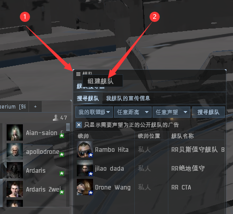

# 4.舰队的使用&跟队

## 舰队面板的使用

### 一.舰队面板在哪里

### 二.创建舰队&舰队登记

#### 创建舰队

#### 舰队登记

### 三.舰队自由&创建联队/中队

#### 自由行动模式

自由行动模式：成员可自行换**中队成员**及**中队队长**位置

#### 创建联队/中队

右键舰队可以**创建联队**

右键联队可以**创建中队**

### 四.舰队历史指令

在跟队的时候要切到**历史**界面，这里显示指挥官和成员发出的各种指令，可以设置过滤，一般分两种

#### 火力狗广播


幽灵有摇修，把**需要护盾**打钩


指挥官一般会说：集火X开头。紧接着会说：加锁X开头。指挥官说的时候会广播出来


右键或者按住锁定键并点击这条广播就可以锁定该目标


#### 后勤广播

#### 保存广播设置

输入**备注名**，按住**分享**拖到笔记，也可以拖频道发送给队友

#### 加载广播

点击自己保存的或者别人发的广播设置

