# 1.认识舰船数据

## 前言

很多新人看不懂装配面板的舰队数据，认识舰船数据是基本技能，接下来带大家认识一下。

## 装配面板

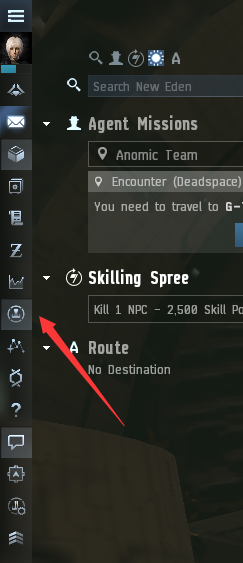

点击**上方箭头所指**图标就可以打开装配面板（按Alt+F也可以打开），

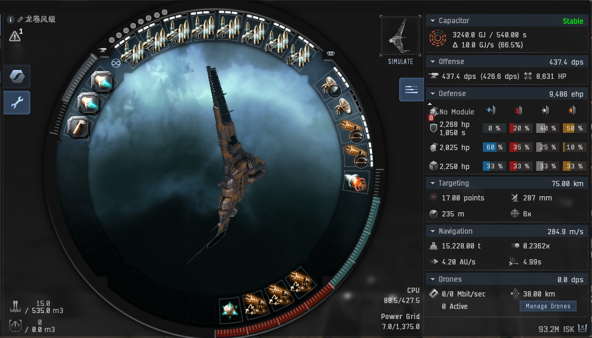

右边一栏的舰船数据分六大类：

1. Capacitor（电容） 2. Offense（攻击） 3. Defense（防御） 4. Targeting（锁定） 5. Navigation（导航） 6. Drones（无人机）

### 1.Capacitor（电容）

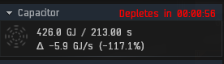

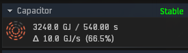

电容是舰船的能源属性，右上角的时间分为两种：1.**Stable（永动）**；2.**持续时间**。 

其受到舰船装备和人物技能的影响，一般来说，在不改变舰船装备的情况下，电容持续时间越长越好，当然这就主要涉及人物技能的问题， 与电容相关的技能大类为**工程学（Engineering）**，其他类也有相关技能，如减某个装备的电量消耗。

### 2.Offense（攻击）

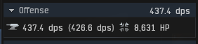

攻击属性分为两种：DPS和DPH，这两种数据区别如下

1. DPS（damage per second）：平均每秒伤害
2. DPH（damage per hit）：所有武器同时攻击造成的伤害

图中显示的是1400火炮的攻击面板数值，DPS只有437（除去无人机），但DPH却有惊人的8631，这就和1400火炮的转速有关， 1400火炮齐射并且命中，一击能削减8631的HP（对方抗性为0的情况下），但因为其射速太慢，导致其每秒能造成的伤害就只有437。 所以在查看攻击数值的时候需要和武器射速挂钩， 射速高的武器，**主看DPS**，射速低的武器，主看DPH。 

另外，无人机只有DPS，没有DPH。 

与攻击相关的技能涉及非常广泛，包括飞船操控学（Spaceship Command），射击学（Gunnery），导弹（Missiles），无人机（Drones）等，主要看你舰船是什么武器。

### 3.Defense（防御）

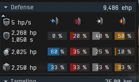

EVE中的舰船均为三层防御，分别为护盾（Shield），装甲（Armor）以及结构（Structure）

其中护盾可以自动回复，装甲和结构则不可以自动回复。图中左上角的5hp/s即代表舰船每秒能够自动回复的护盾量。

每艘舰船的三层防御基础抗性均不同，这就导致了同一种舰船可以出现三种不同的防御模式，盾抗，甲抗以及结构抗。

盾抗以及甲抗会根据抗性来调整装备从而使抗性均衡，使其不出现抗性短板， 而结构由于基础抗性均衡且无专门增加结构抗性的装备，所以一般只存在增加结构基础的配置。

在界面右上角的EHP，代表舰船抗性装备全开（不超载）能够达到的HP总量。 但EHP不代表你能承受这么多的伤害，因为一般来说能够承受的伤害不足EPH的二分之一，所以在计算船体有效时应考虑到。

与防御有关的技能涉及护盾（Shield），装甲（Armor）等。 

### 4.Targeting（锁定）

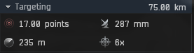

首先右上角是锁定距离，锁定距离越长，远距离作战优势越大。接下来介绍下面四个数据 ：

#### 雷达感应强度（Ladar Sensor Strength）

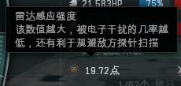

#### 扫描分辨率（Scan Resolution）

#### 信号半径（Signature Radius）

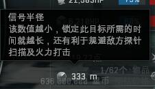

#### 最大锁定个数（Maximum Locked Targets）

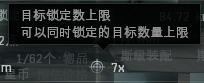

锁定相关技能：**锁定学（Targeting）**

### 5. 导航（Navigation）

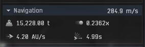

首先右上角是舰船开启或关闭推进器的前进速度，接下来介绍下面四个数据 ：

#### 质量（Mass）

#### 惯性系数（Inertia Modifier） 

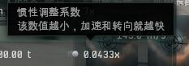

#### 舰船跃迁速度（Ship Warp Speed）

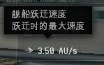

#### 朝向时间（Align Time）

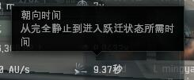

相关技能：**导航学（Navigation）**

### 6.无人机（Drones）

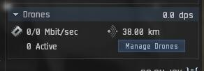

无人机几乎是EVE中大部分舰船不可或缺的装备，不论是主力无人机船，还是其他船型，都会用到无人机，对新人还很友好，因为简单好用。 右上角是无人机的DPS， 接下来介绍下面2个数据

#### 无人机带宽（Drone Bandwidth）

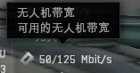

一次性放出的无人机的带宽总和，舰船自身的属性，不受任何其他装备或技能的影响。 不同种类的无人机带宽也不同。

* 轻型无人机 5Mbit/sec 
* 中型无人机 10Mbit/sec 
* 重型无人机 25Mbit/sec 
* 岗哨无人机 25Mbit/sec

#### 无人机控制距离（Drone Control Range） 

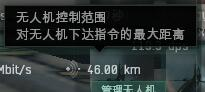

控制无人机的最大距离，其受装备及无人机技能的影响，如果无人机超出了舰船最大的无人机控制距离，那么你将无法命令无人机进行操作，只能收回或者放弃。 

对于岗哨无人机，无人机控制距离代表你能够使用其攻击的最远距离。

相关技能：**无人机（Drones）**

## 模拟装配

如果你想要了解一艘舰船不同装备的数值，可以打开装配页面右上角的**模拟装配**（Simulation Mode）功能，通过改变不同的装备来进行数据模拟，这也是一大乐趣。

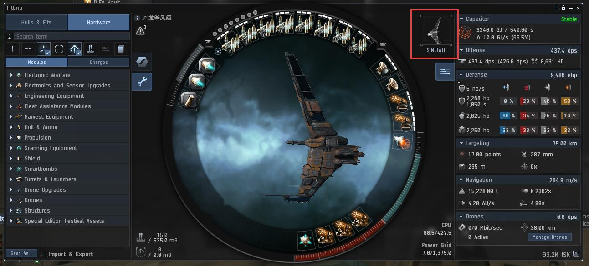

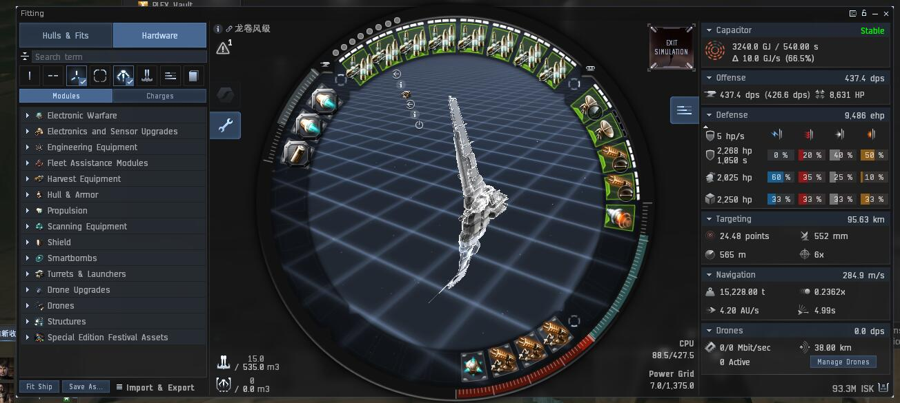
