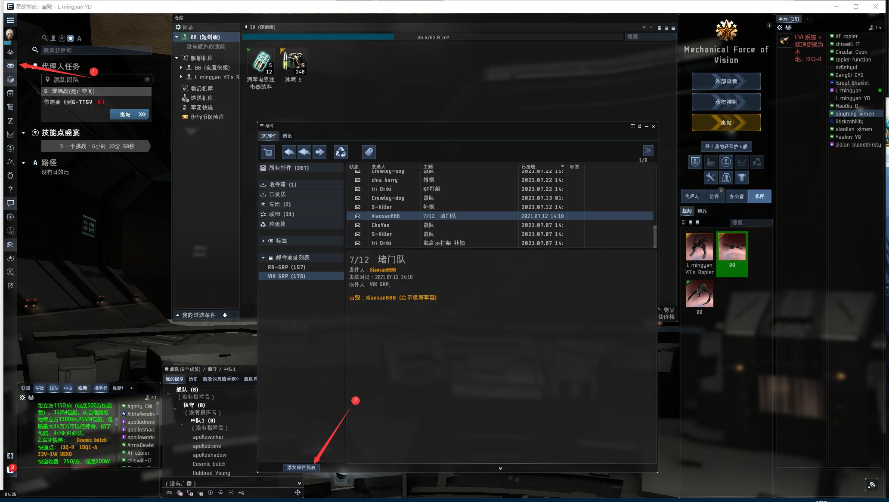
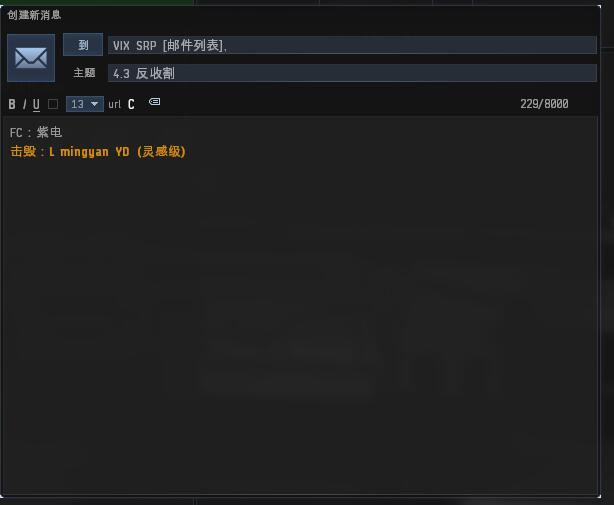

# 2.补损邮件

## 军团补损

### 以下情况不补损：

1. 跑路损
2. 掉队损 
3. 装备制式不对损 
4. 不听指挥过门.进场损. 
5. 带队指挥所说的不予补损的情况 
6. 所有种类的刷怪损

### 补损范围

指挥官允许驾驶的舰船。

### 如何添加邮件列表

打开**邮件>>EVE邮件>>添加邮件列表**

输入**VIX SRP**，点击加入

这里就出现了

### 发送邮件

右键**VIX SRP**邮件列表，点击**发送邮件到列表**


在损失报告里面**按住头像拖到邮件里面**就变成黄字KM


### 补损方式

在**VIX SRP**邮件组发送标准格式的补损申报邮件 （包含日期、战斗目的、KM黄字、舰队指挥ID）。

## 联盟补损

联盟补损请看：[https://gitee.com/Ranger_Regiment/info/wikis/%E8%A1%A5%E6%8D%9F%E5%88%B6%E5%BA%A6?sort_id=2148700](https://gitee.com/Ranger_Regiment/info/wikis/%E8%A1%A5%E6%8D%9F%E5%88%B6%E5%BA%A6?sort_id=2148700)
