# 1.高安异常空间与远征

## 前言

刷**异常**触发**远征**是EVE里最普通的生产方式，在0.0地区有基础插件的支持下可以无限刷新，在高安地区是随机刷新的，因为我们是入门级别的教学，所以我这里主要教新人如何在高安刷异常与远征。

### 一．如何发现异常

我们通过我们的舰载扫描器找到异常，打开探针扫描器如下图所示

在筛选结果里把异常空间勾上就可以看到我们的异常空间

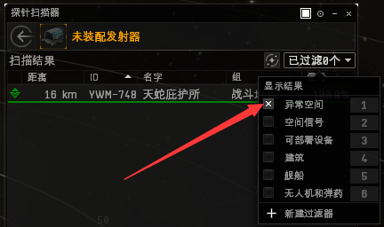

我们还可以通过星际代理处找到这些异常

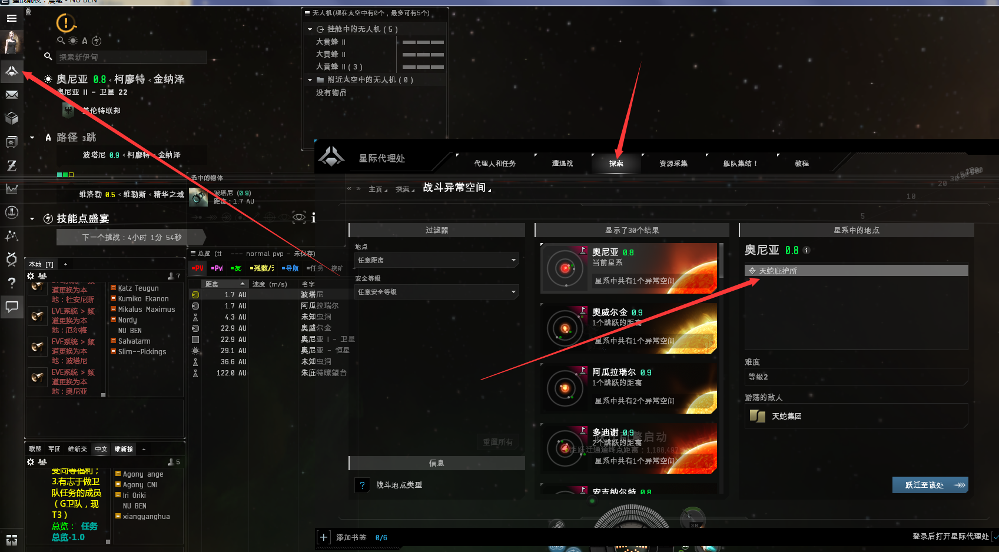

绿色的信号位标就是我们此行的目标异常，跃迁到这里就可以打了。

接下来我们会进入一个找异常、刷异常的重复过程直到我们触发了远征。下图就是触发了远征的弹窗

.png>)

**高安团**的**军团频道**置顶有推荐下面这些星域，这里是**盖伦特**地盘，有大量**天蛇异常**。

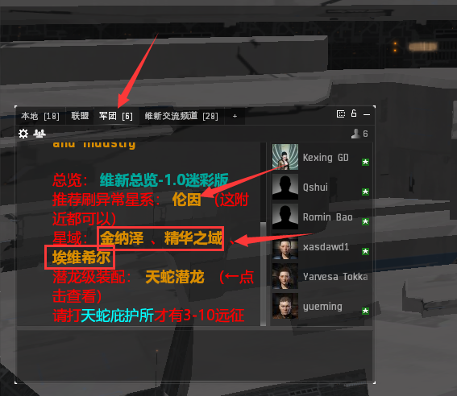

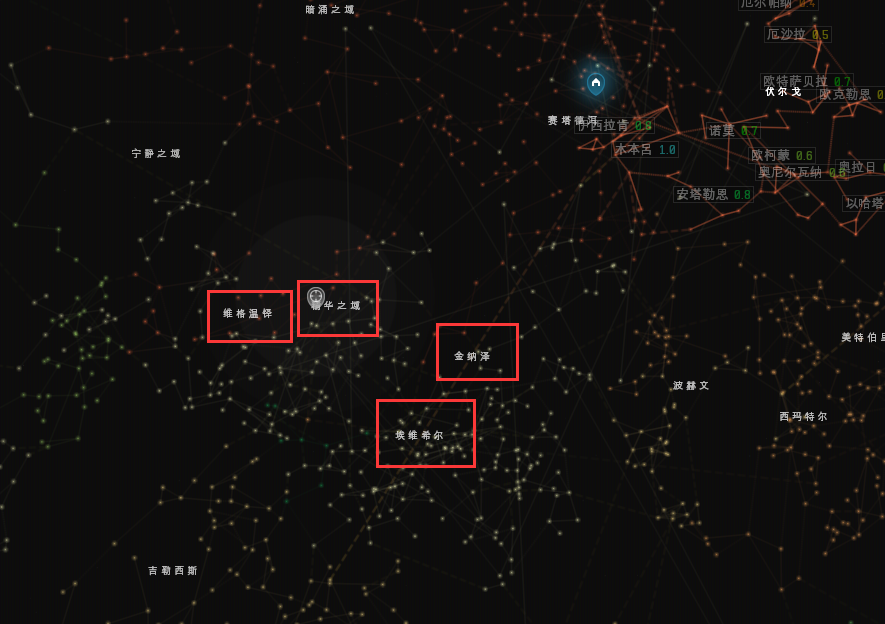

### 二.推荐舰船

#### 潜龙级（Worm）

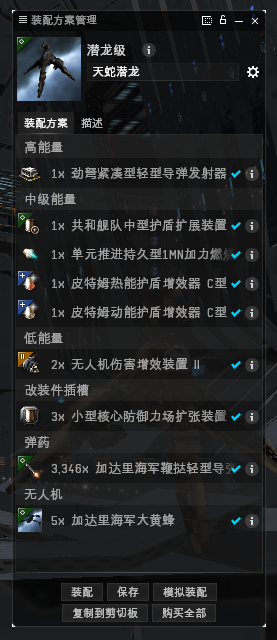

技能参考[**一百万技能点的使用**](../jrwm/3.md#qian-long-ji-worm-ji-neng-biao)****

#### **无人机用法**

* 释放：SHIFT+F
* 攻击：选择锁定目标，按F键
* 收回：SHIFT+R

#### **为什么只能两个无人机？**

* 每个舰船带宽是固定的，不能改变

### **三.远征攻略**

打开星际代理处在远征里找到你刚刚触发的远征

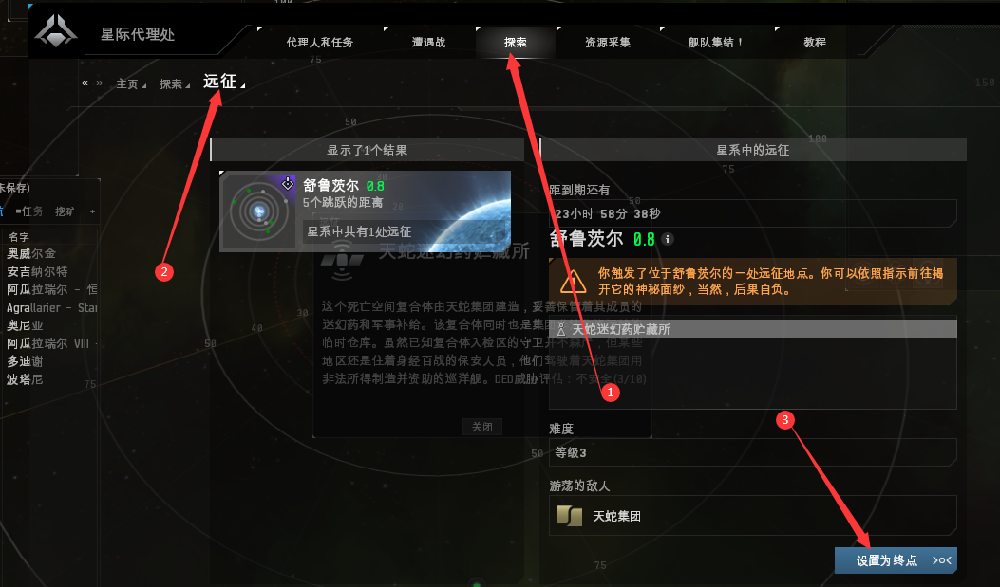

到达目标星系后，我们可以

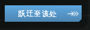

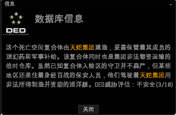

天蛇3-10**第一层**我们选择进入**安保轨道**（比较近）

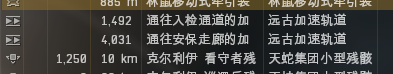

一路清怪打到最后一层，最终目标是这个

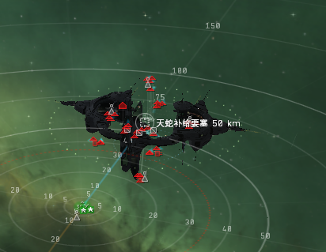

先打掉部分怪，再打建筑**天蛇补寄要塞**，打掉这个建筑 拾取掉落的货柜（看脸的时刻来了）

运气不错大概有一亿的掉落

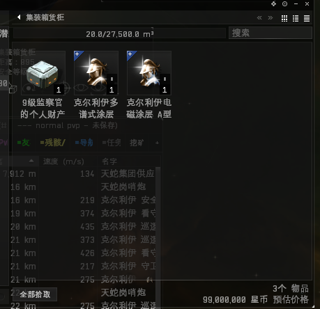

### 四.产物处理 

1. **盒子（检察官的个人财产）**我们拉到**吉他**三跳的地方（经过加达里>>阿里卡拉>>**维尔埃勒**）直接出售； 
2. 其他产物扔吉他市场；
3. 蓝图留着或在吉他挂公开合同出售；

## 关于高安远征触发的死亡明细如下

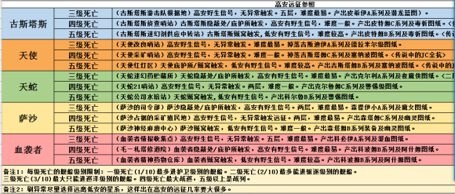
