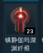
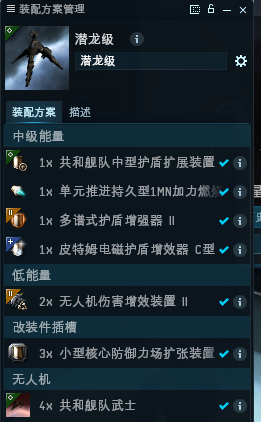
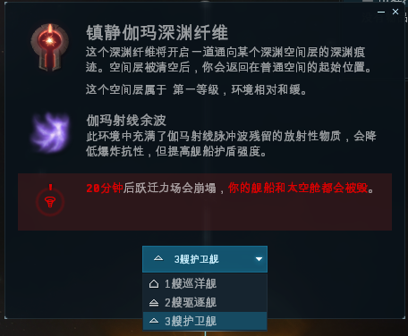

# 2.新手深渊攻略

## 一．深渊简介 

深渊是EVE的副本系统，我们通过深渊钥匙进入深渊空间挑战三个波次不同类型的怪物组合，获取小红书（统合部收，相当于赏金）、深渊材料、蓝图（用于制造三神裔相关的船只）和技能书达到收益的目的。相对于其他收益方式，深渊具有不依赖环境、收入稳定的特点，今天我们就以一个新兵开局的角度来向大家推广这种PVE方式。

## 二．深渊环境

深渊内有不同的天象加成，根据使用的纤维种类不同，所得到的天象加成也不同。一共有五种深渊环境，分别对应的加成天象如下： 1. 伽玛纤维:加护盾值，减爆抗（我们潜龙最擅长这个了） 2. 异种纤维：加扫描分辨率，减动抗 3. 电子纤维：加回电，减电抗 4. 黑暗纤维：加速度，减炮台射程（无人机船千万不要进这个空间） 5. 火瀑纤维：加装甲值，减热抗 

## 三．深渊等级 

深渊等级分为宁静（零级）、镇静（一级）、焦燥（二级）、猛烈（三级）、狂怒（四级）、混乱（五级）、灾变（六级）七个级别，我们一方面可以通过纤维的名字判断深渊钥匙的等级，一方面也可以通过纤维的图标判断钥匙的等级。纤维图标上的触点代表着纤维的等级。 

## 四．新人深渊的选择

新人因为技能和经验原因，我们这里只向新人推荐一级伽玛深渊

没错，就是这个钥匙，我经过无数次的实验证明，这是对新人来讲非常稳定的（指爆船少）的一个深渊方案

## 五．深渊前的准备 

1. 船只准备，这是我们的新人做完职业代理后军团发放的潜龙经过了稍加修改后的深渊配置**（原来那个是打天蛇异常和远征用的）**；
2. 纤维准备，我们要准备起码三个**镇静伽玛深渊纤维**；
3. 网络稳定，确保你的**网络稳定不掉线**，掉线将是你最大的敌人；
4. 基本的打怪操作技巧（开启主动装备、环绕、放无人机、攻击目标、回收无人机），如果这个都不会，请用**特里斯坦级（小胖子）**找个**异常**练练手。

## 六．开启深渊空间 

首先我们要**找一个离空间站及其他天体1000KM以上的点**（这个点大家自己做，你愿意用船爬也好，还是说会跃迁途中保存地点（CTRL+B)也好，**这个点最好不要离你的基地太远，以便以后补给方便**），然后我们自己右击自己的名字组建一个舰队，最后货柜舱的纤维使用并选择三个护卫舰生成一个深渊痕迹，我们点击深渊痕迹就可以进入深渊空间了。


**很重要！很重要！很重要！深渊空间有三层，20分钟时间限制，时间一到船蛋双飞**


## 七．深渊收益 

深渊的收益并不是直接的赏金，你需要在每一层找到一些**红箱子**并打爆它才能拿到收益。主要收益藏在**三神裔生化结合贮藏舱**里（其他红箱子也有，但不多，不建议拾取）。

## 八．战斗技巧

1. 萨沙巡洋舰的毁电很凶，看到以后记得不要离他太近；
2.  维拉之握（一个无人机战巡）打无人机特别厉害**注意无人机血量**；
3. 抑制塔非常克无人机，记得远离它（它不是怪，注意你的无人机不要自动反击它）；
4. **一定一定要环绕起来走位**；
5. 深渊空间只有20分钟，你需要在二十分钟内打完三层，一定要不浪费时间（正常七八分钟就能打完）；


说明：因为是一级深渊，是让大家练手的深渊，所以没有太多的压力，大家还是要在一级深渊多了解怪物特性，动起来永远是你最好的防御方式。


## 九．产物处理 

1. 小红书（三神裔调查数据库）我们拉到吉他三跳的地方（经过加达里>>阿里卡拉>>维尔埃勒）也是我们卖盒子离吉他最近的地方； 
2. 其他产物扔吉他市场；
3. 蓝图留着或在吉他挂公开合同出售；
4. 奇奇莫拉图军团800W一张收；
