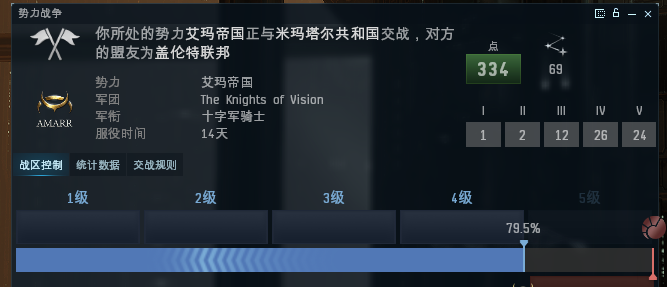

# 1.A族卫队任务攻略

## 一．什么是卫队

卫队也称之为势力战争，是EVE里的阵营战争。众所周知EVE里有四大帝国：盖伦特、加达里、艾玛和米玛塔尔，EVE在历史背景设定上，把加达里和艾玛设定为同盟，盖伦特和米玛塔尔设定为同盟，势力战争就是一场2V2的阵营战争；而卫队就是为阵营而战的方式，只有加入卫队才能参与到阵营战争中。

## 二．如何加入卫队&#x20;

加入卫队的方式很简单，我们有两种渠道加入卫队： 1：加入NPC势力卫队：只需要你在势力所属空间站的右上方找到势力战争服务按纽，点击我要加入卫队就可以了（条件是该势力声望不能为负）； 2：加入玩家势力卫队：有很多玩家建了军团加入了国民卫队，我们只需要联系上军团管理，加入他们军团就默认加入了卫队（这种方式是没有声望要求的，当然当整个军团的平均声望为负的时候也会被清理出卫队）

## 三．加入卫队后的利弊&#x20;

利：你可以参与卫队战争，通过绕杆子、做卫队任务、击杀敌对卫队玩家获得卫队专属忠诚点，用以兑换一些装备、蓝图、植入体等卫队物资来获取收益。

弊：进入敌对势力高安区域会有海军一直在追杀你，在敌对高安区域，你不能隐身。&#x20;

## 四．卫队等级和卫队时期&#x20;

上文我们讲过，卫队收益就要靠获得卫队忠诚点来获得收益，获得忠诚点的方式有三种：卫队任务、击杀敌对卫队和绕杆子，本文本攻略就要讲述如何进行卫队任务。

### 卫队等级是影响卫队任务的主要因素：&#x20;

* 当卫队等级1级的时候，我们做任务的收益是正常收益的50%；&#x20;
* 当卫队等级2级的时候，我们做任务的收益是正常收益的100%；
* &#x20;当卫队等级3级的时候，我们做任务的收益是正常收益的175%；&#x20;
* 当卫队等级4级的时候，我们做任务的收益是正常收益的250%；
* 当卫队等级5级的时候，我们做任务的收益是正常收益的325% ；

### 所以在欧服卫队有渔猎期和出货期的说法：&#x20;

* 渔猎期是指卫队等级较高（四级或五级），这个时期我们通过任务或绕杆子积累忠诚点；
* &#x20;出货期是指卫队等级较低，忠诚点获取难度较大，我们将不再任务，忠诚点收益极低，但忠诚点兑换比例较高；

## 五．任务接取条件&#x20;

接取卫队任务必须要在卫队团里（我们有自己的A族卫队团The Knights of Vision，也可以以个人身份加入国民卫队）。初期只能接取一级任务，当你的卫队声望达到1的时候可以接取二级；声望达到3的时候可以接取三级；声望达到5的时候可以接取四级。

## 六．任务接取路线&#x20;

因为卫队任务大多为**斩首**（打BOSS,拆建筑和打工业舰）任务，但需要我们跑十几跳甚至二十几跳，所以跑路的时间远大于做任务的时间，这是卫队任务的特点。为了缩减**时间成本**，我们都是同时接取十几个任务一起跑。

军团首页列取了十六个空间站，我们一一设定航标后就出去接取任务，任务报酬的忠诚点数除了与卫队等级相关以外还受代理人所在星系的安等影响，五级卫队下一个四级任务的收益大概是在6万左右，三级任务收益大概在1.5万左右，16个空间站 32个代理一圈下来总忠诚点收益大概是150W左右还有将近1E的赏金收益。

## 七．任务筛选&#x20;

### 1.所有需要任务物品的任务我们是不接的。因为交任务需要再回到这个空间站且任务十分困难。

### 2.如果你对低安的路线不是非常熟悉，请多跑几次熟悉一下路线，军团首页也列取了一些优先级比较高的任务星系，如果不在这些任务星系的任务你可以选择拒绝（每四个小时拒绝一次任务不掉声望）。

## 八．任务舰船配置推荐

1. 入门级茶隼配置（可以做一到三级）\
   &#x20;
2. 进阶级寒鸦配置（可以做三到四级）\
   &#x20;&#x20;
3.  &#x20;高手级隐轰配置（可以做三到四级）

    &#x20;


备注：当然T3也可以打这些任务，但不推荐，低安是一个PVP强度很高的区域，T3的成本注定了很容易被人盯上。


## 九．任务攻略及注意点&#x20;

### 四级：

1. 致命攻击：击杀指挥官&#x20;
2. 轻视的代价：击杀指挥官（注意这个指挥官有可能会暴击我们的任务船）可以做任务空间点，交过任务后回任务空间捡五个大型残骸，大约会有2000W额外收益。&#x20;
3. 回击：击杀指挥官&#x20;
4. 斩草除根：打掉主反应堆&#x20;
5. 开采者的愤怒：打掉左边四只工业舰&#x20;
6. 阻断供给：三个工业舰&#x20;
7. 灰色地带：六个工业舰&#x20;
8. 死人不说话：战术指挥站 9.阻止侵略：打掉被米玛塔尔控制的星门（注意走位，较危险）

### 三级&#x20;

1. 士气与道德：工业舰四只
2. 阻断供给：工业舰两只
3. 闪电冲击：工业舰三只
4. 开采者的愤怒：打掉不在气云里的工业舰
5. 应急计划：打掉指挥官&#x20;
6. 暴露：打掉指挥官&#x20;
7. 父与子：打掉指挥官
