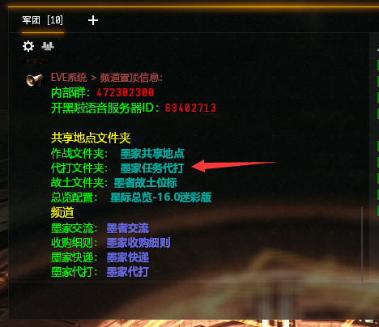
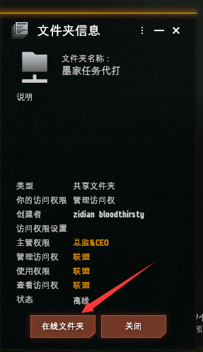
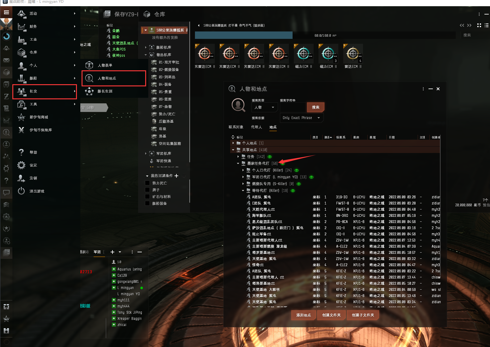

# 代打做点

## 前言

有时候代理人会给你燃烧任务，比如 混乱团队、混乱代理人、混乱基地，这是天花板级别任务，难度很大，新人做不了，这时候可以做到军团代打文件夹里，只要开个穿梭机，跑到任务地点轨道口做点，让团里老玩家帮你代打，只需分享一半收益给代打人员，怎么分享下面会讲；下线前也可以把牌子任务做代打文件夹里，牌子归代打员，不需要分享忠诚点

## 一.连接共享文件夹

代打文件夹在 军团频道置顶，点击蓝色字，再点连接即可

点击左上角**菜单>>个人>>人物和地点**，就能看到**墨家任务地点**文件夹

