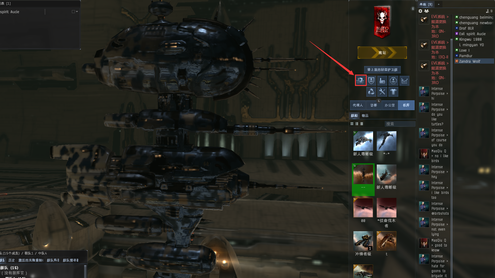
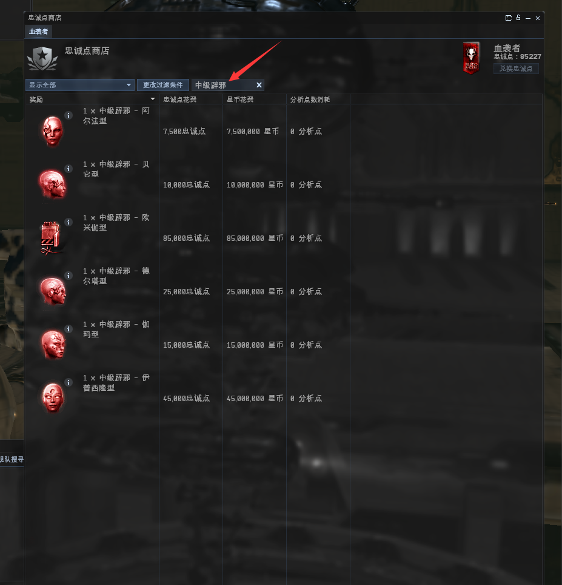
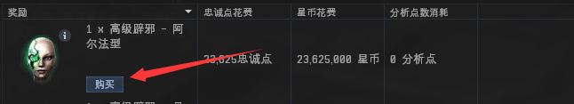

# 辟邪兑换教程

## 辟邪兑换表

| 名称           | 材料                    | 忠诚点（LP） | 星币（ISK）/m |
| ------------ | --------------------- | ------- | --------- |
| 高级辟邪 - 阿尔法型  | 视觉滤镜—基础级              | 23625   | 23.625    |
| 高级辟邪 - 贝它型   | 记忆增强体—基础级             | 31500   | 31.5      |
| 高级辟邪 - 德尔塔型  | 脑控次处理器—基础级            | 78750   | 78.75     |
| 高级辟邪 - 伽玛型   | 神经增效体—基础级             | 47250   | 47.25     |
| 高级辟邪 - 伊普西隆型 | 社交适应芯片—基础级            | 141750  | 141.75    |
| 高级辟邪 - 欧米伽型  | 天赋植体 诺贝尔 船体升级 HG-1005 | 267750  | 267.75    |
| 总            | 2E                    | 590625  | 590.63    |

| 名称           | 材料                    | 忠诚点（LP） | 星币（ISK）/m |
| ------------ | --------------------- | ------- | --------- |
| 中级辟邪 - 阿尔法型  | 视觉滤镜—加强版              | 7500    | 7.5       |
| 中级辟邪 - 贝它型   | 记忆增强体—加强版             | 10000   | 10        |
| 中级辟邪 - 德尔塔型  | 脑控次处理器—加强版            | 25000   | 25        |
| 中级辟邪 - 伽玛型   | 神经增效体—加强版             | 15000   | 15        |
| 中级辟邪 - 伊普西隆型 | 社交适应芯片—加强版            | 45000   | 45        |
| 中级辟邪 - 欧米伽型  | 天赋植体 诺贝尔 船体升级 HG-1003 | 85000   | 85        |
| 总            | 60M                   | 187500  | 187.5     |


**不要用血袭者忠诚点换材料，非常非常亏！！！！！**


## 如何兑换

### 一.忠诚点商店

先到I3Q-II空间站，然后在左边打开**忠诚点商店**

### 二.搜索辟邪

搜索“**中级辟邪**”或者“**高级辟邪**”，显示出来的这6个就是一套

### 三.购买

满足3个条件（材料+忠诚点+星币）就可以购买

### 四.出货

一套6种挂交易合同给军团收购员


[3.md](../../d2/3.md)


