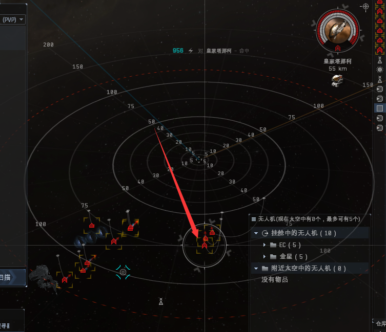

# 1.血袭者4级安全任务

## 前言

**血袭者任务**是海盗任务的一种，主要产出血袭者LP（主要兑换高级辟邪脑插及血袭者旗舰弹药），**海军牌子**（配合海军LP兑换势力装备）和**赏金**。高端的四级任务玩家每小时可以稳定收入**三亿**以上，本教程主要教大家如何入门。 当我们决定做血袭者任务，首先要付出的代价就是：**1.不能再刷血袭者怪物，包括异常、星带和死亡。2.不能再进入高安**，海盗任务的目标多为打海军，所以长时间做任务的号基本不能再回到高安。正因为付出这两个代价，所以海盗任务的收益一直很可观。

## 准备工作

### 一.舰船准备

任务的门槛并不高，当大家想明白以上两点，准备涉足于海盗任务的时候，你会发现一条毒蜥就可以胜任大部分的四级任务。这里还是向大家推荐用毒蜥起步，链接的一百万技能点足够大家点出来胜任大部分任务的毒蜥级。

#### 毒蜥级配置

[**毒蜥技能表（点击查看）**](../../jrwm/3.md#du-xi-gila-ji-neng-biao)\*\*\*\*

#### 伐木者级配置

用来做**侦查**三部曲、**货柜递送**任务。


此伐木配置可给副角色用，只需有船体技能



此旭日配置可给副角色角色用


### 二.声望准备与关系

如果你是一个白号（血袭者势力声望不低于负2）事情就会变得简单起来，你只需要找军团的人带你能做二级任务（血袭者军团声望到1）就可以独立自主地冲声望了。从能做二级到能接四级任务，只需要半天的时间就足够了（I3Q本地有二级代理和故事线代理），如果你的血袭者声望低于负二，那这个事情就可能有点麻烦了，你需要不停刷一级代理刷出来故事线把势力声望提升到负二以上才可以正常和血袭者做朋友。（这个过程推荐大家弄一个T1护卫或驱逐来完成）。

#### 血袭者同盟声望

血袭者同盟声望只有故事线任务才能提升，好处如下：

* **血袭者同盟>2**
  * 菱形怪是白色的，不会主动攻击你；
* **血袭者同盟>5**
  * 菱形怪是蓝色的，变成友军，你被玩家攻击会帮你摇修和打死对方；
  * 4级任务声望需求改变，从原来的**血袭者>5**变成**血袭者>-2**；

### 三.安全关系学

每级增加\*\*10%LP（忠诚点）\*\*奖励，**增加收益**的技能（很重要），技能书只能在市场才可以购买到（可以找军团管理买）

### 四.移动式牵引装置

最少要准备3个。

**移动式牵引装置**：自动把半径125km内的残骸拉到身边并把里面的物品转移到自己仓库里，从近开始拉

#### 牵引如何使用：

在船仓右键**移动式牵引装置>>！为自己发射**


1.最好右键牵引保存地点，避免走了找不到，收了删除点；\
2.放两个牵引没用，会互相拉残骸；


#### 地点在**左上角菜单>>个人>>人物和地点**，就能看到

### 五.任务过程中的基本操作（必看）

1. 在不熟悉周边地理情况的时候不要开着自己的任务船**乱跑过星门**;
2. 时刻牢记血袭者是我们的亲人，打不还手，骂不还口；
3. 进入任务空间以后开启主动装备环绕起来（推荐40KM，最好学会Q键或双击太空走位)，毒蜥级除了其超高的**有效**和**回盾**速度外，它的**速度**才是它最好的**防御**，**注意不要撞到建筑！！！**
4. 当本地有白名、红名这些非友军时，除了打开定向扫描有无作战探针外，**拉离落地点信标50KM以上**也是一个良好的习惯（不管敌人怎么飞进来，他们也要从**落地点信标**冲过来），不要离信标100km，对方一轮**跳刀（8秒）就会直接瞬移到你脸上**，保持在**50km左右**就好。
5. 当你的血袭者同盟声望没有正5之前，**不要长时间在空间站门口逗留**，血袭者空间站门口长期有菱形工业舰，发现敌对目标时，它会呼叫更强的支援把你揍了。
6. .请**先清护卫和驱逐怪**（打你无人机很疼），大多数护卫怪有干扰能力，所以被套上**扰频、扰断、网子时要第一时间打掉（防止来不及逃跑）**
7. 毒蜥是靠护盾抗伤害，其他两个血条（装甲和结构）抗性低血量低（脆皮），抗不了几秒，所以**护盾血量低于一半以下一定要立刻回站恢复！！！**（被**护卫反跳立刻打掉！！**）
8. .有钱了请在经常打任务的每个星系各放一艏毒蜥，**避免过门遇到爱**（过门开**穿梭机**或者**截机**、**游艇**）


空间站门口看到\*\*菱形怪（◆）\*\*请立刻进站，不然大部队来了，你会被秒杀，等一会他们会走


### 六.伤害属性与抗性

#### 游戏分四个属性：电磁、热能、动能、爆炸

#### 右键怪>>显示信息>>属性

不同势力的怪属性不同，每个势力舰船都有一个抗性偏低，既然舰船有抗性，那武器也有各种属性，用对应伤害属性进行攻击效果最佳，当然也有少数如统合部这样的特殊势力怪是全属性抗性值相同。

#### 下面来讲解无人机的攻击属性：

1. 帝国海军渗透者：**电磁**  攻击属性，速度2760m/s，**甲抗**
2. 加达里海军金星：**动能** 攻击属性 ，速度2268m/s，**盾抗**
3. 共和舰队瓦尔基里：**爆炸** 攻击属性 ，速度3000m/s，**盾甲差不多**
4. 联邦海军战锤：**热能**  攻击属性，速度2016m/s，**甲抗**

### 七.舰船等级识别图标


#### 大部分新人不会识别！！


速度快，大部分追你的你的无人机打，最大威胁是有各种干扰（减速，阻止跃迁），第一优先消灭对象。

速度快，也会打你无人机，一样优先消灭。

速度慢，高火力高防御，有毁电、阻碍你锁定其他目标等干扰能力。


因为我们这个教程只是教大家入门，所以更高深的任务攻略在这个教程里我们不做更多讲解，在大家入了门以后一起交流，会得到更效率的任务方式。


### 八.规避技巧

#### 1.盯紧本地频道

本地频道显示的是进入本星系的人员（虫洞内本地频道不显示），右边的人物列表代表着有本星系（地图）有这些人。通过本地频道我们可以与同地图的进行交流，主要还是用来知晓哪些人与你在同一个星系。

#### 2.定向扫描

当本地频道出现**红、橙、白**玩家请开始不停定向扫描

.png>)

.png>)

.png>)


**不停按V扫描，别偷懒，对方技术好，探针可能只出现8秒**


#### 3.预防泡泡拦截

对方可能不进你的任务空间，而是选择在你回空间站的那条线上离空间站50km左右发射一个**拦截泡泡**，你如果直接跳空间站就会撞泡泡上，然后被他们按住打死


所以这里建议跳其他建筑，比如空堡、铁壁等等



等待地方撤离一段时间后再出来继续做，如果对方就是待这不走了，就是要搞人，对方人不多可以找大佬带你，或者换地方做任务，z3v那边做任务



他还在就千万别头铁回去，即使探针消失了，你的任务空间也可能被他扫到蹲里面带你呢


## 燃烧任务攻略

**任务的天花板，技能要求高，成本也高，新人做不了，可以做点让老玩家代打。**

### 一.混乱团队

找代打或者拒绝

### 二.混乱代理人

找代打或者拒绝

### 三.混乱基地

没人代打，请拒绝


任务攻略在这个教程里我们不做更多讲解。


## 速刷任务攻略

### 一.阻止乱序者

斩首任务，打掉“**大君王“**（战列怪），然后打掉新刷出来的“**影**”（战列怪）即可 。

* 伤害类型：动热
* 使用无人机：金星
* LP点收益：5700
* 赏金收益：180W
* 牌子收益：0

### 二.扎茨玛特的右使者

进去以后打**哨站总部**（建筑）和**佐尔**（战列怪）。

* 伤害类型：动爆电
* 使用无人机：金星
* LP点收益：6800
* 赏金收益：195W
* 牌子收益：0

**佐尔**（战列怪）掉落以下物品：

* 毕克基的破译卡收益：800W （100%掉落）
* 超感脑插收益：7000W（掉落机率极低）

### 三.阻止军备

进去以后有一个**战列**、两个**护卫**（可以打掉），**等一分钟**会刷一波怪，**打掉五个工业舰**收工。

* 伤害类型：动热
* 使用无人机：金星
* LP点收益：15000
* 赏金收益：450W
* 牌子收益：0

### 四.货柜递送

开一个[**高速护卫**（可用伐木者）](./#fa-mu-zhe-ji-pei-zhi)，跳进去，开两轮微曲冲**仓库**，**打开仓库拿东西**之后会刷怪，不用管，**直接走人**。[（附护卫参考配置点击查看）](./#fa-mu-zhe-ji-pei-zhi)

* LP点收益：6000
* 赏金收益：210W
* 牌子收益：0

### 五.侦查

#### 1.侦查1/3

开一个[**高速护卫**（可用伐木者）](./#fa-mu-zhe-ji-pei-zhi)，进第一层直接向下冲轨道，过轨道。落地会刷怪，不管，直接走人。注意 ，第一层的小怪有反跳，磨磨蹭蹭的话会被抓，被干扰跃迁请启动  ，可以抗干扰。

* LP点收益：6000
* 赏金收益：200W

#### 2.侦查2/3

开一个[**高速护卫**（可用伐木者）](./#fa-mu-zhe-ji-pei-zhi)，进轨道，**向左看**，有一个**被加锁的加速轨道（如下图所指）**，开微曲**冲**，距离15km时立刻**朝向回去的空间站或星门**，会刷两次怪，**不管他们，不要停船，继续保持加速**（**不要在轨道边上逗留，轨道上刷出来的护卫怪有网和反跳**），当屏幕左侧的任务状态显示已完成，跳走交任务。

* LP点收益：1400
* 赏金收益：50W

#### 3.侦查3/3

开[**伐木者级护卫舰**](./#fa-mu-zhe-ji-pei-zhi)，只有天象伤害。每隔20秒受到一次4种属性伤害（每种属性各500共2000伤害）伤害很高。跳进去，落地冲轨道，不要逗留立刻进轨道，进去就完成收工。

* LP点收益：2000
* 赏金收益：70W

### 六.惊奇

**开放空间**，进去打一下**工业舰**（不用打死），会刷3堆A族海军怪，**打死下面最远的那个A族战列**，会在里面上方再刷两堆C族海军怪，打掉那个**身边没有别的怪** 只有他一个的**C族战列怪**，就完成了。

* 伤害类型：电动热
* 使用无人机：A海军用**渗透者**，C海军用**金星**
* LP点收益：14000
* 赏金收益：420W
* 牌子收益：0

### 七.危难中的少女

落地调整舰船方向，**环绕怪堆50km以上**，**先打掉两个护卫**，娱乐花园有两个，**任务信标 正下方的娱乐花园是任务建筑（如下图所指），直接打**。**进半甲的时候会刷一波怪+两个蜘蛛无人机**，**蜘蛛无人机要立马打掉，无人机爬太慢来不及请立刻放弃当前无人机，然后重新放一组无人机打掉**，娱乐花园进半结构的时候会再刷一波+佐尔，**打掉左尔**，**右键左尔残骸做点，交完任务回来捡**。


1.扛不住跳走；\
2.打一半回来打不要跳0m，请**右键太空>>危难中的少女>>遭遇战>>跳跃至>>50或70km；**\
2.不要打克鲁乌尔，会再刷6战列。无人机可能会在自动反击的时候误伤，建议落地先锁定再放无人机开火；



**视频教程：**[**https://www.bilibili.com/video/BV1Yh411n7kG/**](https://www.bilibili.com/video/BV1Yh411n7kG/)\*\*\*\*


* 伤害类型：电动热
* 使用无人机：金星
* LP点收益：9400
* 赏金收益：330W
* 牌子收益：0

**佐尔**（战列怪）掉落以下物品：

* 毕克基的破译卡收益：800W （100%掉落）
* 超感脑插收益：7000W（掉落机率极低）

### 八.世界碰撞

#### 1.有破译卡

带上  **毕克基的破译卡**进去落地冲**通往劳工基地轨道**，进去第二层。

#### 2.无破译卡

进去落地冲**通往劳工基地轨道，清掉帝国海军怪**进**劳工基地轨道**到第二层。**（这些怪有掉落牌子）**

第二层：落地立马开加力朝向轨道，有一个 **劳工监督者** 有机率掉脑插或值钱的势力装备，打掉做点，打完直接进下一层。


必有两个护卫怪冲过来给你套**网子**，也有可能给你套**反跳**



值得打的监督者

* 护卫：精兵、支援护卫
* 巡洋：突击队长
* 战列：舰队指挥官（最好，最值钱）


第三层：进去以后打掉**小型军械库**就完成了，回站交任务，**那个轨道不用再进。**


**小型军械库进去放大就看到了，如下图**


* 伤害类型：电热
* 使用无人机：渗透者
* LP点收益：15000
* 赏金收益：600W
* 牌子收益：1000W（1方法没有牌子）

### 九.封锁线

全抗怪，一共5波，每打一个**将军**会刷一堆怪，有**网子塔。**

#### 1.速刷法（大约5分钟）

**需要小航（航空母舰）/帕拉丁（掠夺舰），只打五个将军** ，打完收工\*\*。\*\*


没有小航/帕拉丁可以找人代打，忠诚点平分，无牌子


#### 2.全清法（毒蜥要打一小时不到）

**开放空间**，每波怪的**将军**最后打（不然会刷下一波怪，小心扛不住）。

* 伤害类型：电
* 使用无人机：金星
* LP点收益：15000
* 赏金收益：540W
* 牌子收益：2700W（统合部牌子本地空间站可直接出售）

### 十.无人机滋生的遗迹

护卫有网子，先不攻击，**向建筑加速打掉建筑**即可。

* 伤害类型：电动热
* 使用无人机：渗透者
* LP点收益：14000
* 赏金收益：510W
* 牌子收益：0

## 牌子任务攻略

### 一.海军舰队

三层全清，战列较多，火力高，建议带针对动抗。有反跳小怪，注意先消灭。扛不住请回站修理，有ECM锁定干扰怪，会让你只能锁定他，先打掉就行。

* 伤害类型：动热
* 使用无人机：金星
* LP点收益：15000
* 赏金收益：600W
* 牌子收益：7000W


请拉到50km以上距离，中途刷出的护卫怪有网子+反跳 一定要先打掉


### 二.疤痕

三层全清，第一层护卫较多优先清。

* 伤害类型：动爆
* 使用无人机：战锤或金星
* LP点收益：15000
* 赏金收益：510W
* 牌子收益：6000W

### 三.警方侵略

只有一层，进去 全清，一堆一堆清 不要全部拉暴动 小怪先打掉。

* 伤害类型：动热
* 使用无人机：金星
* LP点收益：5500
* 赏金收益：200W
* 牌子收益：5000W

### 四.未授权的军队

落地轨道并未上锁，无需打怪，直接接近并激活轨道即可。 进去 全清，任务物品在**穿梭机的残骸**里面。

* 伤害类型：动热
* 使用无人机：金星
* LP点收益：13300
* 赏金收益：500W
* 牌子收益：2900W

### 五.海盗的生意

第一层：清怪

第二层：清怪，最后几个怪掉落**货柜**，里面有任务物品

* 伤害类型：电热
* 使用无人机：渗透者
* LP点收益：15000
* 赏金收益：600W
* 牌子收益：3700W

### 六.袭击

第一层：轨道没锁而且距离你0米，不要浪费时间，直接进第二层。（可打，有3千万牌子）

第二层：全清（最后一波怪比较远，在最后一波怪刷出来前清完前面刷出来的所有怪可提前完成）

* 伤害类型：动热
* 使用无人机：金星
* LP点收益：15000
* 赏金收益：550W
* 牌子收益：3000w

### 七.截击破坏者

落地几个驱逐护卫，打完进轨道，里面小怪很多（注意无人机血量），从小往大清。打完以后在**货柜**里拿任务物品

* 伤害类型：电热
* 使用无人机：金星
* LP点收益：13000
* 赏金收益：500W
* 牌子收益：1400W

### 八.大举进犯

落地几个小怪不管，直接进轨道

第一层：全清，护卫有网子

第二层：全清，进去怪很远，慢慢爬，打着打着会刷一波巡洋护卫怪 护卫有网子

第三层：全清，护卫有网子

* 伤害类型：电热
* 使用无人机：渗透者
* LP点收益：15000
* 赏金收益：450W
* 牌子收益：3100W

## 其他低收益任务攻略

后期声望够请拒绝。

### 一.莫得团的猎头

第一层：全清

第二层：进去**不放无人机，冲到右边**（远离落地点的护卫怪堆，里面有两个赏金猎人护卫怪有网子，被网要打掉）打掉右边那个建筑的那堆怪（如下图所示）即可左边显示任务完成就走人。

* 伤害类型：动热
* 使用无人机：金星
* LP点收益：15000
* 赏金收益：600W
* 牌子收益：0

### 二.狂暴

**开放空间**，全清，护卫和战列先打。

* 伤害类型：动热
* 使用无人机：金星
* LP点收益：8600
* 赏金收益：280W
* 牌子收益：0

### 三.伏击护航队

全清，捡货柜里面的任务物品（400方）

* 伤害类型：动热
* 使用无人机：金星
* LP点收益：9000
* 赏金收益：350W
* 牌子收益：0

### 四.无人机的袭击

**开放空间**， 全清，落地向下走位，每打一个**轰炸机阿瓦姆**刷一波怪，护卫和战列优先打掉

* 伤害类型：电动热
* 使用无人机：渗透者
* LP点收益：7700
* 赏金收益：280W
* 牌子收益：0

### 五.抢救矿冶设施

第一层：全清，怪少

第二层：全清，护卫怪有反跳和网子且数目多，先清掉，再打掉**无人机堡垒**和最近的战列和巡洋即可，显示任务完成可直接走人（找不到无人机堡垒可右键如下图位置点锁定目标）

* 伤害类型：电热
* 使用无人机：渗透者
* LP点收益：8500
* 赏金收益：300W
* 牌子收益：0

### 六.死人不会说话

第一层：全清，护卫有网子先打掉，火力高，进去**立马拉远**

第二层：全清，有四堆怪，护卫和蜘蛛无人机有网子 **一堆一堆清，不要拉暴动**

第三层：非常简单，**打掉建筑和boss**即可走人

* 伤害类型：动热爆
* 使用无人机：战锤
* LP点收益：15000
* 赏金收益：500W
* 牌子收益：0


没有在I3Q-II/0N-3RO，请拒绝任务


### 七.复仇之火

第一层：全清，一堆一堆清，不**要全部拉暴动护卫有网子先打掉**

第二层：怪少，除了岗哨，其他都清清完打开**货柜**拿任务物品走人

* 伤害类型：动热
* 使用无人机：金星
* LP点收益：14800
* 赏金收益：540W
* 牌子收益：0

## 故事线代理人任务


这里只写4级的攻略


### **一.特别快递**

运4000方的大型加密货柜到几跳外的空间站交任务


军团为了方便大家，让快递员跳货运到z3v，接了任务把40个加密集装箱放I3Q公用机库，然后在Z3V**军团合同**购买就行，用工业舰运一到两跳就行了



I3Q接的箱子一定要挂交易合同给军团快递员，Z3V挂的箱子合同不可以多买点存着，查到罚款！！！！


* 同盟声望：+1.5
* 军团声望：+3.6

### **二.战备物资**

交8000个水硼砂，随机奖励一个+4脑插


军团合同购买就行


* 同盟声望：+0.33
* 军团声望：+0.8

### 三.清除记录

#### 有两个轨道可以选择

1. 进巡逻区轨道：有怪，全清，进入**海盗基地轨道**打开身边的货柜拿取**人质**即可回站；
2. 进毒气轨道：无怪，有毒气会让你持续掉血，**毒蜥**换**50MN推进器**，开推接近进入**海盗基地轨道**打开身边的货柜拿取**人质**即可回站

* 伤害类型：热动爆
* 使用无人机：金星
* 赏金收益：600W
* 牌子收益：0
* 同盟声望：+ 1.5
* 军团声望：+3.6

### 四.高阶牧师卡尔蒙

两层全清 怪少 **网子多** **护卫怪有网子 先打掉**

* 伤害类型：电热
* 使用无人机：金星
* 赏金收益：500W
* 牌子收益：1930W

### 五.进化

进轨道 立刻打掉 **毁电塔** 和 **网子塔**，再打被**寄生的空间站**，不打怪，直接进轨道，弹窗就完成

下图所指是被**寄生的空间站**

* 伤害类型：电热
* 使用无人机：渗透者
* 赏金收益：500W
* 牌子收益：0

### 六.收服打捞能手

无轨道，全清，任务物品在3个货柜里，**每接近一个货柜会刷一波怪**

* 伤害类型：电热
* 使用无人机：渗透者
* 赏金收益：500W
* 牌子收益：0


如果在太远的地方没船，建议拒绝


### 七.绑架事件

落地门口3个战列，打掉进轨道\
第一层：全清 第二层：全清\
第三层：全清\
第四层：只有一个战列怪和几个炮台，打掉战列怪，接近货柜，拿到任务物品回站交任务


注意：一堆清完再清另一堆，每一堆的护卫先打死


* 伤害类型：动热
* 使用无人机：金星
* 赏金收益：450W
* 牌子收益：0
* 同盟声望：+1.5
* 军团声望：+3.6

### 八.行刺企图

无轨道，**4个护卫怪（有网子）先打掉**，再打掉剩下4个战列怪，完成

* 伤害类型：动热
* 使用无人机：金星
* 赏金收益：340W
* 牌子收益：600W
* 同盟声望：+1.5
* 军团声望：+3.6

### 九.斯库维塔事件

#### 1/6：

落地放牵引 清怪（包括蓝色的运输船）回去换个有4000方的运输船收任务物品和牵引

* 伤害类型：动热
* 使用无人机：金星

#### 2/6：

一层 清怪（包括蓝色的运输船）

* 伤害类型：动热
* 使用无人机：金星
* 赏金收益：90W
* 牌子收益：6600W

#### 3/6：

快递任务 运一个小物品 最好开 截击 或者 游艇

#### 4/6：

一层 全清\
二层 全清 落地立马拉远 伤害很高 护卫有网子 必须先打掉

* 伤害类型：动热
* 使用无人机：金星
* 赏金收益：190W
* 牌子收益：640W

#### 5/6：

只有一层 全清 **落地立马拉远** 护卫有网子 **维兰•马克林**掉落**任务物品** 和 维兰•马克林弹道思维处理器脑插

* 伤害类型：动热
* 使用无人机：金星
* 赏金收益：220W
* 牌子收益：2260W
* 维兰•马克林弹道思维处理器脑插收益：1.5E

#### 6/6：

三层 全清，怪很多

第三层落地点有很多怪，**护卫有网子和反跳 反跳必须先打掉再打网子并拉远朝向建筑，扛不住跳走，** 清完怪 打掉**星座扫描器仪**


也可以找老人带你打



这一步可以养，清完怪不要打建筑，等明天维护后再打，每天打一次，一次几亿，直到最后期限打掉建筑交任务


右键这里即可锁定到**星座扫描器仪**，如下图

* 伤害类型：动热
* 使用无人机：金星
* 赏金收益：210W
* 牌子收益：9700W
* 掉落脑插势力装备收益：几千万-1亿多
* 同盟声望：+1.4
* 军团声望：+

### 十.诺门的主张

#### 第一次攻击(1/5)：

一层 全清 有网子 怪一堆一堆清 不要全部拉暴动 最后一层清完打掉控制塔

* 伤害类型：全伤 动热为主
* 使用无人机：金星
* 赏金收益：400W
* 牌子收益：0
* 军团声望：+0.55

#### 惊弓之鸟(2/5)：

运输任务 去几跳外拿加密的数据芯片回来

* 赏金收益：180W
* 军团声望：+0.23

#### 帝国的介入(3/5)：

开放空间 全清 怪少

* 伤害类型：电热
* 使用无人机：战锤
* 赏金收益：270W
* 牌子收益：800W

#### 分而治之(4/5)：

两层 全清 护卫有网子和反跳

* 伤害类型：电热
* 使用无人机：渗透者
* 赏金收益：380W
* 牌子收益：5000W
* 掉落脑插：几千万（看脸）

#### **破釜沉舟(5/5)：**

一层 全清 怪很多 **护卫必须先打掉 有网子 不然扛不住**\
二层 全清 有三堆怪 **一堆一堆清 不要全部拉暴动** 护卫有网子\
三层 全清 怪少 护卫有网子

* 伤害类型：电热动
* 使用无人机：金星
* 赏金收益：230W
* 牌子收益：5200W
* 诺门家族徽记脑插：1.5E（大概）
* 掉落脑插势力装备收益：几千万-1亿多
* 同盟声望：+1.5

总共5亿的收益
