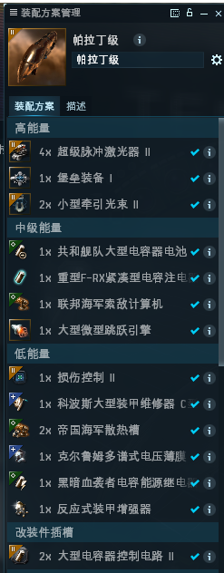
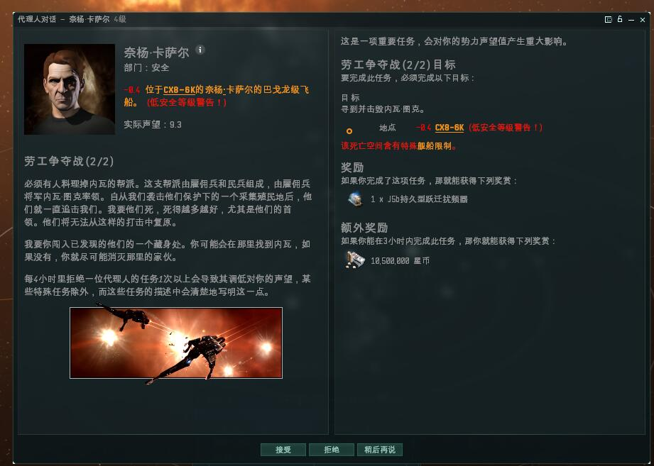
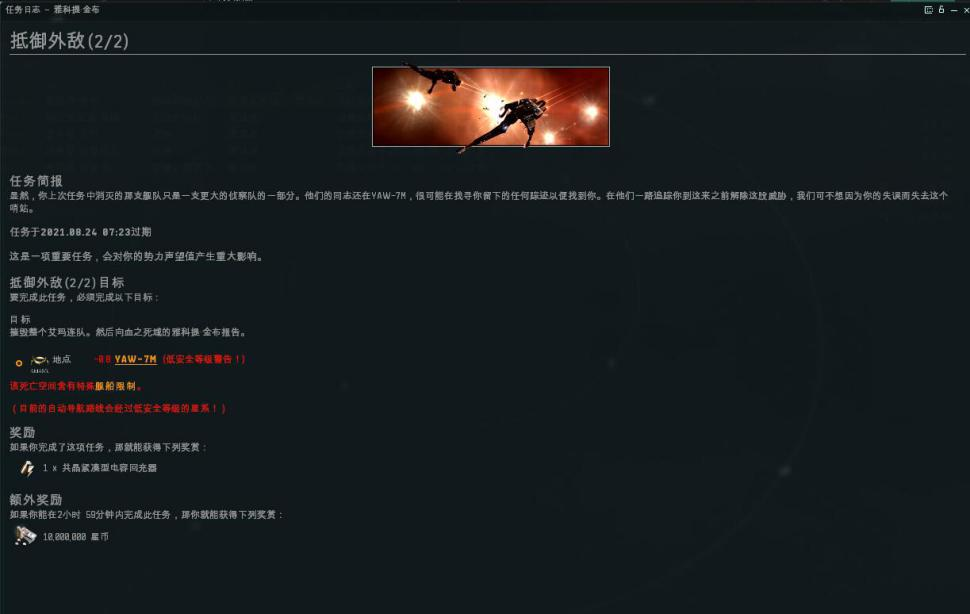
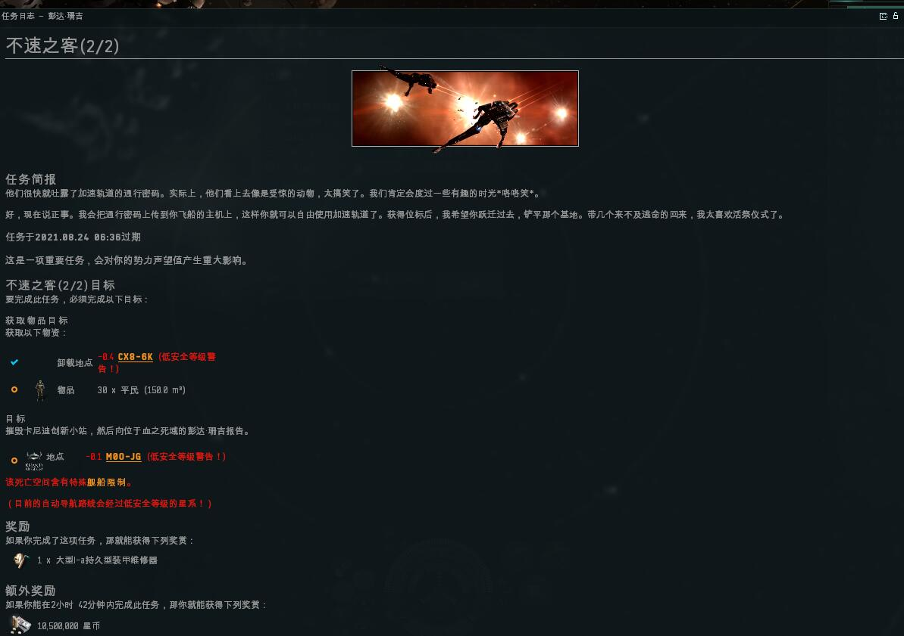
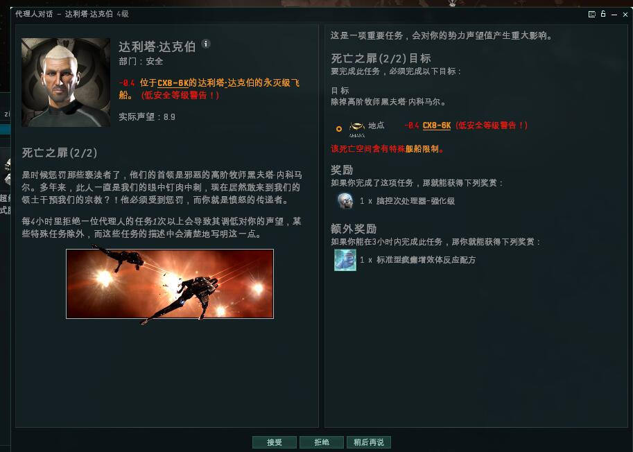
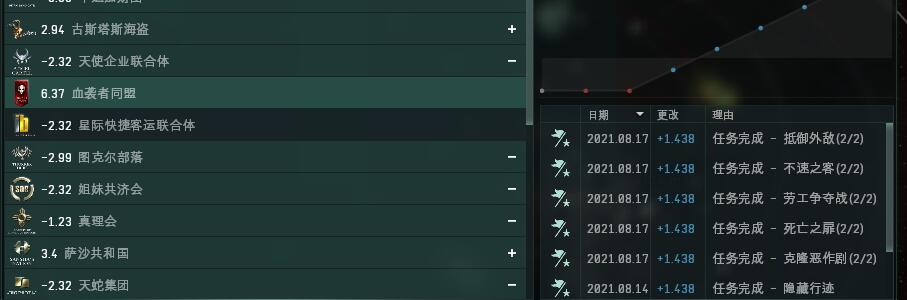

# 2.血之死域-血袭者4级空代

## 一．空代说明

 空间代理人是一次性故事线任务，给大量的势力声望，血袭者空代任务位于CX8-6K星系的血之死域空间内，一共五个代理人，对于我们刚冲上军团声望势力声望不足以很痛快拒绝任务的人员来讲是个很好的提升势力声望的途径。

## 二．声望要求

能接4级安全代理人

##  三．任务所用船只

 所有任务都需要击杀大量的NPC，所以我们使用我们的任务帕拉丁才能快速完成这些任务。

## 四．任务详细解析

###  1.劳工争取战

.png>)

第二步比较麻烦 要刷三波次的怪 最后的BOSS是个舰队指挥官

### 2.抵御外敌

.png>)

一层轨道：五波艾玛海军 

### 3.不速之客

.png>)

* 第一层两波无人机怪 
* 第二层一波无人机怪 
* 第三层卡尼迪怪一波

卡尼迪怪 三波全清，打完建筑掉平民

### 4.克隆恶作剧

.png>)

* 第一层轨道：三波次的血袭者怪 
* 第二层轨道：两波次的血袭者怪 
* 第三层轨道：四波次的血袭者怪（毁电很凶）

.jpg>)

一层轨道 五个战列怪，打完捡集装箱拿到任务物品。任务完成

### 5.死亡之罪

.png>)

任务要求我们去任务空间捡一个任务物品（在一个集装箱内，我们需要绕过中间的帕格拉曼通）拾取物品后离开，**千万不要接近或攻击死亡监察建筑**，会刷出海量的NPC，顶不住顶不住。

* 第一层：空无一人直接进 
* 第二层：三波艾玛海军怪 
* 第三层：攻击艾玛太空堡垒会依次刷四波艾玛海军怪最后刷出高阶牧师。

## 五．收益展示

这五个空代给接任务的角色带来了大量的势力声望，我们试验的角色初始血袭者同盟声望1.35，五个空代做完后势力声望达到了6.37（做任务的，你们应该懂什么意思了吧）

任务过程中击杀大量的艾玛海军及两个艾玛海军战列BOSS有大概1.2E的牌子，任务奖励在上面截图里看，除了一本4000万的技能书和一个加五属性插没有太好的东西。 \
攻略到此为止接下来我们做几点军团内说明。

## 六．军团代打

 这五个空代任务给大家带来大量的势力声望，可以很好解决势力声望小号势力声望不足而不敢拒绝任务的尴尬，所以当你没有PLD，又想提升这个势力声望的话，请用你的小号，开上一个货柜舱150以上的船只找老玩家代做。初步打算收雇佣费3E并收取所有任务奖励（如有不妥，后续再行修正），如需要带声望请提前预约，所有任务全部打完PLD也需要两小时到三小时的时间。
