# 3.00异常空间与远征

## 前言

刷**异常**触发**远征**是EVE里最普通的生产方式，在0.0地区有基础插件的支持下可以无限刷新，**赏金**也高，和高安异常一样有**远征**触发。

## 一．如何发现异常

我们通过我们的舰载扫描器找到异常，打开探针扫描器如下图所示

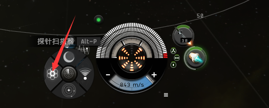

分离窗口

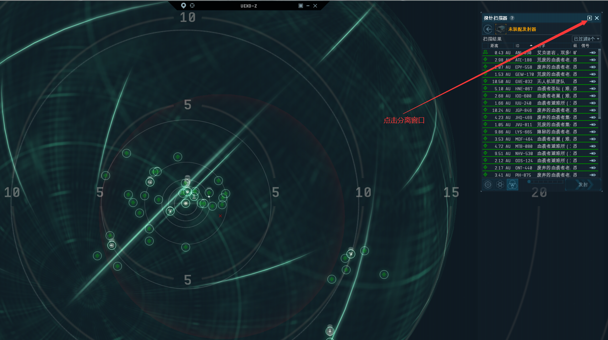

关闭**恒星系图**

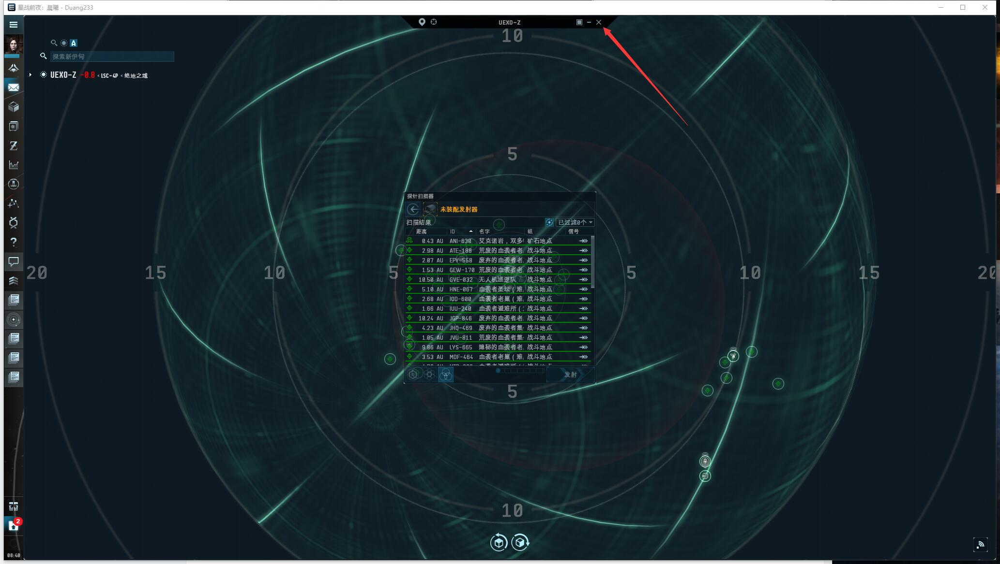

在筛选结果里把异常空间勾上就可以看到我们的异常空间

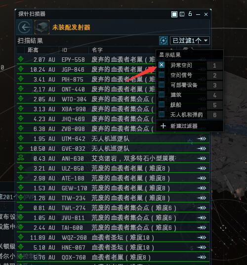


**00地区的异常每20分钟刷新一次**


## **二.推荐**舰船

### 配置

#### 1.预言级（Oracle）

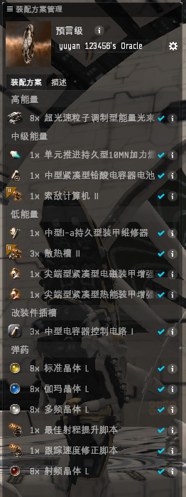

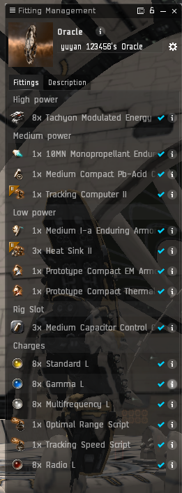

### 2.所需技能

以下技能用送的**一百万可分配技能点**即可点出来。


\[中文]\
艾玛护卫舰操作 3 \
艾玛驱逐舰操作 3 \
艾玛巡洋舰操作 3 \
艾玛战列巡洋舰操作 3

射击学 5 \
小型能量炮台研究 3 \
中型能量炮台研究 3 \
大型能量炮台研究 3 \
弹道分析学 4 \
外科手术打击理论 3 \
高速射击理论 3\
精确射击理论 4 \
受控点射理论 3 \
航迹预算学 3

维修系统理论 1

武器升级研究 4

导航学 3 \
加力燃烧器原理 3 \
规避机动理论 3 \
远距锁定研究 3



\[英语]\
Amarr Frigate 3\
Amarr Destroyer 3\
Amarr Cruiser 3\
Amarr Battlecruiser 3\
\
Gunnery 5\
Small Energy Turret 3\
Medium Energy Turret 3\
Large Energy Turret 3\
Trajectory Analysis 4\
Surgical Strike 3\
Rapid Firing 3\
[Sharpshooter](https://showinfo:3311) 4\
Controlled Bursts 3\
Motion Prediction 3\
\
Repair Systems 1\
\
Weapon Upgrades 4\
\
Navigation 3\
Afterburner 3\
Motion Prediction 3\
\
Long Range Targeting 3


## 三.开始赚钱

### 1.星带怪

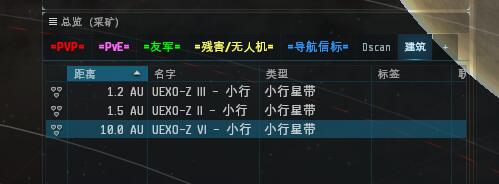

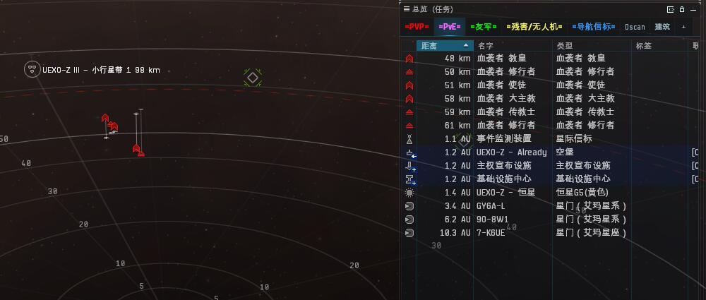

星带的怪难度低，有机率出**官员怪**（概率极低），官员怪有机率掉落**官员装**（紫装）或者 出**矿母**。

#### 如何识别官员怪：

看怪的名字，如：**德拉克里雅·梅隆、阿拉姆·伊施坦 **等等


**出官怪请立即跳走，同时记住哪个星带，然后找管理帮你打**


**如何识别矿母（航空母舰）：**

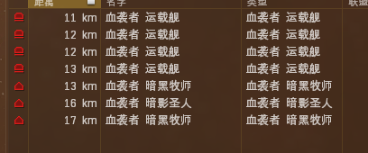

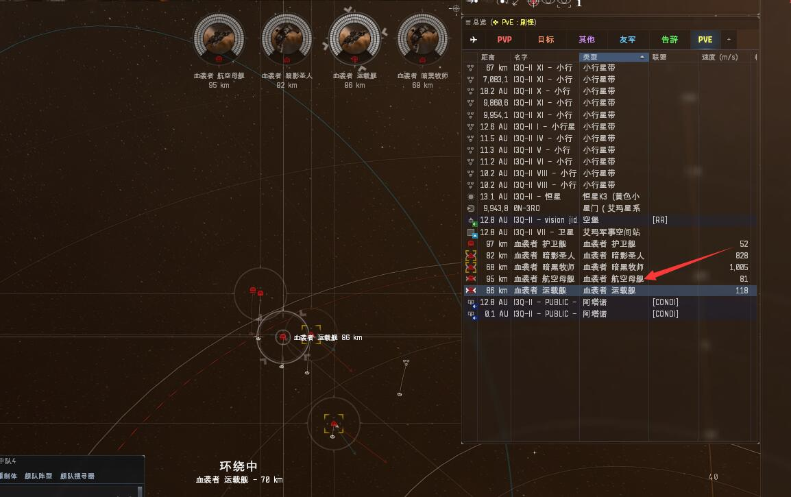


矿母会掉落大量矿，需要工业舰运输




**遇到怪名字带个◆（菱形）的怪，请立刻 马上 跑！！！！，他很凶**


### 2.异常空间

#### 血袭者港

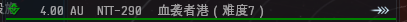

* 怪少，大怪居多

#### 血袭者集会

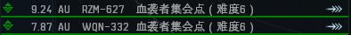

* 血袭者集会，小怪多，简单，会触发6-10，能卖1到1.5亿

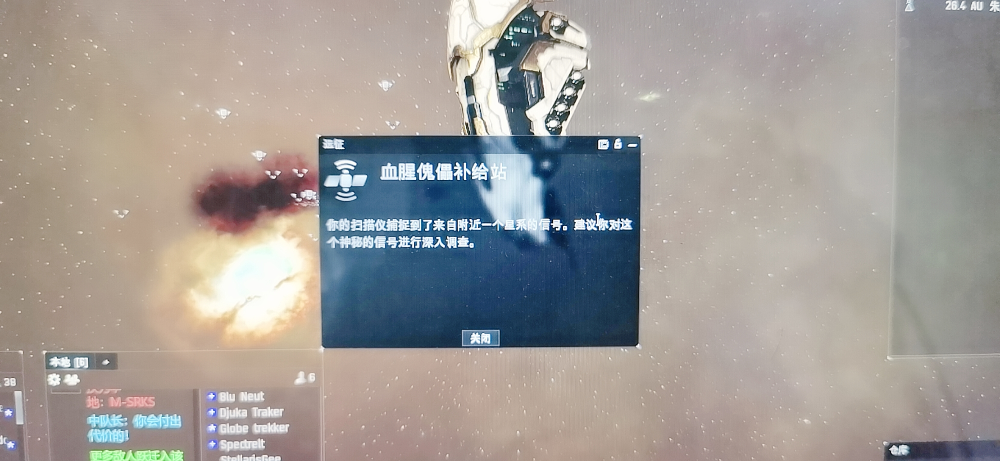

## 四.刷怪正确姿势

### 1.开黑啦语音

#### 为什么强制大家上线加舰队上开黑啦? （非常非常重要）

* **上线加舰队上开黑啦**是主权军团的基本要求，主要是为了大家能够相互沟通学习，更重要是保障大家的安全。希望大家能够严格遵守这一基本要求，多次上线刷怪不加舰队不上**开黑啦**，将会遵照军团**劝退流程**进行处理（**一次警告，二次罚款，三次劝退**）。

#### 如何使用开黑啦


[1.md](../../d7/1.md)


### 2.本地频道

本地频道显示的是进入本星系的人员（虫洞内本地频道不显示），右边的人物列表代表着有本星系（地图）有这些人。通过本地频道我们可以与同地图的进行交流，主要还是用来知晓哪些人与你在同一个星系。

#### **如何使用本地频道**

1. 本地频道区别于其他聊天频道，**一定要单独拖出来**。
2. 点击频道上方的三个小人按纽，将本地**显示精简模式**，根据本地人数将频道**拉长**，以能显示本地所有人为准。当本地出现：**白= **** ** **、橙- ** **、红- ** 都是**敌对**，请**规避跳走**.
3. 本地频道可以与玩家进行沟通，但**严禁骂人、侮辱性词汇及无意义刷屏**。

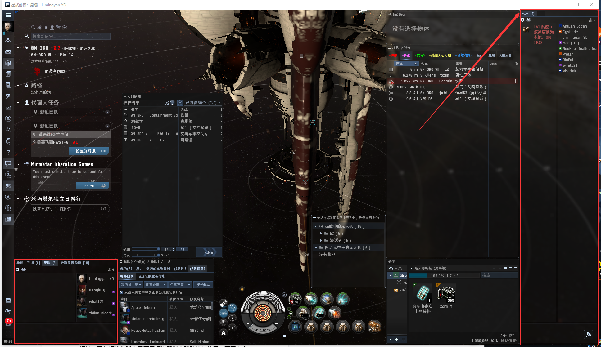

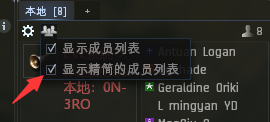


**反正一句话：本地频道进红请立即跳走！！！**


### 3.预警频道

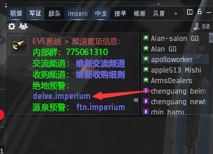

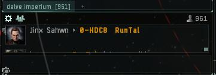

预警频道发的预警都是自己人或者友军发的，你可以从中提前预知敌人去向，两三跳位内有预警就需要**准备规避**

### **4.加值守舰队**

* 点开人物头像上方的**菜单>>社交>>舰队**>>在里面找到 值守舰队，一般命名**RR绝地值守**/**维新值守**。找不到的话**语音**询问值守管理，加入舰队值守舰队才有机会救你！

.png?alt=media\&token=627588c2-08f3-44a7-9983-cc7faec2faa0)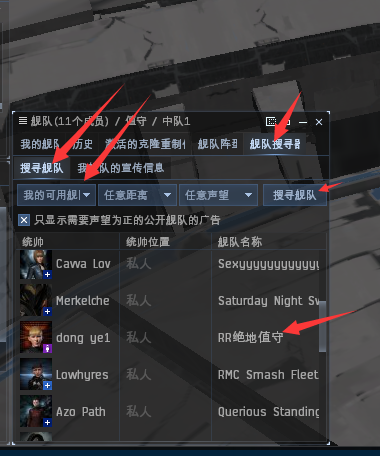

## 赏金机制

## 五.异常远征对照表

| 异常名称                                  | 远征名称&等级      |
| ------------------------------------- | ------------ |
| 血袭者集会点 （Blood Rally Point）            | 血腥傀儡补给站6-10  |
| 血袭者活动中心(Blood Hub)                    | 血袭者监狱8-10    |
| 血袭者港(Blood Port)                      | 血袭者协调中心7-10  |
| 废弃的血袭者集会点(Blood Forsaken Rally Point) | 血袭者监狱8-10    |
| 荒废的血袭者集会点 (Blood Forlorn Rally Point) | 血袭者监狱8-10    |
| 血袭者离弃老巢 ( Blood Forsaken Hub)/**小老巢** | 血袭者舰队集结点9-10 |
| 血袭者离弃老巢 ( Blood Forlorn Hub)/**大老巢**  | 血袭者舰队集结点9-10 |
| 血袭者避难所 (Blood Haven)                  | 血袭者海军船坞10-10 |
| 血袭者圣坛 (Blood Sanctum)                 | 血袭者海军船坞10-10 |

## 六.远征价格表

| 远征名称&等级                                       | 价格   |
| --------------------------------------------- | ---- |
| 6-10血腥傀儡补给站（Crimson Hand Supply Depot）        | 100m |
| 7-10血袭者协调中心（Blood Raider Coordination Center） | 60m  |
| 8-10血袭者监狱（Blood Raider Prison Camp）           | 60m  |
| 9-10血袭者舰队集结点（Dark Blood Fleet Staging Point）  | 60m  |
| 10-10血袭者海军船坞（Blood Raider Naval Shipyard）     | 100m |
