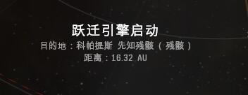
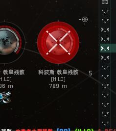
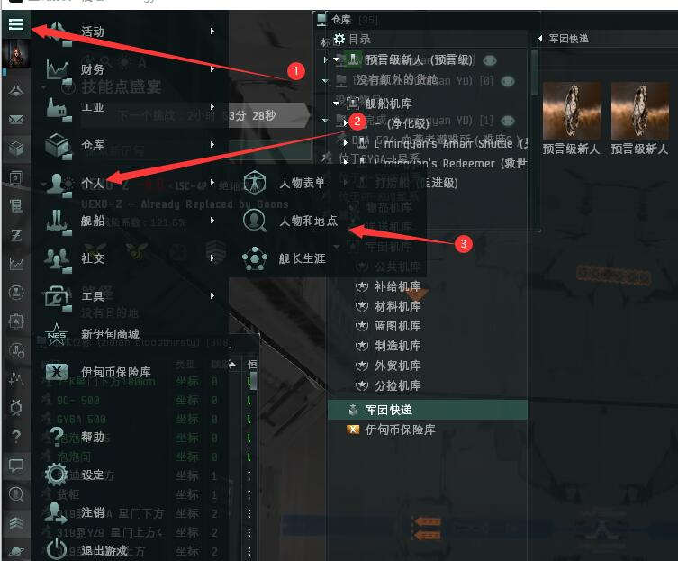
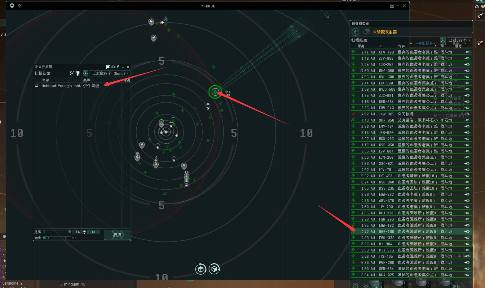

# 4.打捞残骸

## 前言

打捞就是捡怪残骸里面的东西和用打捞器提取出特殊材料，这些材料价值很高，用于制造。因为干打捞这行成本低，所以非常适合新人，下面会详细讲解一下如何打捞。

## 装备舰船

#### 促进级

## 如何打捞

首先，要找个打捞点，可以自己打**异常空间**生产一个，也可以打捞军团做的**打捞地点**

### 1.跳到打捞点

### 2.落地放牵引

**移动式牵引装置**：自动把半径125km内的残骸拉到身边并把里面的物品转移到自己仓库里，从近开始拉


1.最好右键牵引保存地点，避免走了找不到，收了删除点；\
2.放两个牵引没用，会互相拉残骸；


### 3.开始打捞

你站牵引旁边，**锁定**牵引拉过来的残骸，然后对着残骸使用打捞器，几轮就打捞成功

以下是打捞成功获得的

### 4.收尾

右键**牵引>>打开货柜>>全部拾取**

最后一共获得价值2.1千万的东西

## 军团打捞地点

1.在军团置顶信息有**生产文件夹**，连接一下

连接上后在**左上角菜单>>个人>>人物和地点**，就能看到军团的地点

#### 打捞地点里面的打捞点是给大家的，占领了请拖走或者删除

## 如何打捞盟友刷怪的残骸

### 五度定向法

1.先跳到一个可以定向到很多异常的点，绿色球就是定向范围，设置最大范围、360°，定向一下有没有生产船在外面

2.确认有了后，再设置最大范围和5°

3.按住V键不放然后鼠标点异常空间，他就会往这个异常方向扫描一下，只要在范围内，扫描到船说明有人在这个异常刷怪，右键保存下来

4.等待异常信号消失，扫描打完了，就可以跳保存的点过去捞了

## 打捞需遵守以下规则

1. 先到先得。扔MTU并不代表你拥有这个残骸点，如果你离开了这个残骸区域，别人来到了这个残骸区域，就等同于你的MTU在偷后来人的残骸。扔了MTU之后离开这个残骸区域，别人可以合法击毁你的MTU；
2. 禁止在行星带、矿异常或者没刷过的新异常扔MTU，禁止在别人正在刷还没有刷完的异常扔MTU；
3. 如果你正在刷怪，因为本地突然来白等原因，没有及时收MTU，请等敌对走之后，第一时间去收掉你的MTU，否则你的MTU可能被击毁；
4. 如果蓝加的MTU周围已经没有残骸，禁止专门用作战针把MTU扫出来打蓝加的MTU；
5. 改残骸箱子的名字：你可以打捞和拾取任何你可以找到的残骸，除非残骸的主人把残骸的箱子改名字了。如果残骸的主人没有改残骸箱子的名字而且残骸的主人不在残骸区域，你就可以随意打捞；
6. 军团共享的地点在未扔下MTU前不允许删除共享地点； 
