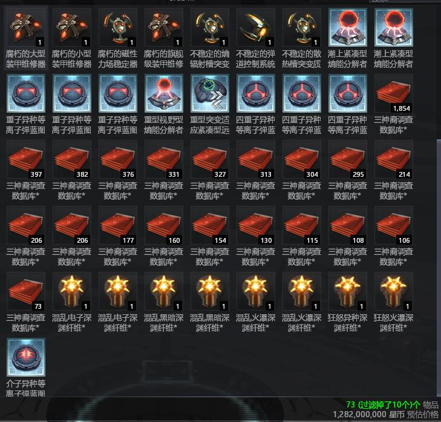
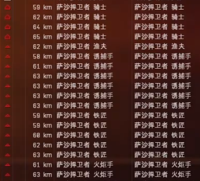

# 5.高级深渊生产指南

## 深渊的特征 

EVE中的深渊类似于其他游戏中的限时副本，可供1-3人进入完成三层PVE挑战并获得收益。进入深渊需要深渊纤维（贸易货物-纤维-xx纤维），根据进入的人数使用对应数量的纤维。使用后会在星系原地留下一个可被作战针定位的“深渊痕迹”，当进入者成功存活后会返回原星系原位置。

深渊可以单人T1、T2、势力巡洋（耗1纤维）、双人所有种类驱逐（耗2纤维）、三人所有种类护卫（耗3纤维）进入。同级别深渊三护卫的收益约为单巡洋的3倍，同理驱逐为单巡洋的2倍，此外三护卫收益略高于高一级单巡洋的收益。

.png>)

在深渊中定向扫描和本地频道会失效，只有重新返回到原星系后才会正常显示。

与异常空间和虫洞星系不同，深渊的挑战时间为**20分钟**，剩余时间归0仍未离开时会**强制爆船捏蛋无loot**，此外在深渊中**NPC会攻击玩家的太空舱**，这两点使得深渊成为EVE中风险最大的生产方式。

深渊生产的优势：可以在全宇宙任意一个星系生产，不受红绿灯的影响可实现全天23.5小时生产，高级深渊每小时收益喜人远超大航 深渊生产的劣势：深渊痕迹可被定位，高安被强暴00被爆船捏蛋，对玩家的技能、装备、操作要求较高，前期投入大，损船基本也损蛋容易血本无归

## 深渊基础知识 

深渊从易到难分为7个等级，深渊等级可以从纤维（钥匙）上突刺的个数看出。高等级深渊空间中每一层怪的总吨位更大，部分怪会有新的电子战（无人机战列多米怪从5级开始有15km网子），残血怪的起始血量更高，但获得的收益也更高。

.png>)

深渊有五个不同种类，每个产出的突变都不同，伽玛产护盾相关、火瀑产装甲相关、黑暗产加力/委曲相关、异种产网子/反跳相关、电子产电池/吸毁电相关，所有深渊都产低槽武器提升相关的突变（熵辐射槽、散热、弹道、磁稳、回转稳定），等级越高的深渊产出不稳定突变的概率越大，只有6级灾变深渊产出旗舰装备突变，6级异种产重网、重反突变

不同种类的深渊会给敌我双方上不同种类的**debuff**和**buff **

* **伽玛：**+50%舰船护盾、-50或70%爆抗 
* **火瀑：**+50%舰船装甲、-50或70%热抗 
* **黑暗：**+50%舰船速度、-50或70%炮台射程 
* **异种：**+50%扫描分辨率、-50或70%动抗 
* **电子：**+50%回电速度、-50或70%电抗 

0\~3级深渊会出现-30%抗性的情况 \
每一局深渊中buff和debuff都是固定的，不会出现第一层-50%抗性第二层-70%

.png>)

深渊中有三种云和两种塔会对船和怪造成影响，三种云分别为：

* **超光速云：**白色增加舰船速度；
* **纤维云：**红色增加修盾耗电；
* **信号云：**蓝色增加信号半径；

两种塔分别为：

* 多体追踪塔：加炮台转速
* 自动抑制器（火花塔）：火花塔又分为近距离（15km伤害高）和中距离（40km伤害中等），会对范围内的无人机和导弹持续造成伤害；

## 深渊的收益 

深渊中所有怪均无残骸可loot和打捞，收益来自于轨道旁的生化贮藏（箱子）和各个节点，在总览上均以红色圆圈表示。 每局深渊固定产出三种物品：调查数据库（红书）、凝缩液（红水/可乐）和同位聚合体（-10），其中红书10w/个由统合部空间站固定收购，红水和-10是制作三神裔相关物品的材料。

.png>)

## 深渊的配置 

目前双开驱逐没有稳定过6级的配置，本文在这里仅给出单开yst/三开审判的配置、技能和相应打法。这里推荐yst而不是毒蜥是因为yst的伤害更高并且有损控续命，委曲配置可以用速度规避很多伤害和毁电，在高安甚至可以秒跳防强暴。三战鹰在黑暗本中会碰到非常非常困难的波次所以不推荐。本文的yst通刷6级除黑暗之外的所有深渊，审判可用于6级电子和火瀑。 

单开巡洋，可根据技能、经济状况以及装配空间盈余将武器换成势力，委曲和全抗换成A型，损控换成深渊或势力，个别格鲁汀换成高水。植入体5号可上高水，7-9可根据自身需要上炮台DPS或黄衫侠、回电以及回盾相关脑插提高生存率。作者用这套配置在测试服尝试50次伽玛未曾翻车，正式服可采用高配。成船价格约为4-5B。

三开审判，可将散热换为T2、主动热抗换为势力。三条的价格约为1.2B。此配置对使用者手速、深渊经验等均有较高要求，务必在测试服熟练运用后才用于正式服生产

双开寒鸦打黑暗（不推荐）：[https://www.youtube.com/watch?v=hCC-oDA3IUs](https://www.youtube.com/watch?v=hCC-oDA3IUs) \
B站搬运为[https://www.bilibili.com/video/BV1yp4y1b74E](https://www.bilibili.com/video/BV1yp4y1b74E) 

此配置非常廉价两条3e，存在一定会翻车的波次，作者测试通关率仅为三成。 深渊的技能要求 单开巡洋建议为主号 重型突击舰操作IV以上（越高越安全） 小型脉冲激光专业研究IV以上 工程学电容、CPU、PG相关技能全满，双武器升级IV以上 导航学高速机动理论IV，其余相关技能全满 无人机相关技能毕业 护盾相关技能毕业 两壁虎、两金星一大黄蜂再配合灼烧有1000DPS左右即为合格

### 三开审判所需技能 


飞船操控学：\
A护卫V\
轻型突击舰操作V

改装件： \
结构改装技术III \
能量武器改装技术III 

导航学：\
加力燃烧器原理V\
加速控制理论IV\
导航学V\
燃料节约技术IV 

射击学：\
受控点射IV\
外科手术打击V\
射击学V\
小型集束激光专业研究IV\
弹道分析学IV\
航迹预算学IV\
精确射击理论V\
高速射击理论V 

工程学：\
CPU、PG、电容相关技能全满\
双武器升级 IV\
抗性定向 IV\
热力学 III 

装甲：\
4种补偿理论全IV\
远程装甲维修IV\
船体加固V 

神经增强：\
坚韧心理学I\
生物学V\
神经毒化控制理论I\
神经毒化抵抗理论I以上 

全套10.5M技能点左右，三个号都必须都满足以上要求 配置中的审判白蛋不嗑药用海军白球有300dps，过量电容回充在10%左右，速度980m/s即为合格


## 深渊的小技巧 

单开巡洋推荐带林鼠/喜鹊mtu捡节点，每一层过门前手动关修控电至70%电再开修过门可防止过门掉线等意外情况

三开审判只有轨道附近的生化贮藏是三倍收益，所以不需要像巡洋把其他全部节点捡完，加力配置满技能只有1007速，所以为了节省时间必须提前冲门。审判能剩多少时间完成取决于操作手法以及冲门的时机，一点时间都不能浪费。除此之外，审判每次过门前务必保持红球（极光）装填并重新开反应甲确保抗性均匀。

每进新的一层都有大约一分钟的无敌时间，此时第一层船只静止而二、三层船只会逐渐往轨道漂，巡洋可利用这段时间拉近与部分怪的距离直接贴脸刚，护卫则利用时间标记怪的击杀顺序。一旦船只开始移动/锁定则无敌消失。

深渊怪会优先攻击首先移动的物体（往轨道漂不算），所以有些整活船只会先释放无人机再移动船只，这样怪会优先攻击无人机。三开审判时领航号需要首先移动再点击重组队，这样怪会优先集火领航号。除移动外，锁定也会激活怪的攻击机制，而在无敌时间中点击停船、开关装备、切换弹药等均不会解除无敌。

三层深渊完成返回原星系时同样有一分钟的无敌时间，当船只起速度或开始锁定时无敌结束。委曲yst配置可利用这一分钟保持静止、超载一轮委曲并在读条转至80%左右时点击跃迁本地建筑可达到近似于假隐跳的秒跳效果，作者曾用这方法两次在强暴党面前起跳离开。

深渊的超出边界伤害是随着偏离边界距离递增而递增的全伤，受飞船的抗性装备影响。所以出界一点点并不会即死，yst可用突击损控短时间减少大量伤害往回拉。

审判的射程为红球（极光）48km、紫球（紫外）25km、蓝球（伽玛）18km、白球（多频）12km，实际生产时需要牢记不同弹药的射程并及时切换弹药保证伤害足够避免超时。

深渊总时间20分钟需要打三层怪，平均每一层耗时6分40秒，对单开巡洋来说此安全线完全足够，而审判只有4冬眠战列的波次才会打7分钟，其余波次均在此安全线内。

在开始生产前，强烈建议把战术视图打开并把视角拉至最远，这样可以清楚地看到怪的相对位置以及距离。在战术视图上用Q走位，第一次Q水平方向拉第二次Q调整仰角，船会向蓝线方向移动

总览采用图标小箭头朝上，并单独把标签一列拉出来放到图标旁边可看到标记顺序，确保集火效率。同时此总览能快速区分不同吨位和类型的怪，非常方便。

生产时建议将画质调至最低，这样可清楚地看到深渊的边界以及各种云的范围还能减轻电脑负担，加速云为淡白色需要特别注意。

## 深渊的具体打法 

虽然深渊里面怪的组合与种类完全随机，但可根据种类分为以下7类怪，并且每一层怪的总吨位固定，也就是说同一类型的怪有可能出现纯巡洋或纯护卫等极端情况。接下来会分别介绍单开巡洋以及三开审判应对不同组合的打法，审判以**粗字**表示。

在讲解具体打法之前，先介绍一下不同怪的电子战属性，这在实战中的击杀顺序尤其重要，在彻底掌握之前建议先打3、4级深渊练手。

自由无人机：深渊主宰（15km网）、诱捕（网子）、唤雾（炮扰）、熔铸（遥修） 

流浪者巡洋：缠绕（网子）、非跃迁（短反）、无弹药（毁电） 冬眠巡洋：纠缠者（网子）、捕鱼者（短反）、游荡者（毁电）、迷惑者（炮扰） 冬眠无人机：典狱官（网子）、支持者（网子）、防火员（毁电）、哨兵（毁电）、看守者（遥修）、保护者（遥修） 

三神裔：游荡XXX（炮扰）、纠结XXX（网子）、锚定XXX（短反）、饥饿XXX（毁电）、复原XXX（遥修量更大）、炫目XXX（感应抑制），所有三神裔均会互相遥修，但洛迪瓦之间不互修 

萨沙：骑士（网子+毁电）、牧师（遥修）、诱捕手（网子）、铁匠（毁电）、哨卫（感应抑制）、传令官（炮扰）

统合部：标记（标记）、抓捕（网子）、掠能（毁电） 天使：塞纳波（网子+毁电+转火无人机）、德拉米尔（转火无人机）、狂怒（毁电）、回声（短反）

## 具体打法 

建议巡洋每一层开始操作为拉朝向、丢无人机、锁怪开火打箱子。巡洋提高效率的诀窍在于分散无人机火力，例如两壁虎分开打两个，两金星+大黄蜂打另一个即可同时打三个怪，大黄蜂优先全场马拉松打掉所有节点再跟着金星打怪。

三开审判操作为（停船）、领航号标记怪顺序、领航号拉朝向、重组队、切僚机互锁队友、给领航号挂修、锁怪、开火，**审判永远红球过门，常用紫、蓝打ved，蓝球打冬眠和流浪巡洋，白球打护卫，所有毁电网子怪优先集火，其余巡洋、护卫怪可分散火力**

### 无人机主宰（多米）

巡洋：边清掉网子、炮扰怪边侧向接近多米，之后环绕多米500 \
**审判：同上，三个号分别环绕多米500，被网住的号手动走位环绕多米，白球打多米，可拿一个号顺便清熔铸，多米半结构时重组队冲箱子。**

### 洛迪瓦+无人机 

巡洋：边往自动抑制塔（火花塔）移动边清诱捕和唤雾，之后在火花塔范围内清洛迪瓦 \
**审判：优先清理诱捕，闪针和烬矛太多时清完诱捕后优先击杀，曲线接近火花塔，防御压力太大时提前超载领航号热抗，僚机遥修，之后紫球/蓝球打洛迪瓦**

### 无人机战巡 

巡洋：优先击杀诱捕，手动环绕战巡14km以上，优先攻击对你闪黄的战巡（转火无人机），被打的无人机可返回并环绕拉出战巡攻击范围即可，剩余4个时可上去贴脸刚 \
**审判：优先击杀诱捕，侧拉清完诱捕后手动环岛走位集火战巡，根据距离用紫球、蓝球，剩余四个时捡箱子冲门**

### 纯无人机护卫 

巡洋：环绕火花塔500优先清诱捕唤雾，之后烬矛 \
**审判：看具体地形和火花塔距离选择反拉至边界或环绕火花塔500，清完诱捕后优先闪针和烬矛，这两种无人机伤害最高，数量越多越危险，要第一时间给领航号挂修，领航号超载主动抗**

### 卡律+冬眠巡洋/流浪巡洋（卡爹） 

巡洋：侧拉清掉短反然后毁电网子，曲线接近卡爹进20km后环绕卡爹500，用壁虎+激光绿球打卡爹，轻中无打网子、毁电和其他，近距离环绕卡爹给网住也不会被打中，优先把毁电怪清至四个以下，操作不好很容易死 \
**审判：侧拉清掉网子然后毁电，曲线接近卡爹环绕500切白球集火打，剩半结构时冲箱子，之后清掉其他巡洋。有加速云时三个号分开环绕卡爹，半结构时点重组队**

### 冬眠巡洋海+护卫（白色背景为加速云）

巡洋：侧拉清掉捕鱼者然后典狱官防火员，之后优先毁电再网子，防御压力不大可在门附近下mtu \
**审判：反拉清掉典狱官防火员然后毁电、网子，贴边后可环绕僚机硬抗，防御压力不大且网子较少时可边冲箱子边清怪。冲门时清怪顺序清醒巡洋>其他巡洋，因为清醒怪速度慢会给拉开距离，其他巡洋一直在身边可用蓝球打**

### 冬眠战列（4乌龟） 

巡洋：利用无敌时间向前滑行至战列主动锁你再动，直接上去贴脸集火绿球打，可顺手清掉毁电网子护卫 **审判：进去马上冲箱子捡之后环绕战列500，红球切白球集火硬打顺手秒掉毁电网子怪 此层为dps check，纯粹拖时间，审判极有可能超出时间安全线，火瀑本时间压力极大。根据深渊总吨位不同，5级3战列6级4战列**

### 德雷+kiki 

巡洋：侧拉清掉反跳之后集火kiki，纠结>游荡，注意kiki会转火无人机，清完后环绕德雷500贴脸切绿球刚 \
**审判：侧拉清掉毁电后观察情况，若kiki不冲上前则侧拉集火清kiki至4个时冲德雷脸，仍然优先kiki后白球打德雷；若kiki冲前则马上反拉至边界然后侧拉贴边界走，红球清kiki至4个再冲德雷脸，击杀顺序纠结>游荡，贴边后谁近打谁**

### 纯kiki


**审判极危险**


巡洋：侧拉之后打法同上 \
**审判：开局标记怪后立马反拉至边界贴边走位，若kiki近于30km则需超载推子，优先护卫毁电，之后看距离决定先游荡还是先纠结，打kiki时全程红球远狙 Kiki伤害极高，被近身审判必死，但开推1200速的kiki追不上委曲巡洋所以较安全**

### 洛迪瓦+kiki 


**审判危险**


巡洋：侧拉优先集火洛迪瓦之后kiki \
**审判：先毁电，然后清洛迪瓦至1个再打kiki，开局反拉至边界然后贴边走位，红球远狙。Kiki剩4个时打完洛迪瓦冲箱子切紫球打冲脸kiki 洛迪瓦之间不互修，所以洛迪瓦越多越安全**

### Ved+护卫


**均危险**


巡洋：开局反拉至边界，优先清理锚定纠结护卫，至边界时可适当侧拉等ved上来之后超载两轮委屈冲门，之后拉直线风筝ved，全无人机集火慢慢磨血，剩3个ved时可冲脸环绕ved硬刚 \
**审判：开局反拉至边界，优先集火纠结饥饿护卫，之后环岛走位紫球/蓝球集火饥饿>可怕ved保持在20km左右，炮扰太多可切红球集火。可怕ved有两种，一种是直接10km贴脸；另一种跟饥饿ved一样保持在20km左右，后一种环岛绕死，前一种对冲用白球打，剩一个ved时冲箱子。**反拉至边界时回头看一眼往饥饿ved少的那一侧环岛，注意避开转速塔和信号云否则必死，具体操作可看[https://www.bilibili.com/video/BV1GA411J7YJ](https://www.bilibili.com/video/BV1GA411J7YJ) 此关巡洋越多越安全，护卫越多越危险，护卫多巡洋少的波次yst优先击杀毁电，手动开修控电硬抗伤害；审判能硬抗一个ved的伤害，超载主动抗遥修优先击杀毁电护卫然后毁电巡洋。审判走位失误给毁电巡洋贴身会空电，必死

### 勒沙克


**审判危险**


巡洋：饥饿太多则开局反拉清完饥饿之后炫目>复原>纠结>其他,饥饿少可以利用无敌时间滑行至30km处贴脸速杀饥饿炫目其他，全程无人机集火，大黄蜂马拉松打节点 \
**审判：进去就动，饥饿太多就清至剩两个，其余情况炫目>复原>饥饿>其他。炫目、饥饿、复原会逐渐远离你，其余接近。**前三者太多时需要“赶牛”往同一个方向驱赶再切红/紫球清掉，具体视频可看[https://www.bilibili.com/video/BV1pM4y1T7Kp](https://www.bilibili.com/video/BV1pM4y1T7Kp) 前两层，处理不好怪跑太远很浪费时间，极有可能一层7-8分钟，审判空电优先开推，然后热抗

### 维拉三神裔 

巡洋：侧拉集火清掉锚定、纠结就可以集火维德马克，可分大黄蜂和金星去清护卫，这种三神裔不会互相遥修，环绕mtu500m即可 \
**审判：反拉白球集火清护卫，顺序是纠结>游荡>其他，等护卫全部清完再紫球/蓝球集火ved，冲箱子时可换紫球和红球。有火花塔优先带到火花塔附近烫蜂群。** \
这层只需要清完所有三神裔即可过门，放出的维拉蜂群不用管。

### 萨沙 

巡洋：侧拉集火骑士，然后牧师，之后分散火力打诱捕、铁匠，哪个怪闪黄转火无人机就先打谁，保持离全部怪35km以上 \
**审判：反向侧拉优先集火哨卫=传令官>牧师，之后分散火力打护卫谁近打谁，可贴边注意保持怪的距离30km以上，最后打骑士，全程红球远狙**

### 元帅（巡洋可能危险） 

巡洋：进去直接反拉，避开信号云，顺序元帅>雷毅>闪电链巡洋>执法者巡洋，保持离元帅距离75km以上，重突V能打82km，IV只能77km比较危险，剩一个元帅时可以冲箱子，所以尽量学重突V生存性更高 \
**审判：侧拉清掉毁电网子后环绕元帅500切白球集火，元帅的网子没有威胁，但毁电元帅太多得先反拉清完再冲脸打其他元帅，保持推子开，关推掉速度必死**

天使（审判操作较多） 

巡洋：进去尽量反拉延长接敌时间，顺序普通塞纳波>精英塞纳波>德拉米尔>精英德拉米尔，杀掉第一个塞纳波之后两壁虎打下一个塞纳波，金星打德拉米尔，大黄蜂马拉松打节点，用紫球激光补伤害，注意无人机血量，塞纳波和小德会转火无人机，塞纳波太多可开一轮突损 \
**审判：进去立马停船关推，环绕僚机500，重组队硬抗，先打一个精英塞纳波因为其跑的比普通更快，看距离近身切白球打，打掉一个后集火打普通塞纳波，之后精英塞纳波、狂怒，僚机第一时间给领航号挂修必要时超载，塞纳波太多可超载白球打，清完塞纳波狂怒网子后可开推冲箱子，**此配置最多抗6个塞纳波，7个及以上有可能空电死（碰到的几率很低）

#### 全组合讲解到此结束 

永远对深渊保持一颗敬畏之心，熟练工有时也会因一时的贪心或失误而翻车，作为一种eve里最高效最便捷也最危险的生产方式要求时刻谨慎，马虎不得 最后建议想生产的同学先在测试服彻底熟练，6级至少30次不翻车再去正式服应用，一开始必然要交很多学费，唯多练二字可破。

