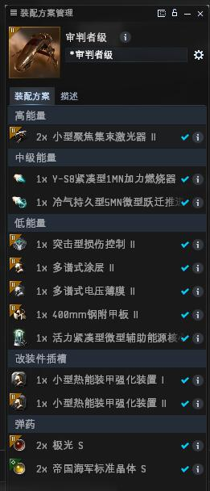
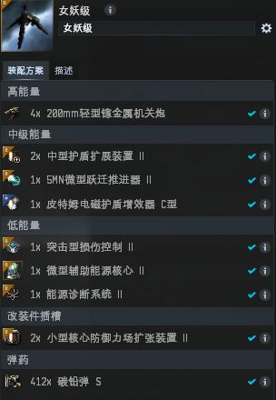

# 6.深渊扒手攻略

## 一.机制说明

这个机制是利用服务器维护（每天晚上七点），服务器强制关闭的特点；在DT前进入深渊，抢取第一层深渊空间的箱子等待维护强制关机，维护后我们的船只会被强制弹出在深空。这样我们就拿到了三分之一的深渊收益。

## 二.钥匙选择：

因为我们花费深渊纤维并只拾取一层的收益，所以钥匙的价格和深渊的等级对我们的收益影响至关重要。所以在深渊等级选择上，我们选择六级深渊，以保证我们每天的收益。在深渊种类的选择上，我们选择伽马或火爆钥匙（这两个钥匙价格非常便宜）。

所以钥匙选择就毋庸置疑：灾变伽玛深渊纤维和灾变火瀑纤维（火瀑更适合我们）。

.png>)

## 三.深渊方式选择

大家都知道深渊纤维分为三种深渊形式：三护卫、两驱逐与单巡洋；所以在深渊形式选择上，我们选择**三护卫深渊模式**（此深渊模式收益是单巡洋收益的三倍，相应地也要消耗三把钥匙）

## 四.舰船选择

突击护卫舰由于有突击损控（10S左右的BKB无敌模式)所以，我们选择突击护卫舰完成这项任务，结合本团技能情况现在向大家推荐的是**审判级**配置如下

女妖级有效更高，更稳

## 五.具体操作

1. 维护前看好维护倒计时，我们在维护剩余1分30秒的时候激活深渊空间并进入
2. 进入深渊以后我们会有一分钟的无敌时间，当倒计时35秒的时候，我们超载我们的微曲冲向生化储藏箱子（最好用Q走位），
3. 在冲向生化箱子的过程中，我们锁定箱子开火，接近残骸拾取所有
4. 利用突击损控加力等保命手段坚持到维护关机。


说明：这个操作时间大家可以到测试服先行测试


## 最后收益说明：

正常来讲每层深渊收益都会在一亿以上，红的话能达到三亿，如此坚持几天，月卡是不是就有了？
