# 1.开黑啦语音工具

## 前言

开黑啦是一款语音交流和文字聊天软件，主打语音，支持IOS，Android，Windows设备。军团日常生产值守、小队作战、教学、开会、联盟作战等等都用这个软件，联盟起PING也会通知全体成员。


**最后提醒大家：上线请上开黑啦！**


## 授权前注意事项


**必须先注册联盟ESI**


### 怎么注册呢？

****[**点我查看！！！！！**](../jrwm/4.md#yi-.-ti-jiao-lian-meng-esi)****

## 使用指南

### 1.下载安装

**官方网站：**[**https://www.kaiheila.cn/**](https://www.kaiheila.cn)****

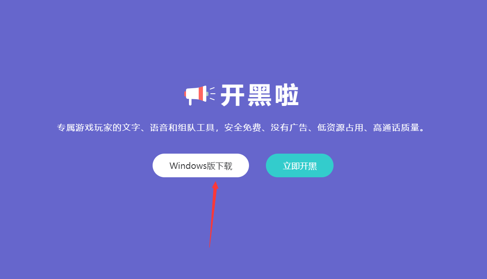

### 2.注册账号

输入手机号码，获取输入验证码。

**邀请码：80361995**

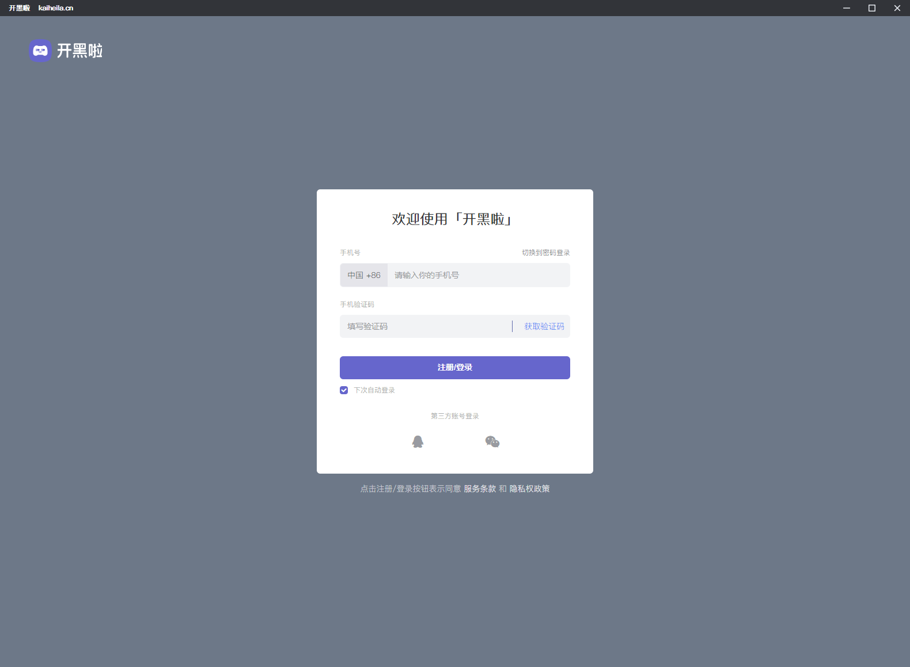


**这里一定要手机号码注册，还有邀请码一定要填写**


### 3.加入服务器

搜索“Ranger Regiment”，点击进入

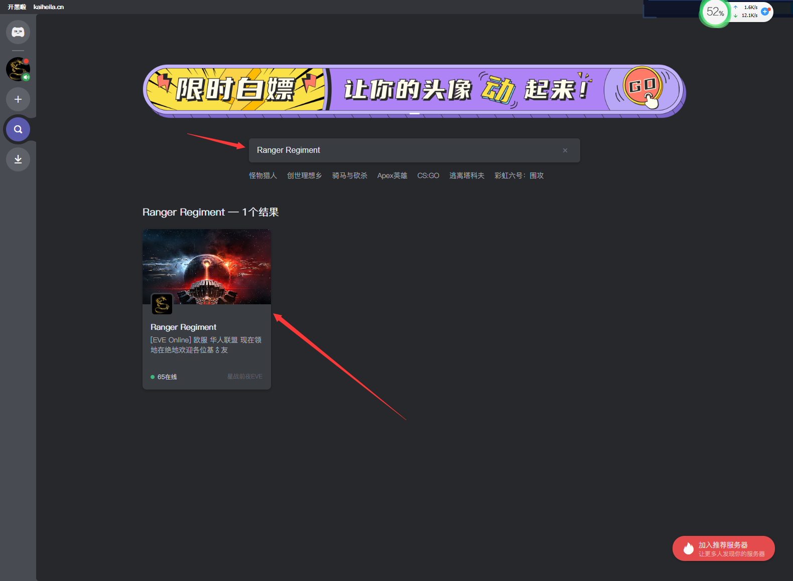

点击加入服务器

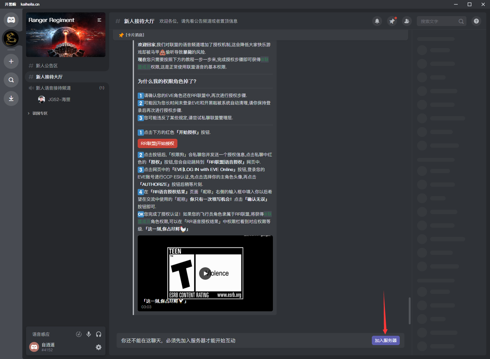

### 4.授权

点击“展开全部”

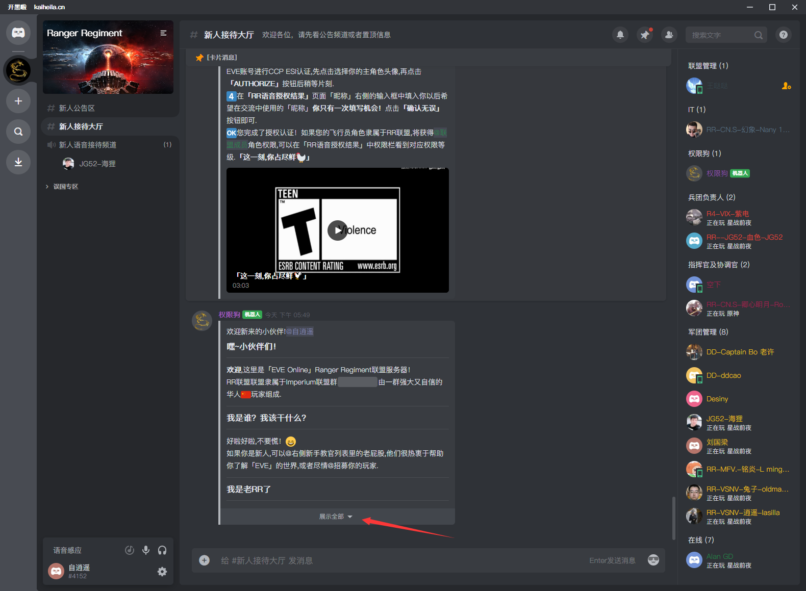

点击红色按钮“开始授权”

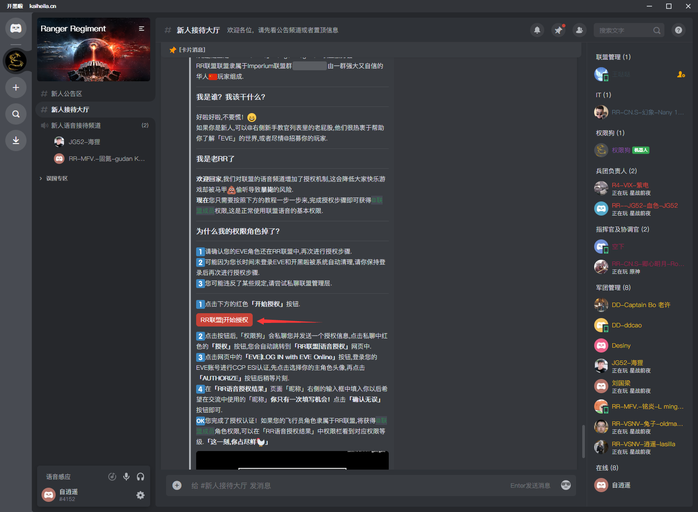

右下角提示“操作成功”，等一会，授权狗会私聊发给你，点击“授权“，会跳到浏览器

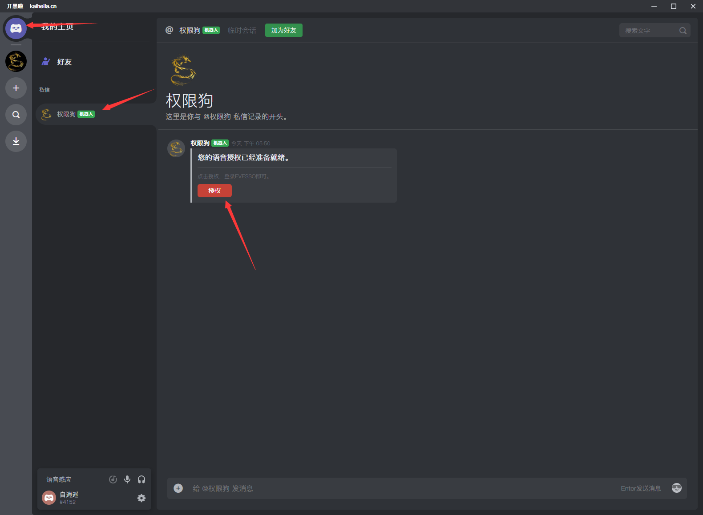

然后登录你的游戏账号

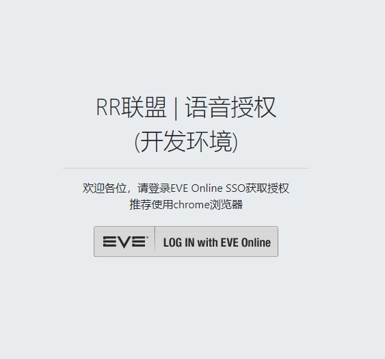

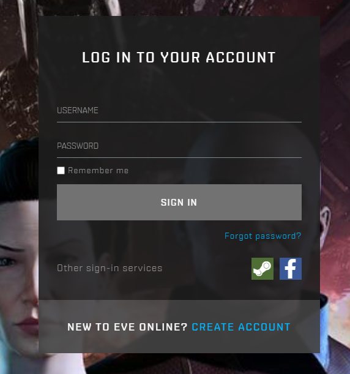

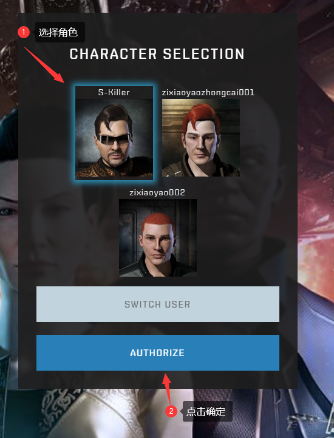

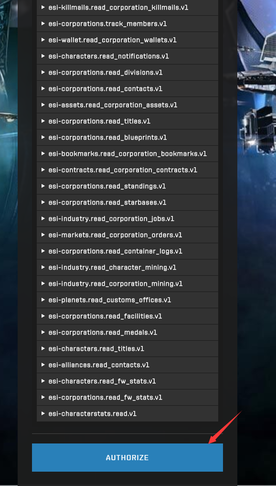


这里拉到最下面


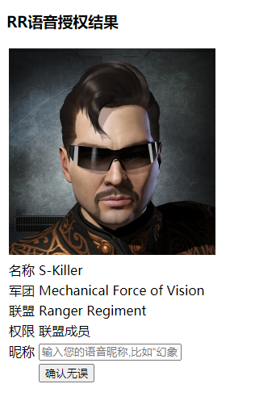

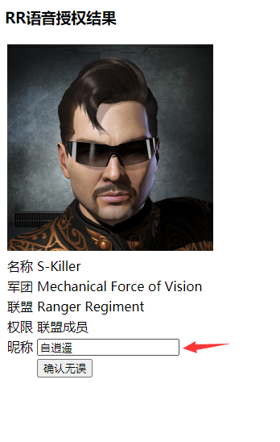

点击“确认无误“


**这里只填写你昵称就行，格式会自动生成！！**


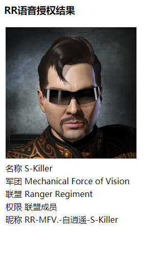

### 5.授权第四兵团权限

找 **紫电** 或者 **铭炎** 给你权限，授权后就可以看到频道了。

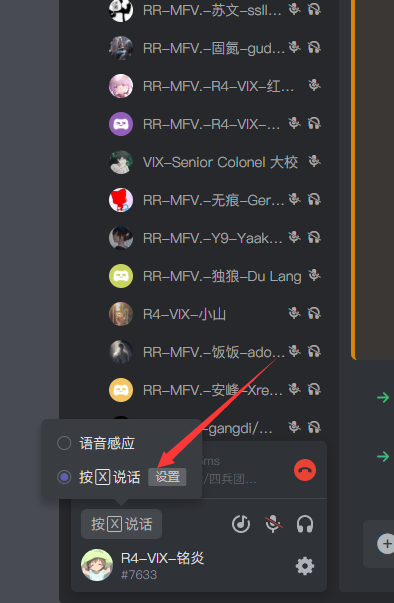


麻烦各位设置按键说话！！！！吵死了


### 6.进入绝地值守频道

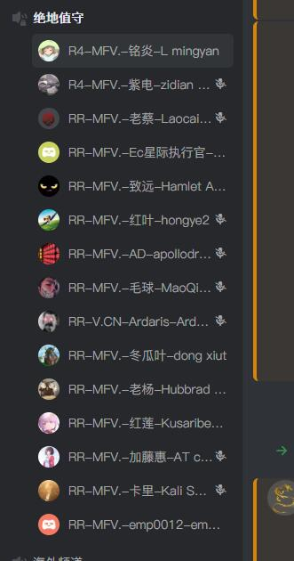
