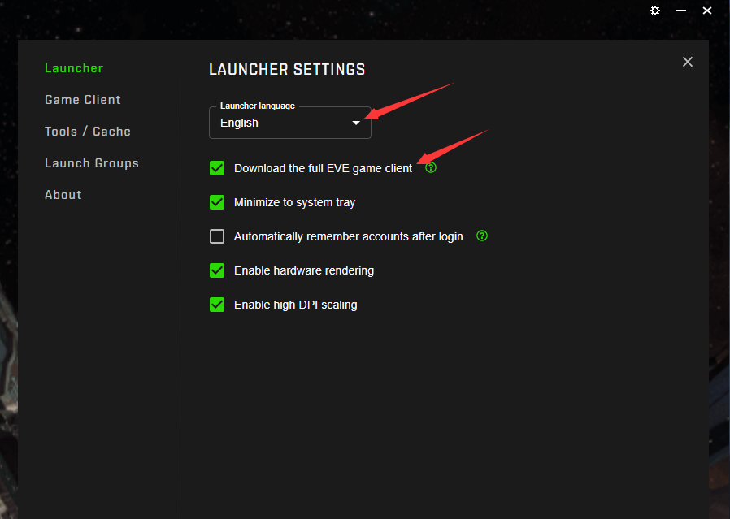

# 2.下载与安装

## 关于下载

#### 1.官网下载

下载地址：[https://www.eveonline.com/download](https://www.eveonline.com/download)

直接点击“DOWNLOAD EVE ONLINE”下载客户端

#### 2.接待群共享文件下载

下载群文件共享的：官网安装包.exe 后进行安装。

## 设置下载全部资源

默认情况下只会下载最低要求的资源，等你需要的时候才会补充下载，这样会导致玩着玩着黑屏好久。所以为了有良好的游戏体验，请你设置一下，让客户端下载全部游戏资源，并耐心等待下载完成。具体设置步骤如下：

* 点击客户端左上角小齿轮

* 语言选择：English（英语），然后打钩Download the full EVE game client，关闭设置页面稍等一会就会开始下载

