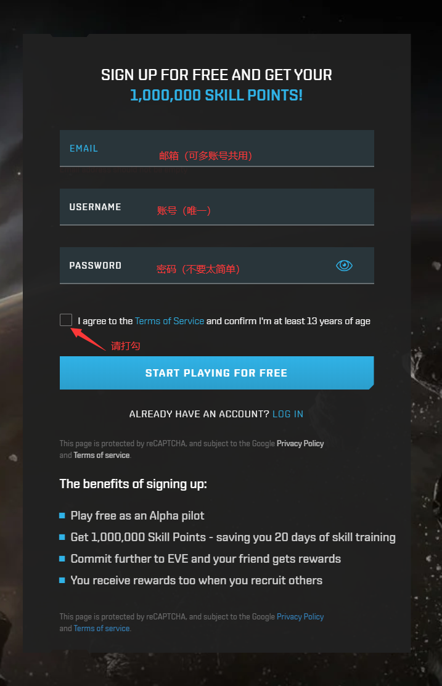
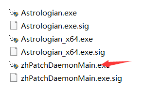
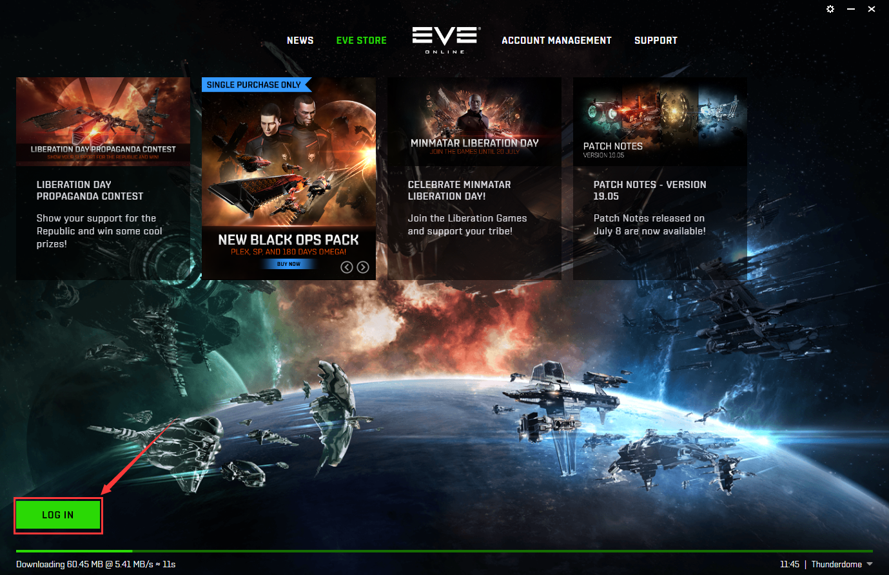
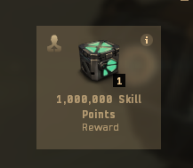
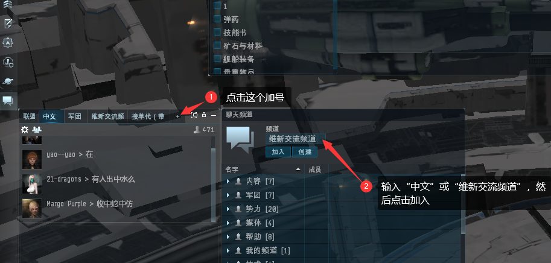

# 3.注册、汉化与创建角色

## 注册账号

游戏可以通过两种途径注册账号：

1、直接注册 （不推荐）

2、邀请链接（推荐）

&#x20;       邀请链接是老玩家邀请新玩家的一种方式。老玩家生成邀请链接发给新人，新人用邀请链接注册后的帐号会有100万自由技能点，如果新人进行充值，则老玩家会有半个月的游戏时间，通常情况下老玩家会以游戏币（6亿星币）的形式回馈给新玩家。这样新人进入游戏会有足够的技能点和游戏币进行起步，对新人成长非常重要、非常重要、非常重要。

#### 邀请链接：[https://www.eveonline.com/signup?invc=e83ca361-9cd8-4326-b13e-aa2b69e56b1e](https://www.eveonline.com/signup?invc=e83ca361-9cd8-4326-b13e-aa2b69e56b1e)

#### 领取请找群主 紫电


充值后请第一时间联系以便查证，带上账户注册时间和角色截图领6亿星币


## 游戏汉化

在群文件里找到**汉化最新版.zip**，（汉化官网：[https://zhpatch2.evemodx.com/#/](https://zhpatch2.evemodx.com/#/)）下载并解压到桌面上，如若出现杀毒软件报错请将此文件加到信任名单。

每次登陆游戏前打开自动汉化再登陆游戏。

汉化成功后右下角会有汉化成功提示。（此时需要注意，我们的登陆界面是不会汉化的）

## 加速器推荐

因为游戏的服务器在欧洲，所以大部中国玩家都需要用到加速器（游戏内体感延迟明显、有卡顿）在这里推荐**雷神加速器**

* 官方网址：[https://jiasu.nn.com/](https://jiasu.nn.com)&#x20;
* 邀请码：8Hz2yP

加速器优点：

1.用户反映较好，加速EVE没有出现过不好的反响。

&#x20;2.小时计费制，四分钱一小时，有活动两分钱一小时（可以随时暂停）。

## 登陆游戏

注册完帐号点击LOG IN添加帐号。汉化完毕后就可以点击进入游戏了（帐号前面的播放箭头）

## 创建角色

EVE经过多次改版，创建角色已经对玩家的发展路线有任何影响了。所以在创建角色阶段我们只需要注意以下几件事情：

1. 如果你对人物形象十分介意，建议好好在角色形象的调整上多下点功夫。创建好人物后，人物形象只能更换衣服发型，但人物不能进行根本的改变，除非你花钱，即使花钱也改变不了性别。
2. 角色的ID只能是英文，无法用其他文字。
3. 建议种族选加达里，这里靠近最大的商业中心--吉他，如果不喜欢加达里的人物模型也可以选其他种族

#### 进入游戏后首先要创建角色，此时经常出现以下问题：

1.一直黑屏

* 这个情况意味着资源没有加载完，打开加速器或等待就可以了，如一直黑屏，可以尝试重启游戏。

2.角色创建种族与血统选哪一个

* 角色创建不会影响人物的发展，与种族和血统没有关系，把人物捏好就成了。

3.如何知道我的号是不是被链接上了呢？

* 点击左下角  查看，如果有一百万的民用技能包，说明链接上了，如果没有则没有链接上需要重新注册

## 进入游戏以后需要做什么？

### 进入游戏的第一步操作：

1.进入游戏以后没有什么操作界面 这个时候你必须要经过一个学习基础操作的过程：

* **视频教程：**[**https://www.bilibili.com/video/BV1NQ4y1k7Wk/**](https://www.bilibili.com/video/BV1NQ4y1k7Wk/)****

聊天频道的使用（建议这个时候加两个频道，1.“中文”频道 2.”维新交流频道“频道，看下方“图1”)

当完成所有的教程任务以后，奥拉会指引你去找职业代理人。之前的过程我们在一个星系（地图内完成，接下来我们需要跨越地图，来到一个全新的星系。我们需要学会：

1. 按着指引穿越黄色的星门，来到职业代理人所在的空间站。（穿越星门的过程是无聊的 但这里需要给新人朋友强调一点：不要用自动导航 不要用自动导航 不要用自动导航）
2. 到达空间站后 我们可以在右边边栏找到五个代理：军事 高级军事 工业 商业和探索

五个职业代理人教程如下，建议新人按顺序做代理（忌一次性接五个）：

### 职业代理人一共分为五种：

* ****[**军事**](4/1-jun-shi.md)（教给玩家如何与NPC战斗）
* ****[**高级军事**](4/gao-ji-jun-shi.md)（教给玩家如何与玩家战斗，第二步必爆船需注意）
* ****[**工业**](4/gong-ye.md)（教给大家如何制造）
* ****[**商业**](4/shang-ye.md)（教给大家如何与玩家交易）
* ****[**探索**](4/tan-suo.md)（最重要，教给大家如何发现一些隐藏的地点）


[4](4/)


## 其他常见问题

1.登录器报错

.png>)

* 解决办法：[https://evepc.163.com/download/](https://evepc.163.com/download/) 下载工具

&#x20;

.png>)

2.因网络或环境问题无法充值

* 联系群管理代充值

3.汉化被杀

.png>)

* 请添加到杀毒软件白名单，并还原文件

4.国服问题

* 国服是网易运营的游戏 相对欧服而言 国服就是一个私服：物价膨胀，脚本横行 人烟稀少 不建议入坑。

5.出现以下情况

.png>)

.png>)

* 请的耐心等待，或关闭重新打开登录

6.为什么我走在路上，无缘无故被人杀了

* EVE是个很自由的游戏，游戏里没有限制的，就是可以干的，所以尽快使自己强大起来
