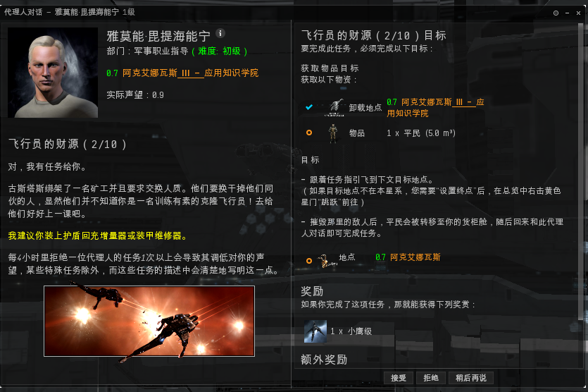
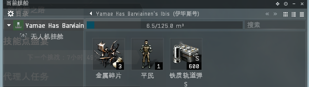

# 4.1.军事

## 前言

军事任务是我们需要做的第一个教程，主要教给大家如何PVE（刷怪）。

## 任务攻略

### 1.飞行员的财源1/10

任务的目标很简单，我们需要去到一个星系（在任务日志里有黄字链接，右击设为终点，大多是在本星系）跳到任务空间做任务。

接受任务以后，我们离开空间站，来到指定的星系：右击太空空白处，找到任务空间跃迁过去。&#x20;

到达任务空间后，我们依次锁定并击毁所有海盗船只就可以完成任务。这是最基本任务的形式：**到达指定星系》》跳进任务空间》》击毁海盗**。完成任务回到空间站向NPC交付就可以得到奖励。

### 2.飞行员的财源2/10

相对于上个任务，这个任务会需要我们捡回一个任务物品（平民），这是也是任务的基本形式之一：**到达指定星系》》跳进任务空间》》击毁海盗》》拾取任务物品**。（有部分任务物品是击毁海盗后会自动进入你的舰船货柜，有部分任务物品需要你去拾取），这个任务打完海盗后会进入你的舰船货柜。

完成任务后会奖励我们一艘船，我们这时候需要把原来驾驶的新手船拆掉上面的武器 装备，安装到新的舰船上。

第一步组装新舰船： &#x20;

第二步激活新舰船 

第三步将原来的新手船拆装箱，拿到装备。 

第四步：将拆下来的装备和弹药安装到新船上。 

### 3.飞行员的财源3/10

仍然是一个需要获取任务物品的任务。

需要注意的是：

1. 怪会环绕你4000米，注意射程，如果打不到请灵活切换弹药或者换炮
2. 打完跑跑无人机任务物品就到了货柜里，这里就可以交任务了，不需要将怪全清掉。

### 4.飞行员的财源4/10

从任务日志上不难得出，这个任务只需要大家接近一个星门。

我们右击这个星门，打开加力接近就可以了。当本地有提示  时，就可以回去交任务.

任务的形式之一侦察：接近或进任务空间到达指定位置就可以完成。

### 5.飞行员的财源5/10&#x20;

仍然是一个侦察任务，我们到了任务空间以后，收到提示就可能回去交差了。

### 6.飞行员的财源6/10

这个任务我们将接触两个新的东西：

1. 加速轨道，加速轨道是很多任务或远征空间存在的一个东西，想要进入深层空间，必须要经过加速轨道，进到任务空间激活加速轨道我们才可以进入下一层，否则你将找不到任务目标。
2. 目标建筑：**一个新的任务形式：进入任务空间》》击毁目标建筑**。正常来讲我们新人的总览里应该是有建筑的，但不排除有些新人总览被修改过，找不到哨站，这个时候我们需要右击总览左上角的四条横杠，打开总览设置&#x20;

在预设标签的（空间实体）里找到（大型可撞击建筑）把任务建筑类别添加进去。&#x20;

有时候任务空间的可撞击建筑很多，我们可以右击总览里的这些建筑  把这些建筑从总览里去掉，需要的时候再调出来。

找到它击毁掉就可以完成任务了。

这个任务奖励了一个脑插，关于脑插和技能 大家可以参考技能和植入体教程（补一个链接）

### 7.飞行员的财源7/10

很简单的任务进去清怪 完成任务。

任务流程虽然简单，但怪不少，正常来讲会把你打进装甲，回到空间站后我们需要对舰船进行维修再进行下一个任务：&#x20;

### 8.飞行员的财源8/10

仍然是一个侦察任务，接近指定的目标以后完成任务。

### 9.飞行员的财源9/10

爬轨道、清怪、打建筑 

### 10.飞行员的财源10/10

一般来讲，最后一个军事任务需要到另外一个星系去做。设定终点，到达指定星系，进入任务空间，击杀目标海盗，完成任务。任务目标怪比较猛，如果你的护盾没了，可以跳走修好再跳回来。打爆停滞网塔以后，可以看到任务目标。

到此为止，普通的军事代理任务我们已经完成，在这里我们学会了几种任务的基本形式：侦察，打任务目标海盗、建筑，拾取任务物品，以后我们去做普通任务基本也就这几种形式。
