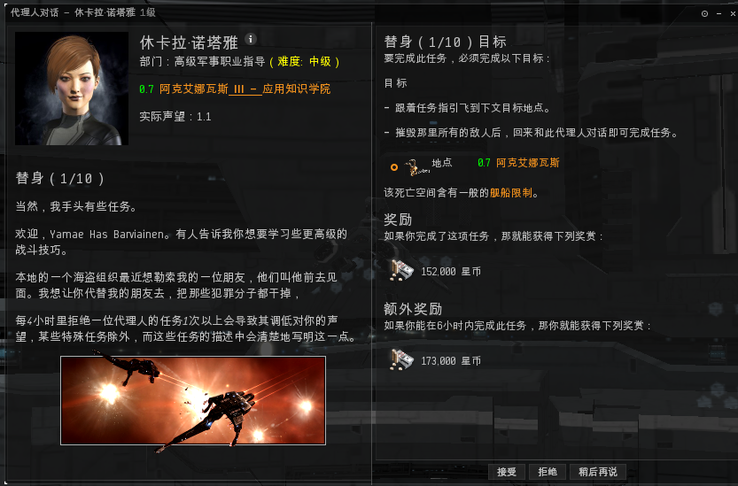

# 4.2.高级军事

## 前言

高级军事任务教一些关于PVP的基本知识点，当然真正的PVP要比任务教给你的复杂的多。希望大家做完军事任务再来做高级军事任务。

## 任务攻略

### 1.替身1/10

进到任务地点，击杀目标海盗 。

### 2.仁慈天使2/10


一定要注意！！！一定要注意！！！一定要注意！！！ 这个任务会给你一条船，开着这条船去，这个任务是侦察任务，也是一个必爆船任务，千万千万不要开着你之前的船去！！！


开上任务给的船以后，可以的话 给他上个保险。

  

### 3.专注的精神3/10

.png>)

任务会给你一个民用跃迁干扰器， .png>) 这个装备是一个中槽装备，你装备上以后到任务空间对目标使用可以防止目标跃迁逃走。这个任务主要教给大家在PVP中，如何把敌人留下来和你进行战斗，没有跃迁干扰装置的话，你的敌人会在需要逃走的时候跳走，你的战斗将毫无意义。

### 4.患难朋友4/10

这个任务会给你一个远程护盾回充增量器，  这个任务主要教给你如何遥修你的队友（奶妈）

在正常的PVP中，奶妈可以很大幅度提高整体舰队的战斗力。  区别于其他网游，EVE里的奶妈有一个很显著的特点就是“医者不能自医”，大家懂吧，哈哈哈。

### 5.立场5/10

这又是一个必爆船的任务，你只需要给他给你的船装两门炮就出发吧，进去任务空间以后，有一个海盗，你击毁他以后会刷出来一大堆的任务怪，不需要你去击毁，接下来好好享受被击毁的过程吧。（我寻思着，这个任务应该是教给大家，出去浪的时候，后面多带些小伙伴比什么都强。）

### 6.不要回头6/10

这是一个侦察任务。接近任务目标，然后回到空间站交任务。

### 7.武器的选择7/10

很简单的任务，进到任务空间，把海盗击毁就可以了。

### 8.和平主义者8/10

非常简单的接近建筑，拿取任务物品的任务。但需要大家注意任务说明

真正的PVP通过教程是学不到的，所以CCP在这里用文字给大家做了说明。

### 9.粘住敌人9/10

这个任务会给大家一个民用停滞光束，任务日志里有关于停滞缠绕光束的说明，我就是再啰嗦了。任务不需要把目标击杀掉，你只需要把网子扣到目标脸上就可以了。

### 10.考核10/10

这个任务的海盗 头目比较难打 大家一定要把他网住打 否则他会网住并反跳你，把你的任务舰船打爆。如果你仔细做了前几步的任务，认真了解了与海盗战斗的方式，这个任务并不难。当然不排除会发生些意外，造成爆船事故，这个时候你可以向紫电申请一条任务地点的全装特里斯坦（配好的，战斗力对新人来讲不错，轻松可以打过这个任务）。 高级军事任务到此为止就结束了。这些任务教给你如何反跳并网住敌人，当然真正的PVP还需要大家在PVP中学习。如果你热衷于PVP，可以考虑找一个专门的PVP军团和教官教给你PVP.毕竟任务教程能教给你的太少了。
