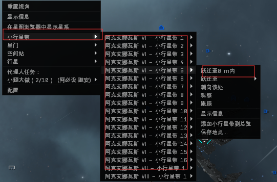
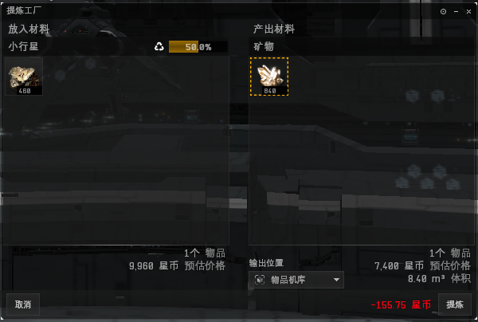
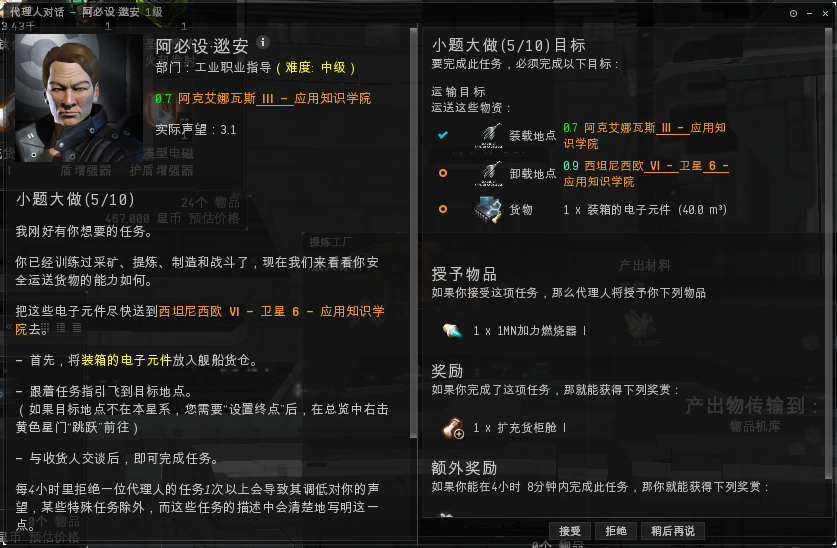

# 4.3.工业

## 前言

工业任务主要教你如何挖矿、提炼、运输、制造装备舰船。

## 任务攻略

### 1.小题大作1/10（如何去挖矿）

第一个任务是一个采矿任务，是采矿任务代理人的基本任务形式之一。需要我们去任务地点采取1000个凡晶石。我们将代理人给我们的采矿器装在舰船上出发

进到任务空间，如果你发现不了所需要的凡晶石，你可以切换到采矿总览或者在总览设置里找到凡晶石加进去（具体如何添加请看[**军事任务教程6/10**](1-jun-shi.md#6-fei-hang-yuan-de-cai-yuan-6-10)）

### 2.小题大作2/10（如何去精炼）

这个任务是教给我们如何把矿石转换成矿物。我们首先要到小行星带挖取一定的凡晶石

  富凡晶石是凡晶石的衍生矿 含量更高。如果你在小行星带找不到凡晶石，说明被人采光了，你可以去下一个小行星带或者直接在市场购买三钛合金。（购买教程参考[商业教程](https://docs.qq.com/doc/DQWxISVVOQVR6QW1I)6-10）

采集完毕后，将物品转移到空间机库右击进行提炼。

得到所需要的三钛合金交付任务。

### 3.小题大作3/10（如何去制造）

任务会给你一张加力的蓝图，你需要把它造成加力燃烧装备 。右击蓝图使用 

当你有足够的矿物，就可以开始你的制造项目了。

当然 任务需要造两个，你需要把流程数调整为两个，记得十分钟后来完成项目。在工业选项卡里。  在项目里找到任务项目完成。

### 4..小题大作4-10

这个任务需要你到任务空间去采凡晶石并精炼成三钛合金交给代理人，你可以用刚才送给我们的冲锋者级，我们把刚才给我们的采矿器装上，并装一个炮（记得装弹药）用来清怪，然后到任务空间采矿带回空间站精炼，如果你没有那么多耐心采矿，可以直接在市场上买7000个三钛合金交给这个人。

### 5.大题小作5/10

这是一个运输任务，是物流代理人经常发布的任务类型，你需要把他给你的任务物品运输到指定的空间站，（就是跑腿）。带上任务物品出发吧，记得回来的路。

### 6.大题小作6/10

这个任务是个非常操蛋的任务，任务说明里让你去找很多矿石去开采精炼，如果你真的按着他的任务说明走，仅找矿石一项就能劝退很多人。我采取的任务方法是：**直接在市场上买20个电池交给任务代理人，QTMD**

### 7.大题小作7/10

普通的运输任务 带上任务物品，出发！

### 8.小题大作8/10

这个任务需要我们造一条穿梭机，造就造吧，人家都说了，市场上买不到的。

整个的制造过程需要四分钟多，安心等待，如果你不会制造，请回头看3/10教程。

### 9.小题大作9/10

这个任务需要我们不仅要装上武器，还要装上矿枪，进入任务空间以后先采矿引出海盗，然后击杀掉海盗拿到任务物品，需要注意的是这个任务物品不会直接到你的货柜里 ，你需要在集装箱货柜里找到。 

10.小题大作10/10

任务目标是造一条护卫舰，如果已经会了制造，可以在市场直接采购一条。

到此为止所有的工业职业代理人任务已经完成，我们在这个职业代理人的教程里应该学会：采矿、精炼、运输、制造这些基础的技能。
