# 4.4.商业

## 前言

商业任务，商业任务主要教给大家如何在市场上采购装备。顺便对考古进行了入门教学。

## 任务攻略

### 1.收支平衡1/10

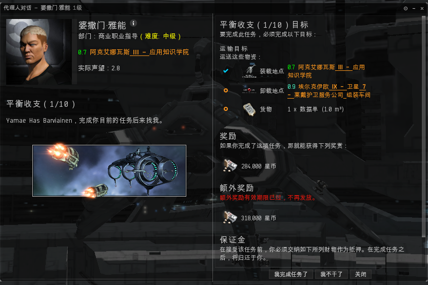

第一步是个很简单的运输任务。

### 2.收支平衡2/10

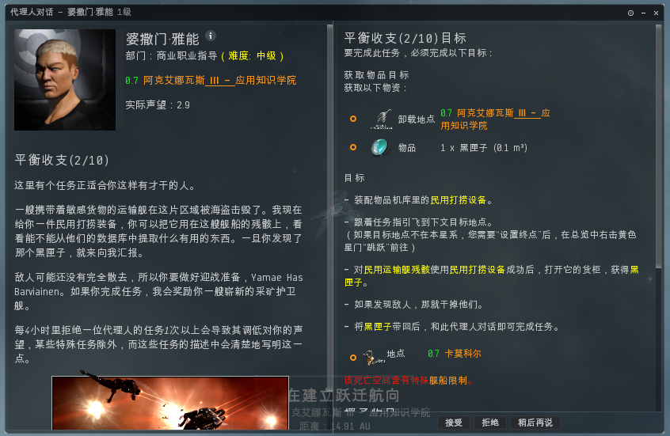

这个任务主要教给玩家如何打捞，即从被击毁的残骸中回收打捞件（主要用于制造舰船改装件），我们接受任务后将代理人给的民用打捞器装在舰船上出发到目的地。锁定目标残骸使用民用打捞装备。 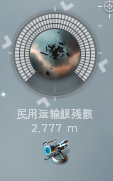 当提示  拾取任务物品回站交任务。

### 3.收支平衡3/10

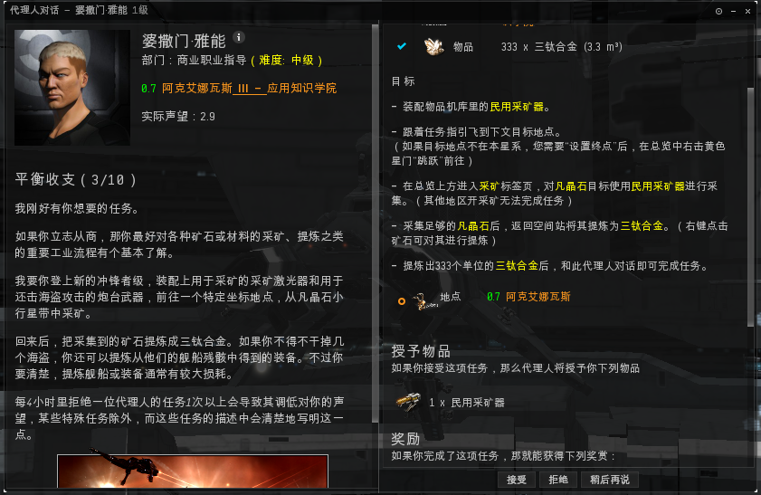

这个任务是让我们去任务空间采矿并精炼。在工业教程我们教过如何采矿并提炼，不过我们并不能用市场买的或之前任务剩下的三钛合金交差，我们必须到任务空间采矿并击杀前来骚扰的海盗才算完成任务。

### 4.收支平衡4/10

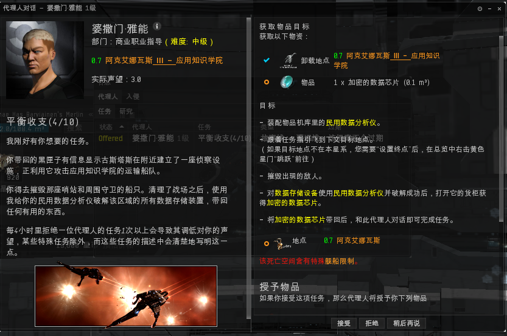

这个任务会给我们一个民用数据分析仪，主要教给我们如何破解数据/遗迹地点，算是考古的入门，我们到达任务空间后，找到 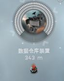 使用民用数据分析仪后会出现以下界面：

  这是一个扫雷的小游戏，我们需要从起点起步，沿着路径找到目标数据，遇到防火墙要绕过或破解掉。最终破解掉目标数据就可以拿到任务物品。更深层的考古教学可以在我们[**扫描教程**](https://docs.qq.com/doc/DQVFSZldtZmxYRm5r)**进**行学习。

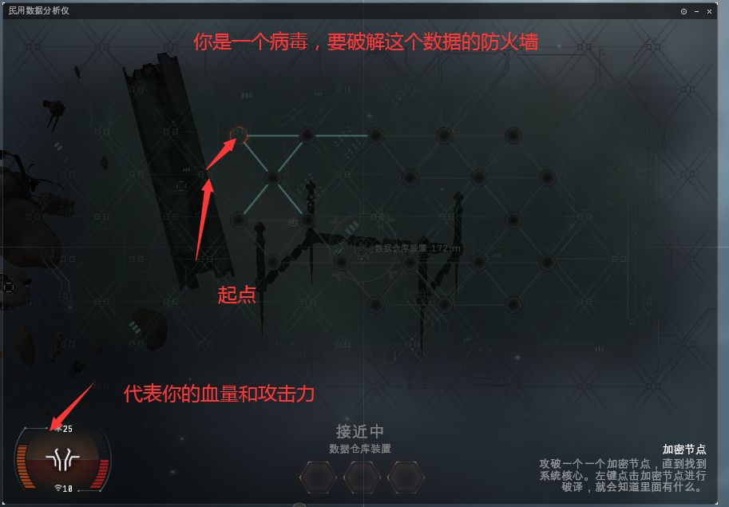

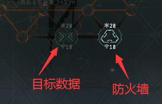

### 5.收支平衡5/10

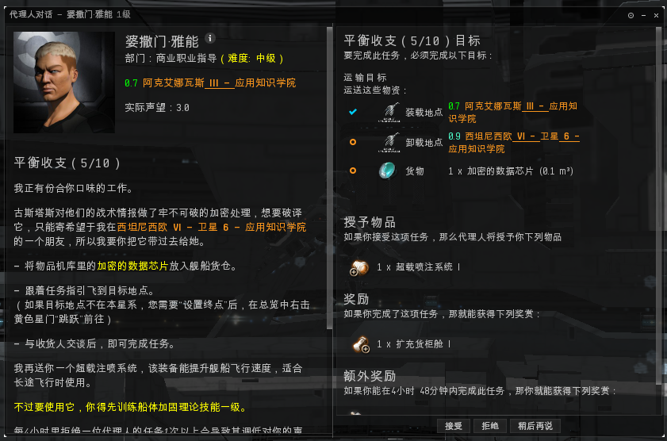

普通的运输任务，不再啰嗦。

### 6.收支平衡6/10

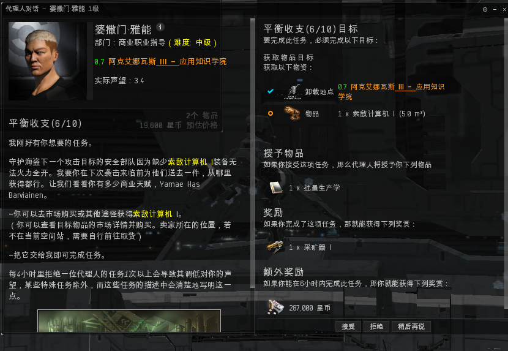

这个任务主要交给我们如何在星域市场上购买东西，我们可以在星域市场里搜索所需要的任务物品交给代理人，注意一定要注意所购买的物品所在的空间站（CCP可不会给你快递到你的空间站） 

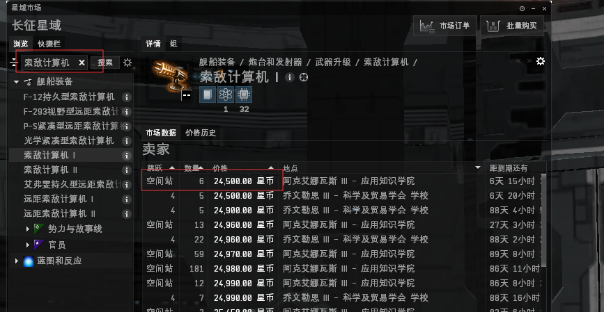

### 7.收支平衡7/10

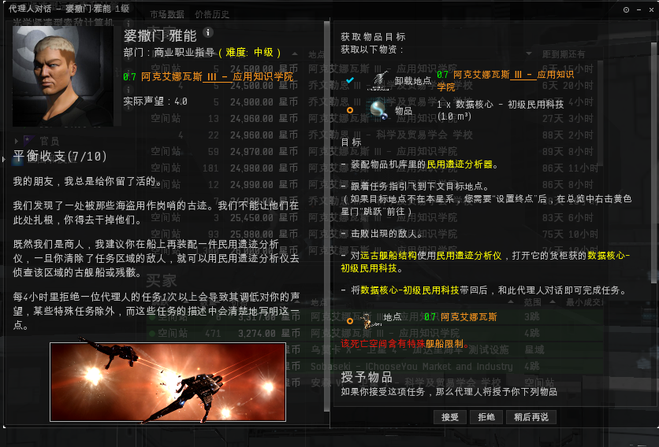

这个任务和4/10一样是一个破译任务，不过这次是破译的遗迹数据，用的是民用遗迹分析仪。

### 8.收支平衡8/10

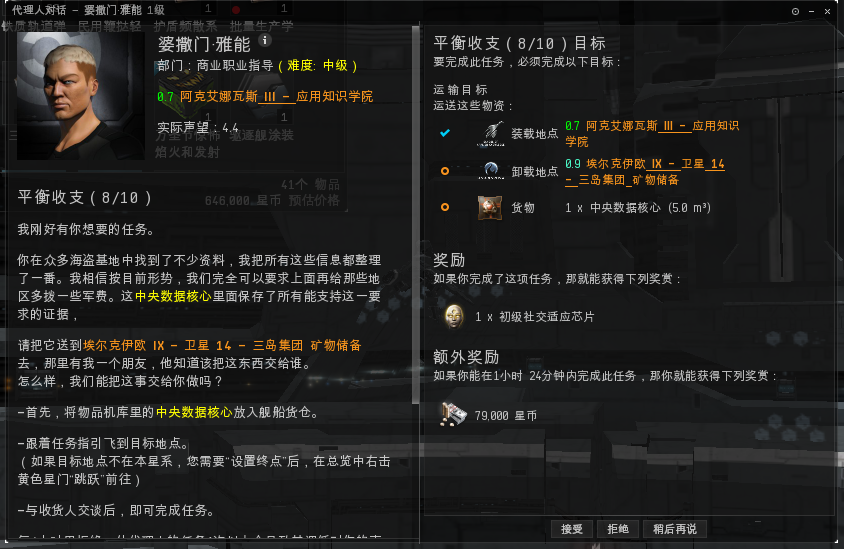

依然是普通的运输任务，不啰嗦。

### 9.收支平衡9/10

在市场上买两个任务物品交付。如果不会可以参考6/10

### 10.收支平衡10/10

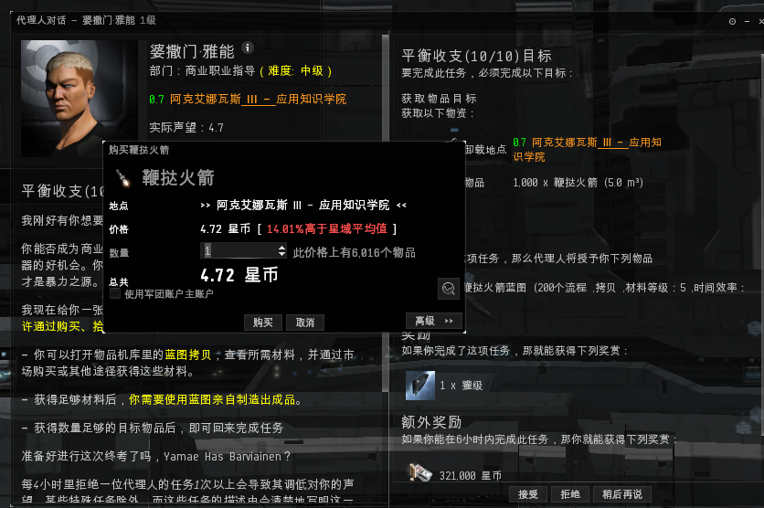

最后一个任务可以在市场购买，也可以自己制造（参考工业教程）。
