# 4.5.探索（最重要）

## 前言

探索任务在CCP标定的难度中是最难的，主要是很多新人不了解任务机制和CCP想要教给大家哪些内容。接下来我一步步剖析探索任务流程告诉你CCP想通过探索任务教给你什么内容。

## 任务攻略

### 1.异常空间1/5

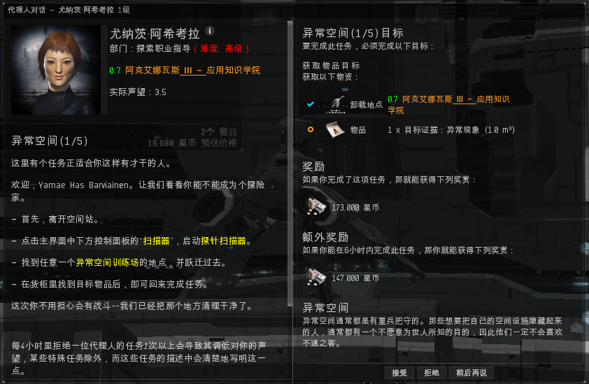

异常空间是存在于太空中常见的信号，不需要通过扫描探针，只需要通过舰载扫描器就可以看到的信号，进入太空，我们按ALT+P或点下面的按纽找到扫描器。  ：

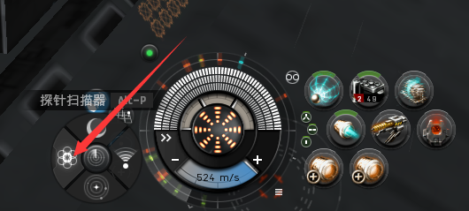

找到“异常空间训练场”跃迁进去，找到一个  拿到任务物品回站交付任务。

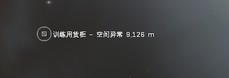

未来我们的生产生活中要经常到异常空间，所以这也是很基础的知识。

### 2.空间信号2/5

这个任务是一个指引性任务，我们按着代理人的指示一步步走就是了

1. 进入任务空间经过加速轨道在勘探物品里拿到
2. &#x20;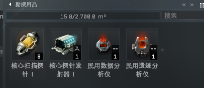&#x20;
3. 经过三层轨道，分别见识一下数据、遗迹、气云信号的场景（卵用，连个箱子也没有）

### 3.数据地点扫描3/5

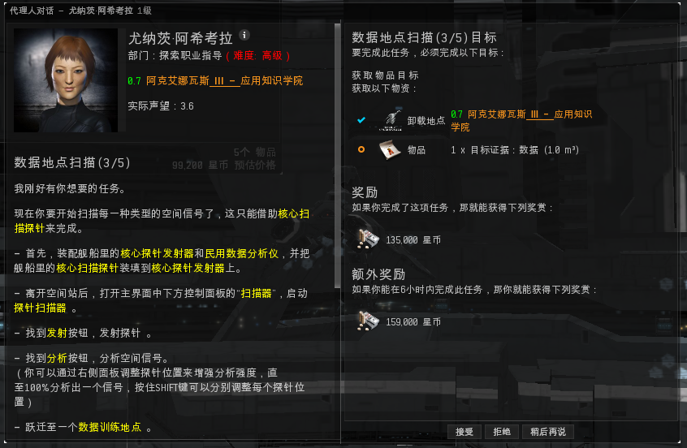

接受这个任务以后，我们需要把上个任务拿到的核心探针发射器装在我们的舰船上。并把核心扫描探针放在发射器里（记得要放八个）。把数据和遗迹分析仪都装在船上。

进入太空，我们按ALT+P打开扫描界面。点击精确发射。

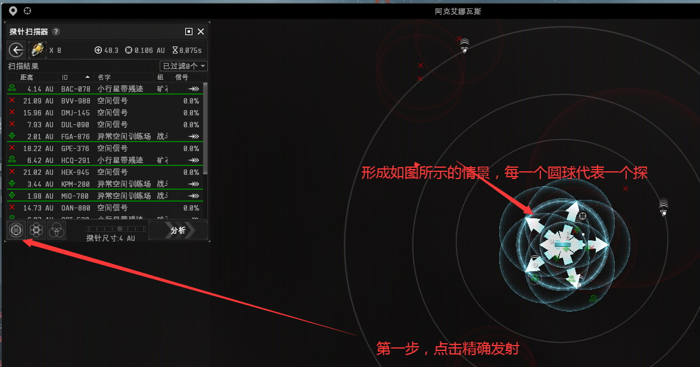

通过拖动探针的移动手柄，移动一下探针覆盖红色的信号点击分析 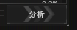&#x20;

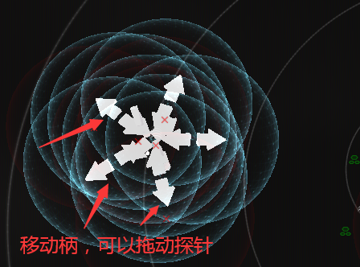

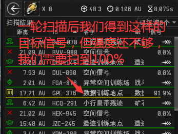

拖动探针手柄，将要扫的信号放在探针中间,并调整探针范围为2AU，进行再分析。

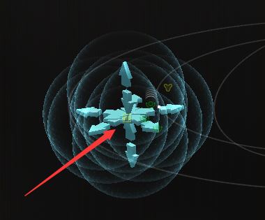

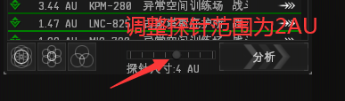

我们得到想要的数据信号 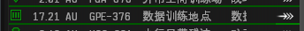 跃迁过去拿到任务物品。如果扫描强度仍然不到100%，需要大家重复以上步骤直到强度到100%为止。

到达任务空间后，我们需要用数据分析仪才能拿到任务物品（如何使用参考[**商业教程4/10**](shang-ye.md#4-shou-zhi-ping-heng-4-10)）&#x20;

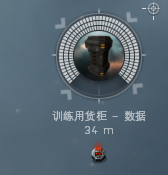

拿到任务物品后交付任务。

### 4.遗迹地点扫描4/5

任务流程和数据地点扫描是一样的，只不过要找的是遗迹训练地点，用的破译工具是遗迹分析仪。&#x20;

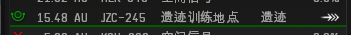

### 5.气云扫描地点5/5

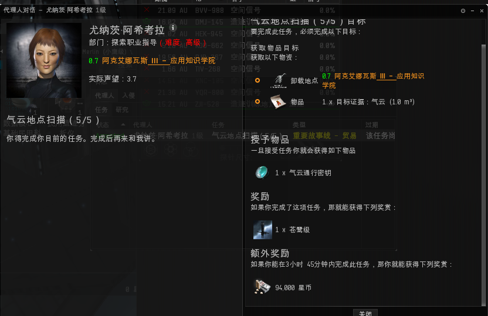

任务流程和数据地点扫描是一样的。找到气云训练地点，拿到任务物品交任务（记得带代理人给你的通行证）&#x20;

总结：探索任务教给我们如何在太空中发现我们需要的信号，对每个EVE玩家来讲是非常重要的。
