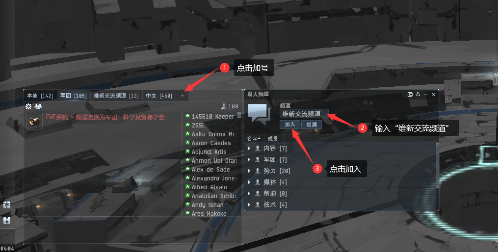
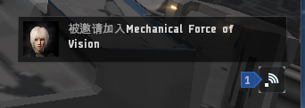
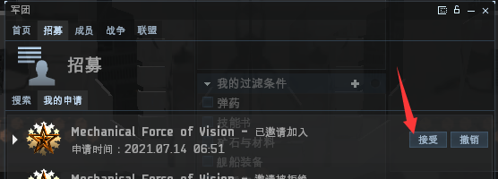

# 加入高安军团

## 新人加团前注意事项

1. 在入团之前一定要把五个职业代理人全部完成；
2. 做完职业代理人需告知群管理 **招新总监-铭炎** 或 **维新CEO-紫电**；
3. **必须上开黑啦：69402713，不上不送潜龙**
4. 申请加入高安军团；
5. 管理审批入团申请并发放新人入团福利，接待你加入**培训群**；

* [接待群（670153898）](https://qm.qq.com/cgi-bin/qm/qr?k=oH29VcZ-rdxmVQPpuAg7nOr5kqusacW6\&jump\_from=webapi)
  * 

## 一百万技能点的使用

新人申请入团收到军团给你的福利后，就可以使用之前邀请链接注册送的一百万可分配技能点了，按照下面所写的技能使用。

### 潜龙级（Worm）技能表

> #### 中文
>
> **无人机**
>
> * 无人机概论 5
> * 轻型无人机操控理论 4
> * 无人机控制理论 3
> * 无人机精准射击 3
> * 无人机导航学 3
> * 无人机效能研究 3
> * 无人机电子理论 3
>
> **导航学**
>
> * 规避机动理论 3
> * 加力燃烧器原理 3
> * 导航学 3
> * 加速控制理论 3
>
> **护盾**
>
> * 护盾提升 4
> * 战术护盾操控 4
> * 护盾管理 3
>
> **飞船操控学**
>
> * 飞船操控学 3
> * 加达里护卫舰操作 3
> * 盖伦特护卫舰操作 3
>
> **工程学**
>
> * 武器升级研究 4

> #### 英文
>
> Drones 5\
> Light Drone Operation 4\
> Drone Interfacing 3\
> Drone Sharpshooting 3\
> Drone Navigation 3\
> Drone Durability 3\
> Drone Avionics 3
>
> Evasive Maneuvering 3\
> Afterburner 3\
> Navigation 3\
> Acceleration Control 3
>
> Shield Upgrades 4\
> Tactical Shield Manipulation 4\
> Shield Management 3
>
> Spaceship Command 3\
> Caldari Frigate 3\
> Gallente Frigate 3
>
> Weapon Upgrades 4

### 如何使用技能点

先领取一百万技能点礼包，然后按照下面两种方法使用。

#### 阿尔法（无购卡）用户：

1. 点击左上角头像打开**人物表单** 
2. 找到相应技能，然后鼠标右键弹出菜单，点击**使用技能点** 
3. 输入需要的技能点，再点确定， 一级一级升，一个一个点。


一定！！一定！！一定！不要输入过多技能点！！！！！！


#### 欧米茄（月卡）用户：

```cpp
无人机概论 5
轻型无人机操控理论 4 
无人机控制理论 3
无人机精准射击 3
无人机导航学 3
无人机效能研究 3
无人机电子理论 3

规避机动理论 3
加力燃烧器原理 3
导航学 3
加速控制理论 3

护盾提升 4
战术护盾操控 4
护盾管理 3

飞船操控学 3
加达里护卫舰操作 3
盖伦特护卫舰操作 3

武器升级研究 4
```

1. 复制上方全部技能
2. 点击左上角头像打开**人物表单** 
3. 点击技能学习队列左边**菜单**，再点击**用剪贴板上的技能替换队列中的技能** 
4. 点击**人物表单**界面的左下角**使用技能点**
5. 核对一下队列里面的技能是否正确，最后点击**确认**按钮


#### 为什么分两种方法，我直接用最方便的第二种不可以？

* 因为没有付费的阿尔法用户只能在技能队列里安排一天的技能，而购买了欧米茄的付费用户则无限制。

## 如何加团

### 1.添加频道

按照下方图片所示操作加入“维新交流频道”。



### 2.申请入团

在“维新交流频道”置顶信息（滑至最上面）按照下图操作。


### 3.填写申请正文

写上你的QQ昵称，管理员好识别。


### 4.接受邀请

管理审批后，你会收到一条邀请加入消息，点击此消息，再点击接受按钮就加入军团了。





## 领取福利

### 1.到吉他贸易中心

打开星图，右上角搜索“jita”


到 **吉他 IV - 卫星 4 - 加达里海军 组装车间**


### 2.选择生产方式并领取潜龙


[1.md](../d4/1.md)



[2.md](../d4/2.md)



因为两个生产方式的潜龙级配置不同，所以二选一领取


### 3.到达吉他后找管理领取潜龙

## 安排训练毒蜥技能

新人点完潜龙技能，就把毒蜥技能挂上慢慢训练。

### 毒蜥（Gila）技能表


\[中文]\
\
无人机控制理论 4\
无人机精准射击 4\
无人机电子理论 4\
无人机效能研究 4\
无人机导航学 4\
中型无人机操控理论 4

护盾管理 4\
护盾操作 3\
爆炸护盾补偿研究 3\
电磁护盾补偿研究 3\
动能护盾补偿研究 3\
热能护盾补偿研究 3\
\
燃料节约技术 4\
加速控制理论3\
规避机动理论 3\
\
飞船操控学 4\
加达里巡洋舰操作 4\
盖伦特巡洋舰操作 4\
\
热力学 3\
能量栅格提升 4\
电容管理学 4\
\
目标锁定训练 4\
远距锁定训练 3\
\
社会学 3\
犯罪关系研究 2



\[英文]\
\
Drone Interfacing 4\
Drone Sharpshooting 4\
Drone Avionics 4\
Drone Durability 4\
Drone Navigation 4\
Medium Drone Operation 4\
\
Shield Management 4\
Shield Operation 3\
Explosive Shield Compensation 3\
EM Shield Compensation 3\
Kinetic Shield Compensation 3\
Thermal Shield Compensation 3\
\
Fuel Conservation 4\
Acceleration Control 3\
Evasive Maneuvering 3\
\
Thermodynamics 3\
Energy Grid Upgrades 4\
Capacitor Management 4\
\
Target Management 4\
Long Range Targeting 3\
\
Social 3\
Criminal Connections 2


## 开始生产赚钱


[d4](../d4/)

