# 加入主军团

## 前言

当新人在高安熟悉游戏后，了解军团的规章制度和新手福利，符合各方面条件，就可申请00地区维新主团，具体申请步骤将会在下面讲解。

## 新人加团前注意事项

1. 符合入团条件；
2. 觉得自己已符合入团条件，想入主团的新人需联系群管理 **招新总监-铭炎** 或 **维新CEO-紫电**审核；
3. 提交入团申请；
4. 管理审批入团申请并发放新人入团福利，接待你加入[**维新内部交流群（**775061310**）**](https://qm.qq.com/cgi-bin/qm/qr?k=Z8VQsPzxCq5mKV3-POM3NDTsRhYpUMUu\&jump_from=webapi)；

### 入团条件

1. 熟悉游戏的各种基础，如：市场买卖、合同交易、打怪等；
2. 毒蜥技能训练完成（参考[**毒蜥技能表**](3.md#du-xi-ji-neng-biao)）；
3. 钱包有5亿星币（血袭者任务起步资金）；
4. 已开通欧米茄（月卡）；
5. 能上[**开黑啦**](../d7/1.md)语音软件（能开麦交流最好）；

### 技能规划路线图

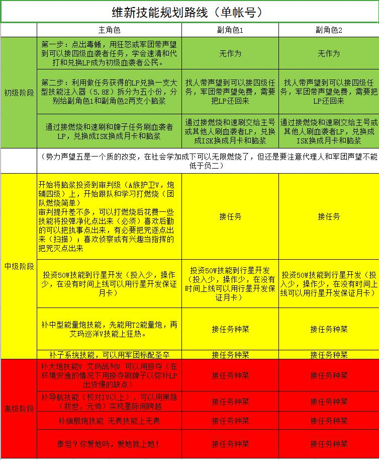

## 入团步骤

### 一.提交联盟ESI 

#### 1.主号注册（首次注册使用）

**一个登陆账号只需要注册一次**

    第一步：点击seat地址打开网页 [https://seat.xming-tec.com/](https://seat.xming-tec.com)

.png>)

    第二步：点击按钮 LOG IN 登录你的账户，选择授权角色后点击授权即可

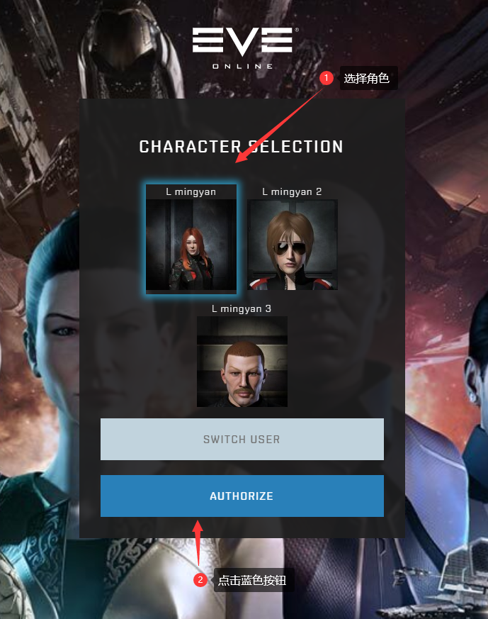

 (1).png>)


**到这一步你可能会找不到授权按钮，请拉到最下面！！！**


    第三步：切换中文： 右上角点击 ----- Profile -- Language ---- Chinese ---- 点蓝色按钮 Update更新

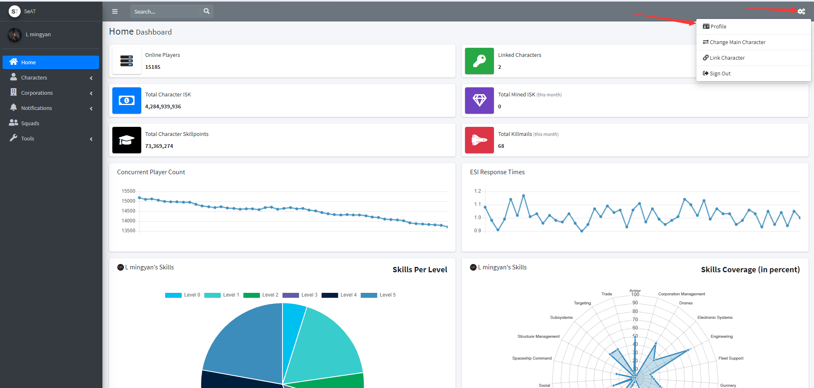

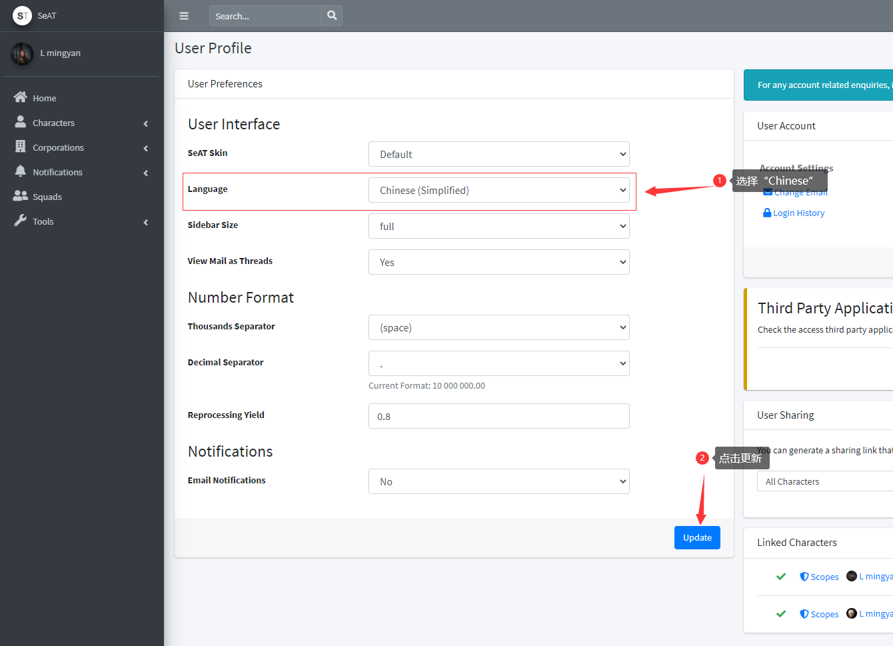

#### 2.小号绑定

**如果你有第二个帐号，小号账户绑定到主号**

    第一步：右上角点击角色名，点击添加新角色

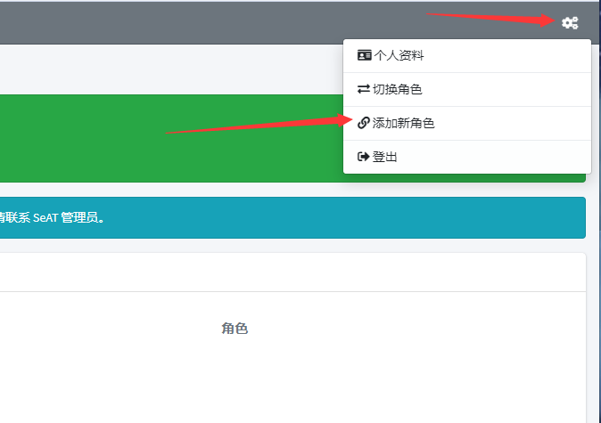

    第二步：登录小号授权即可

 (1).png>)

### 二.加入军团

#### 主号注册（首次注册使用）

1.在聊天频道名字旁边，有个小“ + ”，点击。如下图：

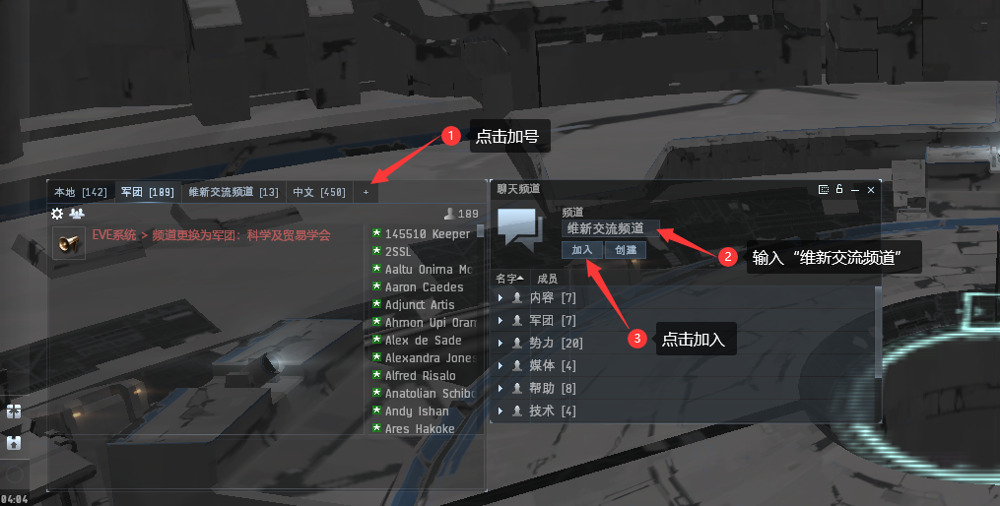

2.在频道置顶信息找到主团名称“Mechanical Force of Vision“，点击后，会弹出打开军团信息面板，然后点击最下面的“申请加入“，弹窗点确定**（不要操作两次，第二次是撤回）**。

**申请后联系军团管理出示提交过ESI的截图**

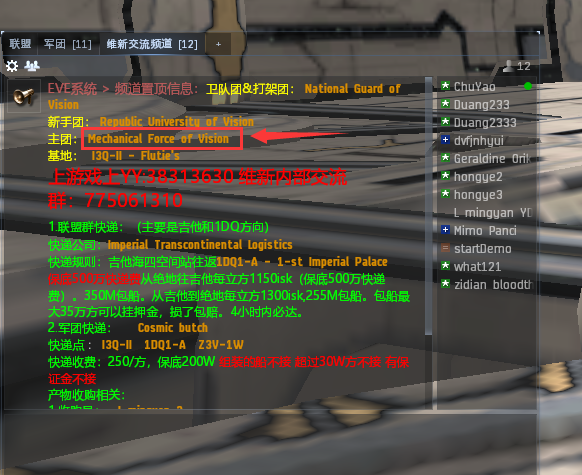

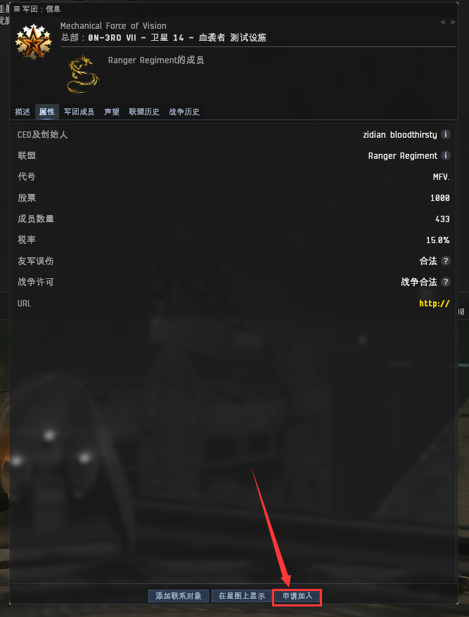

3.管理审批通过后，你会收到一条邀请加入消息，点击此消息，再点击接受按钮就加入军团了。

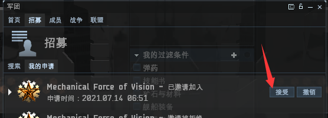

### 三.注册联盟群Seat

* **加入军团后才能注册**

1.前往 [https://gice.goonfleet.com/Manage/Characters](https://gice.goonfleet.com/Manage/Characters)

* 在右上角选择中文，如果没有注册过点击右边的eve Log in with EVE Online进行账号注册

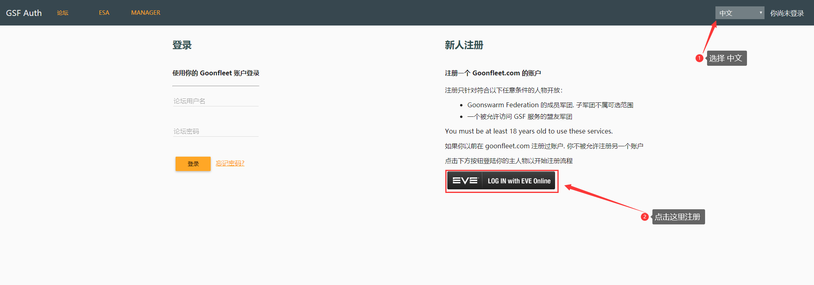

2.根据步骤 登陆账户以及输入邮箱

 (1).png>)

3.输入验证码

.png>)

3.选择授权角色后点击授权

 (2).png>)

最后 goons 网站会往你的邮箱里发一封激活信，打开你自己的邮箱，并点击如下图所示的激活链接，点击那个链接，打开网页，激活你的账户。红色标注的就是你的 **Goonfleet账户**

.png>)

点击验证邮件后，现在你就有了**Goonfleet账户**和密码，**Goonfleet账户**可以是你的电子邮件，也可以是你的**第一个注册账户的角色名**。该账户可以用来登录goon论坛

返回[https://gice.goonfleet.com/Manage/Characters](https://gice.goonfleet.com/Manage/Characters)

登录刚才注册的邮箱号输入账号密码点击登录

.png>)

#### 小号绑定（小号账户绑定到主号）

1.点击CHARACTERS(人物)

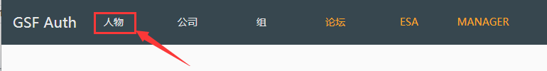

2.点击 注册一个人物

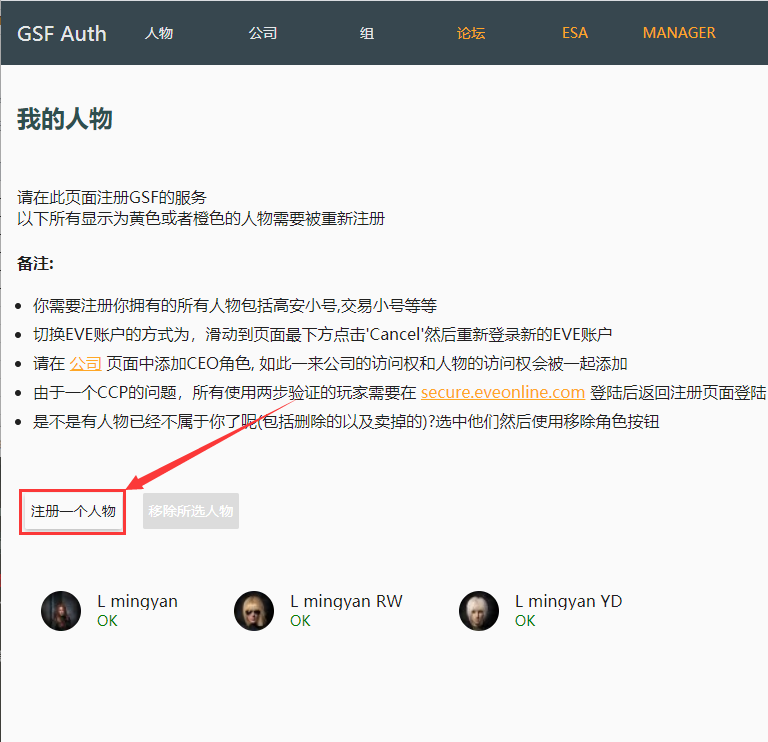

3.登录你的eve账号，选择角色授权即可，最后把所有账户下 所有 **角色/人物** 都注册好就是上面图片那样

### 四.如何到达驻地

当加入军团后，我们需要到驻地与军团小伙伴们一起生活，从高安到驻地是非常远的。这里建议大家设置基地自毁来到驻地。

1. 点击左上角头像，打开**人物表单**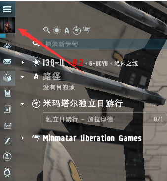 
2. 点击**人物角色**，击再点**基地空间站**，然后点**选择基地空间站**，参考**图1**
3. 在**远程军团办公室**里找到**I3Q-II VII - 卫星 2 - 血袭者 组装车间**，点击后面的**设置基地空间站**按钮，参考**图2**

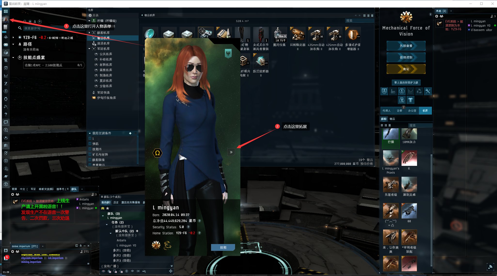

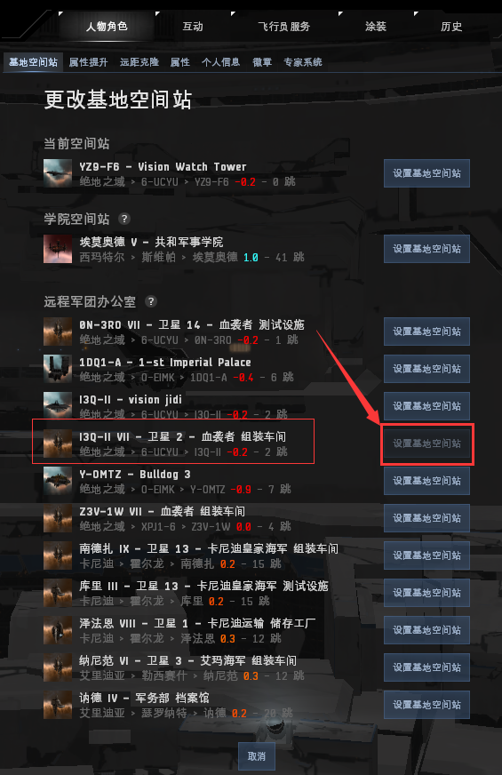

最后右键**正在驾驶的舰船**，点**离舰**，再点击**自毁**，就到达军团驻地了

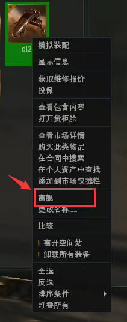

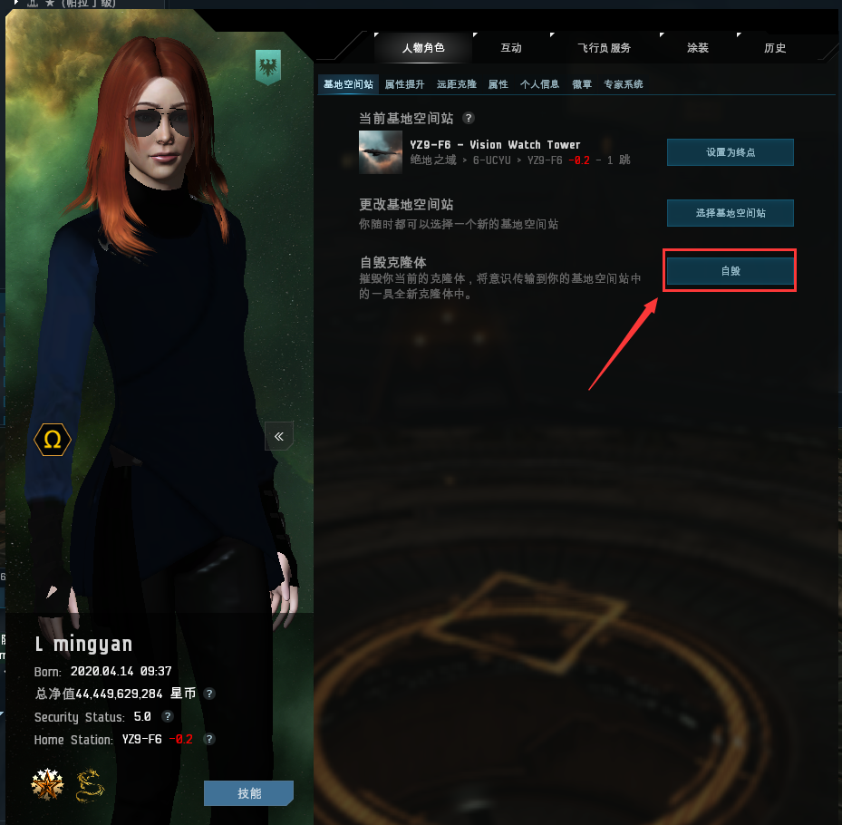


如已经没有远程设置基地的机会，就买一条穿梭机设置基地为终点一路跑下来


### 五.舰队、开黑啦及本地频道的使用

#### 1.为什么强制大家上线加舰队上开黑啦? （非常非常重要）

* **上线加舰队上开黑啦**是主权军团的基本要求，主要是为了大家能够相互沟通学习，更重要是保障大家的安全。希望大家能够严格遵守这一基本要求，多次上线刷怪不加舰队不上**开黑啦**，将会遵照军团**劝退流程**进行处理（**一次警告，二次罚款，三次劝退**）。

#### 2.如何加舰队

* 点开人物头像上方的**菜单>>社交>>舰队**>>在里面找到 值守舰队，一般命名**RR绝地值守**/**维新值守**。找不到的话语音询问值守管理，加入舰队值守舰队才有机会救你！

.png>)

#### 3.如何使用开黑啦


[1.md](../d7/1.md)


#### 4.本地频道

本地频道显示的是进入本星系的人员（虫洞内本地频道不显示），右边的人物列表代表着有本星系（地图）有这些人。通过本地频道我们可以与同地图的进行交流，主要还是用来知晓哪些人与你在同一个星系。

#### **5.如何使用本地频道**

1. 本地频道区别于其他聊天频道，**一定要单独拖出来**。
2. 点击频道上方的三个小人按纽，将本地**显示精简模式**，根据本地人数将频道**拉长**，以能显示本地所有人为准。当本地出现：**白= **** ** **、橙- ** **、红- ** 都是**敌对**，都要做出**规避动作**或准备**反收割PVP**.
3. 本地频道可以与玩家进行沟通，但**严禁骂人、侮辱性词汇及无意义刷屏**。

