# 加入教导队军团

## 向新人提供

1. 直接链接号无月卡下00的机会&#x20;
2. 绝对控场的00主权区域体验&#x20;
3. 教官手把手带队教你的贴心服务（每天晚上老人带队）
4. 预言级战列炮的射击体验

## 入团条件

1. 根据军团指引加入**教导团**
2. 有100W可分配技能点（邀请链接注册）
3. 能上**开黑啦**语音（能开麦交流最好）


如已经技能已经点到无人机上，需要重开新号


## 入团步骤

### 一.提交联盟ESI&#x20;

#### 1.主号注册（首次注册使用）

**一个登陆账号只需要注册一次**

&#x20;   第一步：点击seat地址打开网页 [https://seat.xming-tec.com/](https://seat.xming-tec.com)

.png>)

&#x20;   第二步：点击按钮 LOG IN 登录你的账户，选择授权角色后点击授权即可

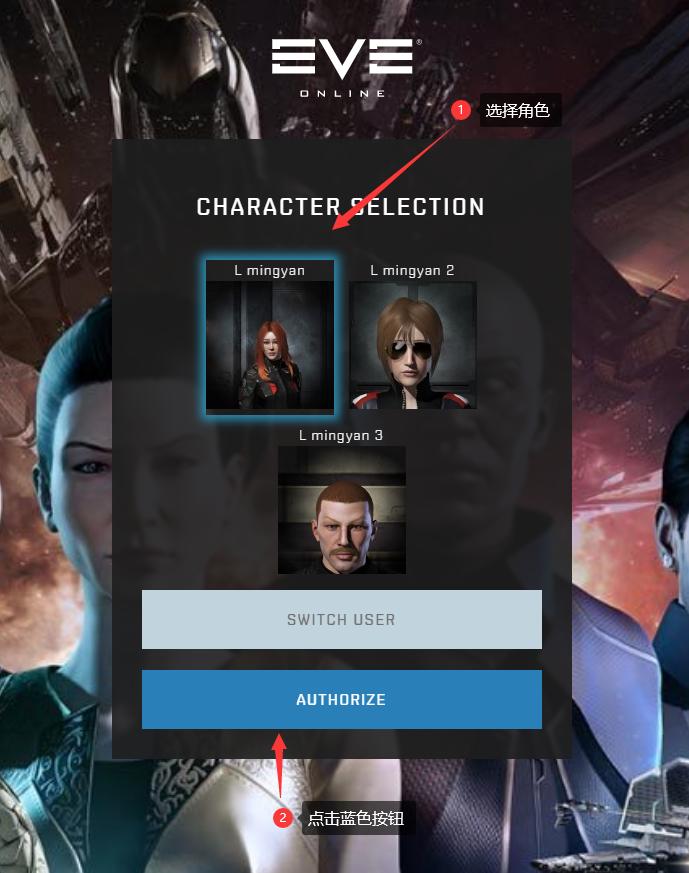

 (1).png>)


**到这一步你可能会找不到授权按钮，请拉到最下面！！！**


&#x20;   第三步：切换中文： 右上角点击 ----- Profile -- Language ---- Chinese ---- 点蓝色按钮 Update更新

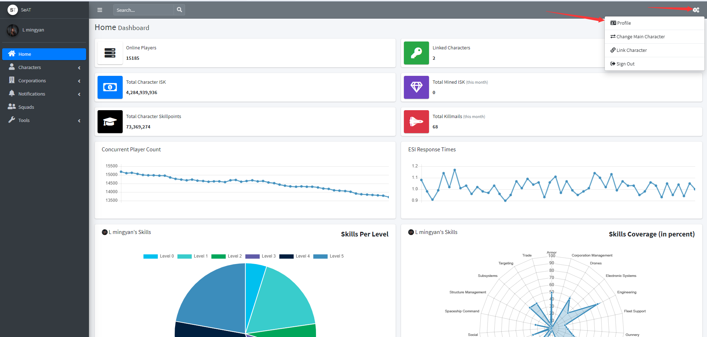

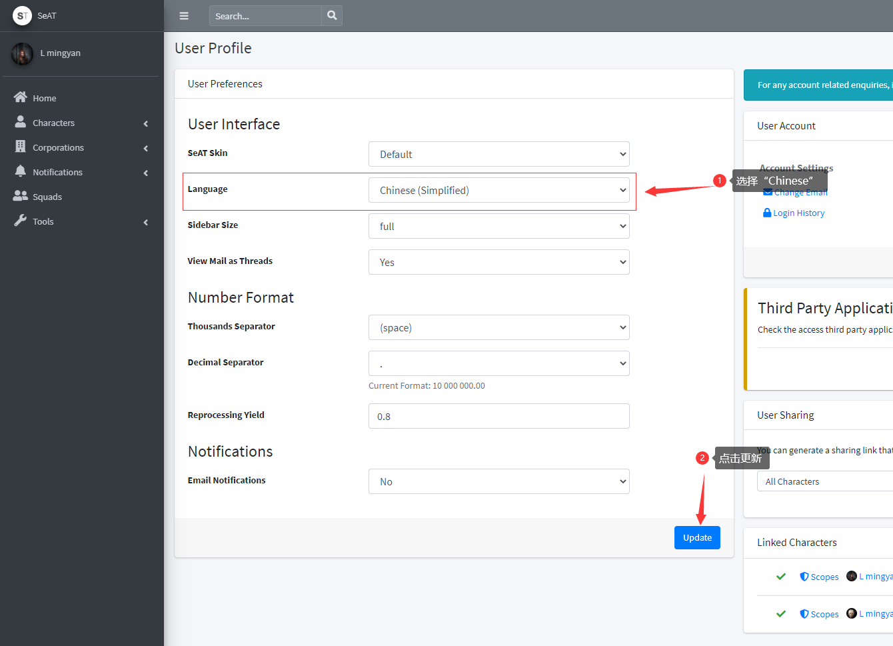

#### 2.小号绑定

**如果你有第二个帐号，小号账户绑定到主号**

&#x20;   第一步：右上角点击角色名，点击添加新角色

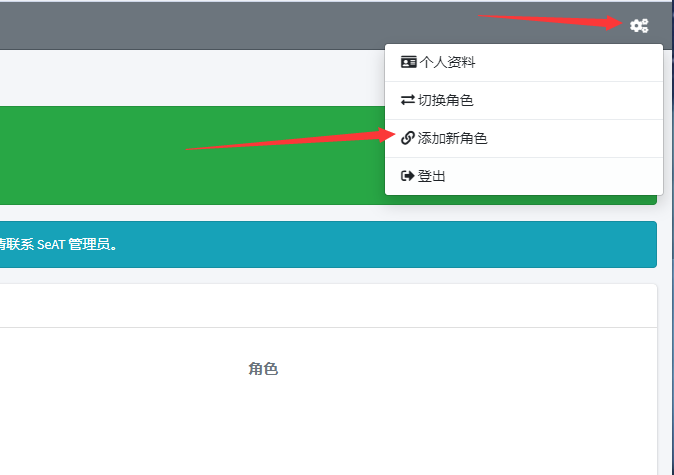

&#x20;   第二步：登录小号授权即可

 (1).png>)

### 二.加入军团

#### 主号注册（首次注册使用）

1.在聊天频道名字旁边，有个小“ + ”，点击。如下图：

2.在频道置顶信息找到**后勤团**名称“**vision cn**“，点击后，会弹出打开军团信息面板，然后点击最下面的“申请加入“，弹窗点确定**（不要操作两次，第二次是撤回）**。

**申请后联系军团管理出示提交过ESI的截图**

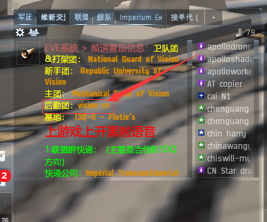

### 三.如何到达驻地

3.管理审批通过后，你会收到一条邀请加入消息，点击此消息，再点击接受按钮就加入军团了。

当加入军团后，我们需要到驻地与军团小伙伴们一起生活，从高安到驻地是非常远的。这里建议大家设置基地自毁来到驻地。

1. 点击左上角头像，打开**人物表单**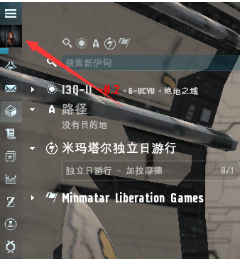&#x20;
2. 点击**人物角色**，击再点**基地空间站**，然后点**选择基地空间站**，参考**图1**
3. 在**远程军团办公室**里找到**UEXO-Z - Already Replaced by Goons**，点击后面的**设置基地空间站**按钮，参考**图2**

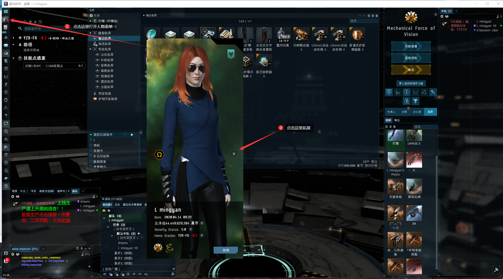

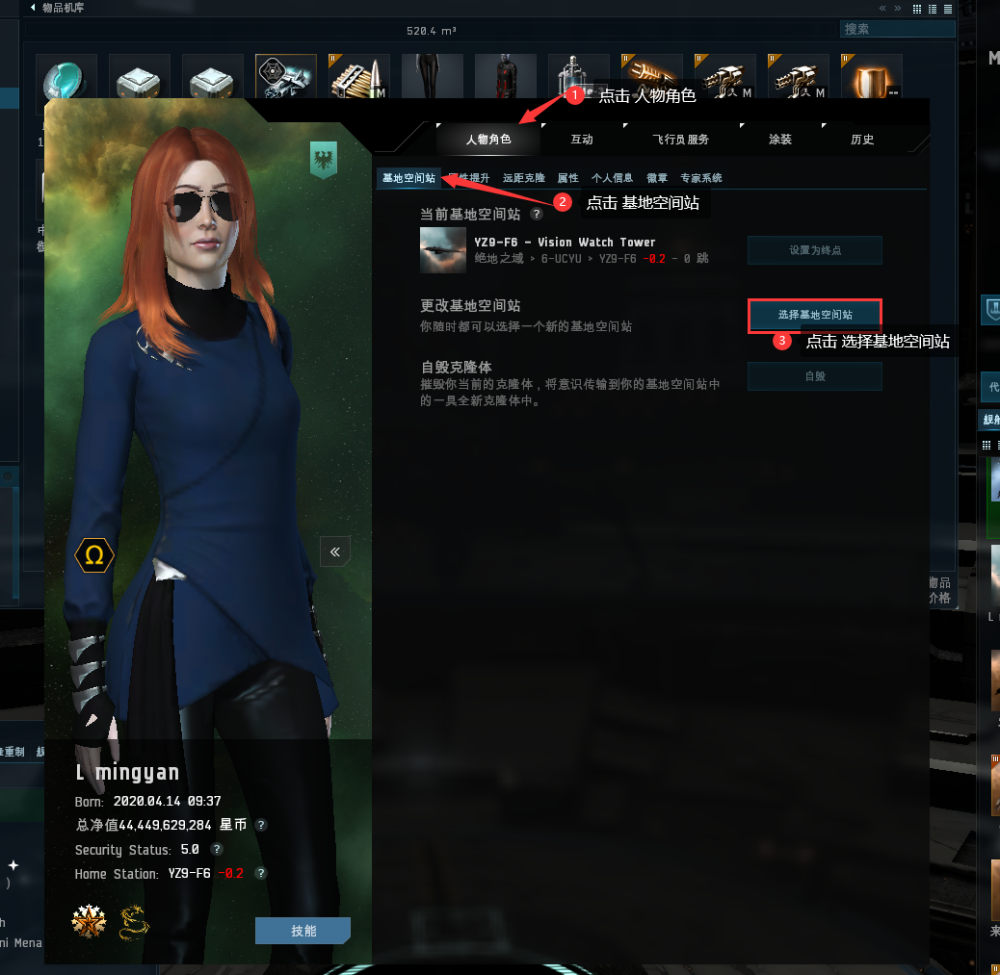

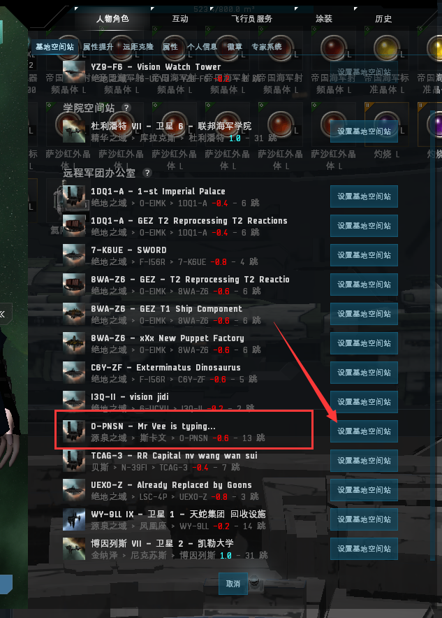

最后右键**正在驾驶的舰船**，点**离舰**，再点击**自毁**，就到达军团驻地了

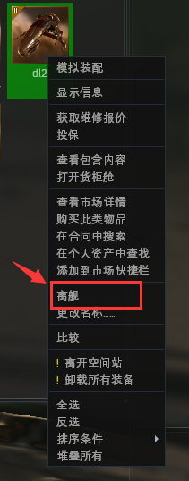

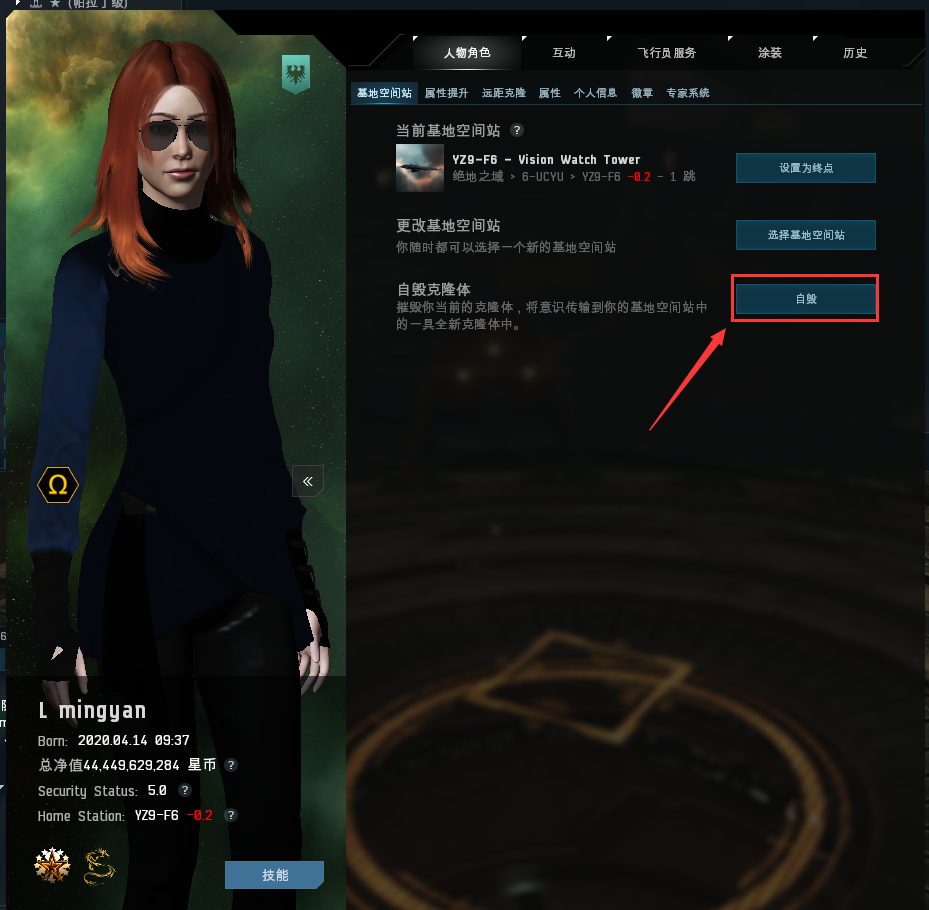


如已经没有远程设置基地的机会，就买一条穿梭机设置基地为终点一路跑下来


### 五.舰队、开黑啦及本地频道的使用

#### 1.为什么强制大家上线加舰队上开黑啦? （非常非常重要）

* **上线加舰队上开黑啦**是主权军团的基本要求，主要是为了大家能够相互沟通学习，更重要是保障大家的安全。希望大家能够严格遵守这一基本要求，多次上线刷怪不加舰队不上**开黑啦**，将会遵照军团**劝退流程**进行处理（**一次警告，二次罚款，三次劝退**）。

#### 2.如何加舰队

* 点开人物头像上方的**菜单>>社交>>舰队**>>在里面找到 值守舰队，一般命名**RR绝地值守**/**维新值守**。找不到的话语音询问值守管理，加入舰队值守舰队才有机会救你！

.png>)

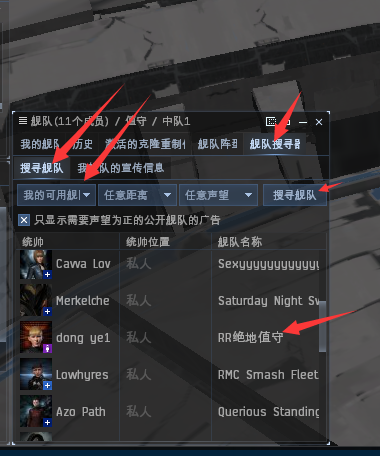

#### 3.如何使用开黑啦


[1.md](../d7/1.md)


#### 4.本地频道

本地频道显示的是进入本星系的人员（虫洞内本地频道不显示），右边的人物列表代表着有本星系（地图）有这些人。通过本地频道我们可以与同地图的进行交流，主要还是用来知晓哪些人与你在同一个星系。

#### **5.如何使用本地频道**

1. 本地频道区别于其他聊天频道，**一定要单独拖出来**。
2. 点击频道上方的三个小人按纽，将本地**显示精简模式**，根据本地人数将频道**拉长**，以能显示本地所有人为准。当本地出现：**白= **** ** **、橙- ** **、红- ** 都是**敌对**，都要做出**规避动作**或准备**反收割PVP**.
3. 本地频道可以与玩家进行沟通，但**严禁骂人、侮辱性词汇及无意义刷屏**。

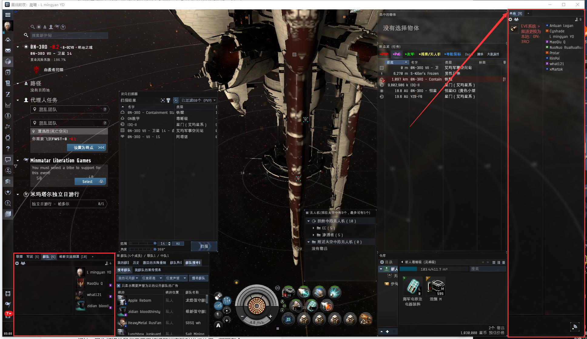

